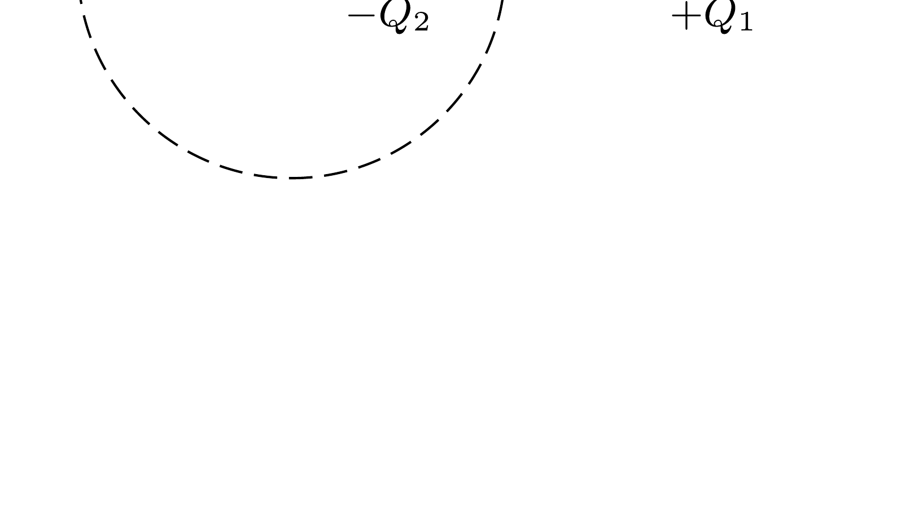
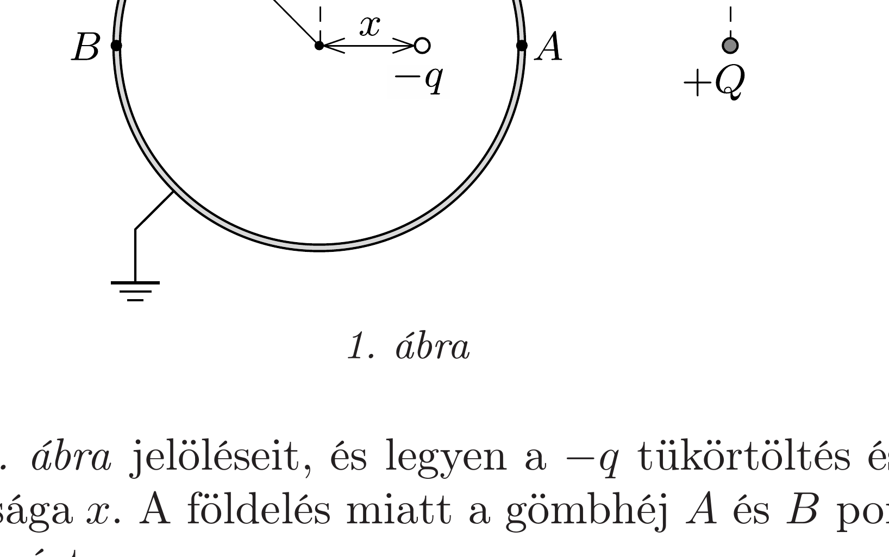
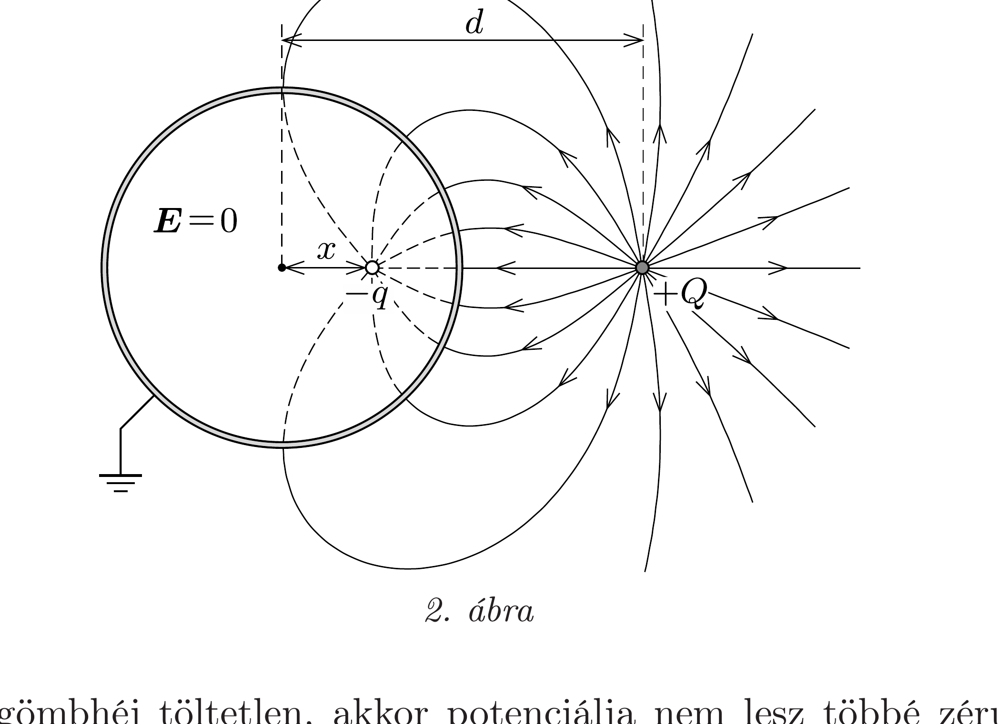
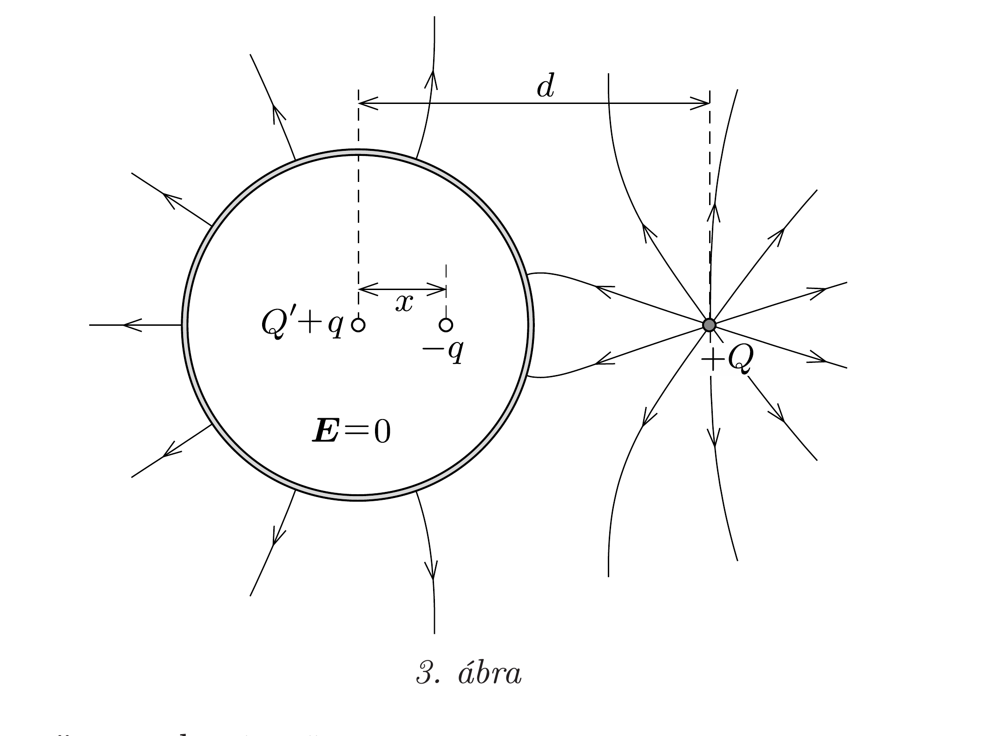
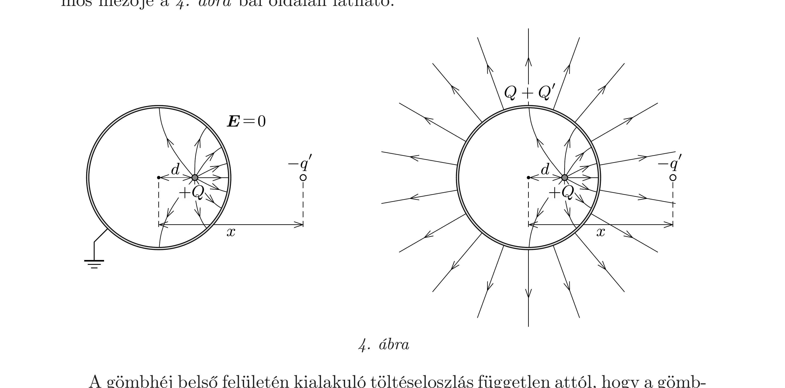

## Útmutatás

Alkalmazzuk a gömbi tükörtöltés módszerét! Ehhez tekintsünk két ellentétes előjelú ponttöltést ( $+Q_{1}$ és $-Q_{2}$ ), melyek egymástól bizonyos távolságra helyezkednek el. Keressük meg a két ponttöltés elektromos eróterének azon pontjait, amelyekben az elektromos potenciál nulla:
\[
k \frac{Q_{1}}{r_{1}}-k \frac{Q_{2}}{r_{2}}=0,
\]
ahol $r_{1}$ és $r_{2}$ az adott pont távolsága a két töltéstől (lásd az ábrát). Egyszerú átrendezés után ezt kapjuk: $Q_{1} / Q_{2}=r_{1} / r_{2}$. Apollóniosz tétele értelmében az ilyen pontok mértani helye térben gömb (Apollóniosz-gömb). Mivel a fém felülete ekvipotenciális, a gömbhéjon az elektromos megoszlás révén felhalmozódó (influált) felületi töltések hatása helyettesíthető alkalmasan választott nagyságú és helyzetú, képzeletbeli ponttöltésekkel (tükörtöltésekkel). Vajon hogyan?

## Megoldás

A könnyebb áttekinthetőség kedvéért tegyük fel, hogy a gyöngy töltése pozitív! Eredményeink (a megfelelő előjelek megváltoztatásával) természetesen negatív töltésú gyöngyre is érvényesek maradnak.
a) Ha a feladatban szereplő fémgömbhéjat földeljük, akkor nulla potenciálú lesz. A gömbön kívül, a középponttól $d>R$ távolságban elhelyezett $+Q$ ponttöltés hatására a gömbhéj külső felületén inhomogén töltéseloszlás jön létre. A gömbhéj belsejében (beleértve a héj falát is) nem lesz elektromos tér (Faraday-kalitka). A gömbön kívül kialakuló elektromos mezőt a felületi töltések és a $+Q$ töltésü gyöngyöcske együttesen hozza létre. A gömbi tükörtöltések módszere szerint (lásd az útmutatást) a gömbhéj felületén felhalmozódó töltések hatása helyettesíthető egyetlen, alkalmasan választott helyzetú és nagyságú, $-q$ ponttöltés hatásával.

Használjuk az 1. ábra jelöléseit, és legyen $\mathrm{a}-q$ tükörtöltés és a gömbhéj középpontjának távolsága $x$. A földelés miatt a gömbhéj $A$ és $B$ pontjaiban is nulla a potenciál értéke, ezért
\[
k \frac{Q}{d-R}-k \frac{q}{R-x}=0, \quad \text { valamint } \quad k \frac{Q}{d+R}-k \frac{q}{R+x}=0 .
\]

Ezekből az egyenletekből a tükörtöltés nagyságára és az $x$ távolságra a következő megoldást kapjuk:
\[
-q=-\frac{R}{d} Q, \quad x=\frac{R^{2}}{d} .
\]
A gömbhéjon kívül elhelyezkedő gyöngyre ható erő a $+Q$ töltés és a $-q$ gömbi tükörtöltés közötti Coulomb-eróvel egyenlő (hiszen az erő nem függ attól, hogy a gyöngy helyén az elektromos teret a gömbhéj felületi töltései vagy pedig egy képzeletbeli tükörtöltés hozza-e létre). A földelt gömbhéj esetében tehát a gyöngyre ható erőt a következőképp írhatjuk fel:
\[
F_{a}=-k \frac{Q q}{(d-x)^{2}}=-k Q^{2} \frac{R d}{\left(d^{2}-R^{2}\right)^{2}} .
\]
Látszik, hogy az eró mindig vonzó jellegú, és $d \rightarrow R$ esetén végtelenhez tart. A gömbön kívüli mező eróvonalait a 2. ábra mutatja.

b) Ha a gömbhéj töltetlen, akkor potenciálja nem lesz többé zérus, viszont felülete továbbra is ekvipotenciális marad. Feladatunk tehát az, hogy a földelt esethez képest a gömbhéj minden felületi pontjában azonos mértékben növeljük meg a potenciált úgy, hogy a gömb teljes töltése nulla legyen. Ez a követelmény könnyen teljesíthető, ha (a fentebb kiszámított $-q$ gömbi tükörtöltés mellé) a gömb középpontjába egy másik, $+q$ tükörtöltést képzelünk. A gömb belsejében továbbra sem lesz elektromos tér, a gömbön kívül pedig olyan mezó alakul ki, mintha azt a $+Q$ töltésú gyöngy és a két ( $-q$, illetve $+q$ nagyságú) tükörtöltés együttesen hozta volna létre.

A gyöngyöcskére ható erőt tehát úgy kaphatjuk meg, hogy az $a$ ) pontban kiszámolt erőhöz hozzáadjuk a gömb középpontjába helyezett $+q$ töltés taszítóerejét is:
\[
F_{b}=F_{a}+k \frac{Q q}{d^{2}}=-k Q^{2} \frac{R}{d^{3}}\left[\frac{d^{4}}{\left(d^{2}-R^{2}\right)^{2}}-1\right] .
\]

A szögletes zárójelben álló kifejezés $d>R$ miatt mindig nagyobb, mint nulla, ezért az erő a töltetlen gömb esetében is mindig vonzó jellegü.
$c)$ A $b$ ) esethez hasonlóan boldogulhatunk akkor is, ha a gömbünknek $Q^{\prime}$ töltése van (3. ábra). Ekkor a gömb középpontjába $Q^{\prime}+q$ nagyságú töltést kell képzelnünk, így lesz a gömbhéj külső felületén található összes (valódi) töltés $Q^{\prime}$ nagyságú. A gömbön belül az elektromos tér továbbra is zérus, a gömbön kívül pedig olyan lesz a mezó szerkezete, mintha azt a $+Q$ töltésú gyöngy, $a-q$ tükörtöltés és a gömb középpontjába helyezett $Q^{\prime}+q$ töltés együtt hozta volna létre.

Ez esetben a gyöngyre ható erő:
\[
F_{c}=F_{b}+k \frac{Q Q^{\prime}}{d^{2}}=-k Q^{2} \frac{R}{d^{3}}\left[\frac{d^{4}}{\left(d^{2}-R^{2}\right)^{2}}-1-\frac{Q^{\prime}}{Q} \frac{d}{R}\right] .
\]
Érdekes, hogy $F_{c}$ még azonos előjelú $Q$ és $Q^{\prime}$ esetén is lehet negatív, tehát vonzóerő, amennyiben a gyöngy elegendően közel van a gömb felületéhez.

Hátravan még annak megválaszolása, hogyan módosulnak az $a), b$ ) és $c$ ) pontokban kapott eredményeink, ha a gyöngyöcske nem a gömbhéjon kívül, hanem annak belsejében helyezkedik el. Ekkor a tükörtöltés a gömbön kívülre kerül, töltésének nagyságát és helyzetét most is a
\[
-q^{\prime}=-\frac{R}{d} Q, \quad x=\frac{R^{2}}{d}
\]
összefüggések adják meg $(d<R)$.
A földelt esetben a gömbhéjon belül lesz elektromos tér, mégpedig éppen olyan, amilyet a gyöngy és a $-q^{\prime}$ tükörtöltés együttesen hozna létre. A $+Q$ töltésú gyöngyből kiinduló erővonalak a gömbhéj belsó felületén felhalmozódó, összesen $-Q$ töltésú felületi töltéseken végződnek, hiszen csak így érhető el, hogy a gömbhéj falában továbbra is zérus legyen a térerősség. A gömbhéjon kívül nem lesz
elektromos tér, a belső felületi töltések a gyöngyöcske terét teljesen leárnyékolják (ellenkező esetben a gömbhéj potenciálja nem lenne zérus). A földelt eset elektromos mezóje a 4. ábra bal oldalán látható.

A gömbhéj belső felületén kialakuló töltéseloszlás független attól, hogy a gömbhéjat földeltük-e, vagy sem, ezért a gömbhéjon belül a töltetlen és a töltött esetben is ugyanolyan elektromos tér alakul ki, mint a földelt gömb esetén. Így a gyöngyre ható eró is ugyanakkora lesz mindhárom esetben:
\[
F=-k \frac{Q q^{\prime}}{(x-d)^{2}}=-k Q^{2} \frac{R d}{\left(R^{2}-d^{2}\right)^{2}} .
\]

A gömbhéjon kívüli mező viszont már eltérő lesz a három esetben. Ha a gömbhéj töltetlen, akkor a külsó felületén $+Q$ töltés halmozódik fel, egyenletes felületi töltéseloszlással. (Ennek magyarázata, hogy a külső felületen lévő töltések nem érzik a gömb belsejében lévő gyöngy hatását, mert a belsó felületi töltések tökéletesen leárnyékolják azt.) A külső elektromos tér töltetlen gömb esetén tehát olyan lesz, mintha azt egy, a gömb középpontjába helyezett $+Q$ töltés hozta volna létre. Ha a gömbhéj $Q^{\prime}$ töltéssel rendelkezik, akkor a külső felületére $Q^{\prime}+Q$ töltés szorul ki, a gömbön kívüli tér pedig egy $Q^{\prime}+Q$ nagyságú ponttöltés terével egyezik meg, ahogy azt a 4. ábra jobb oldala mutatja.

Megjegyzés. A fémgömbhéj belső és külső felületén kialakuló töltéseloszlást Gauss törvénye segítségével számíthatjuk ki. A felületi töltéssúrúség a valódi töltés és a tükörtöltés terének szuperpozíciójaként előállítható tényleges elektromos térerősséggel arányos $\left(\sigma=\varepsilon_{0} E\right)$.
