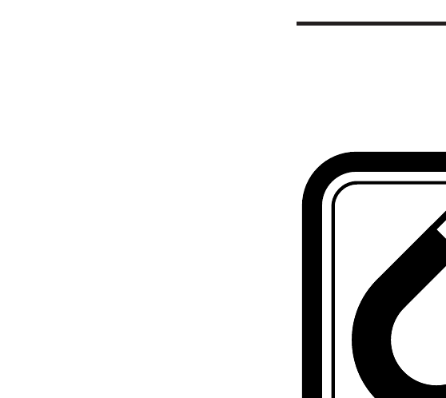
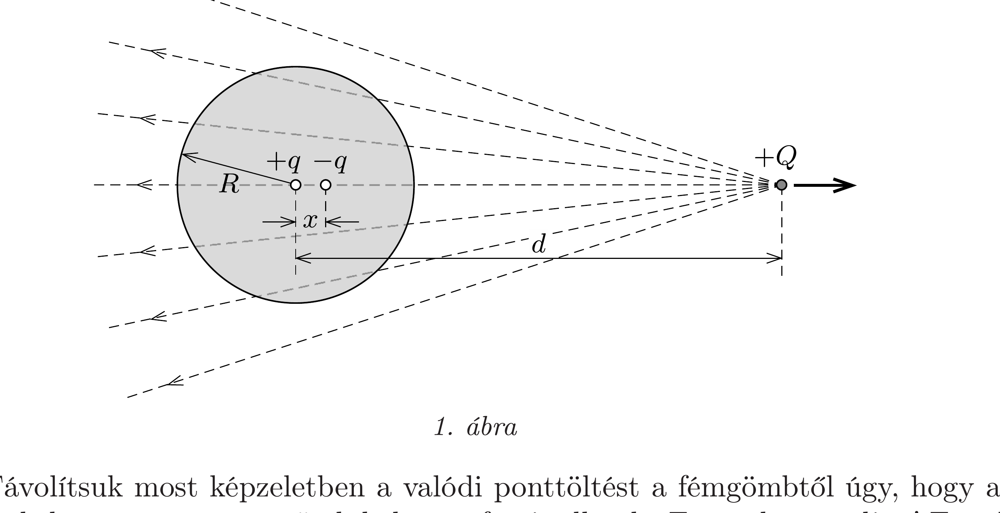
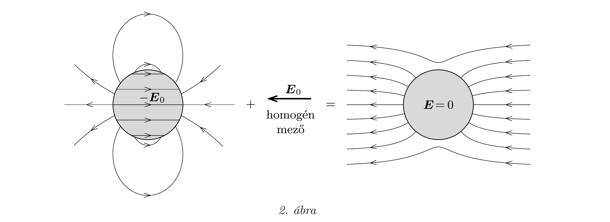
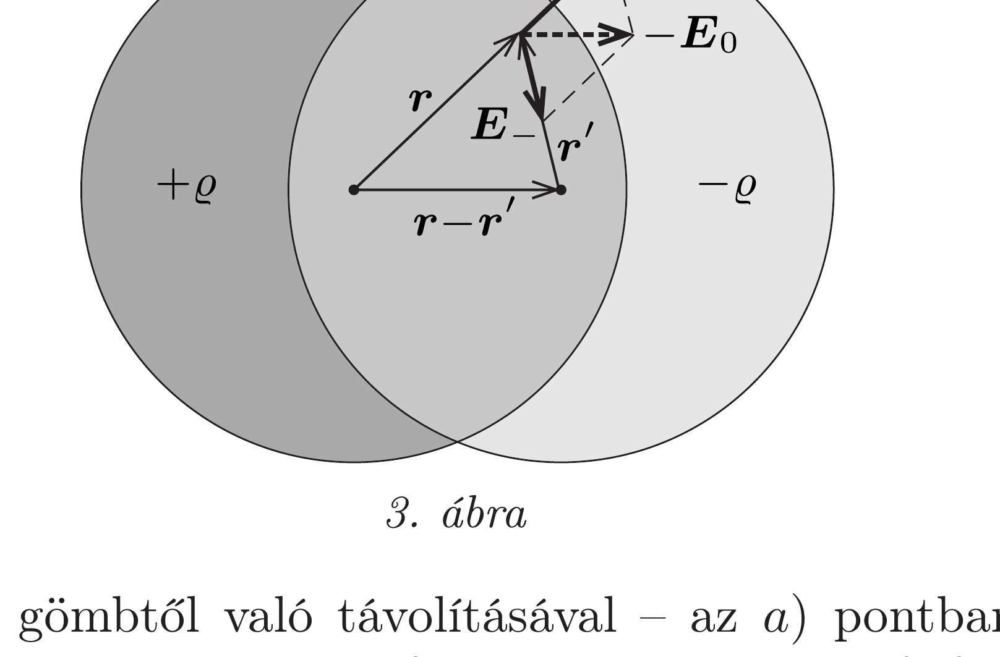
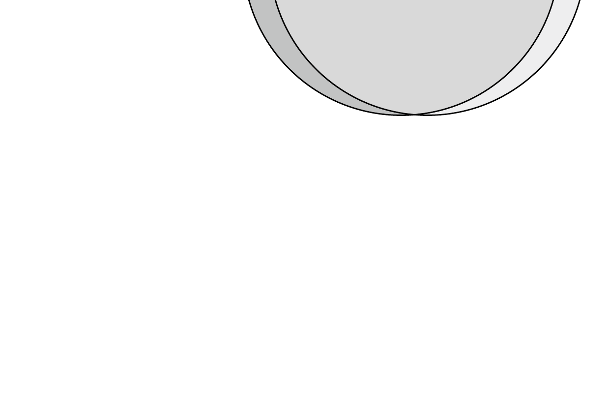
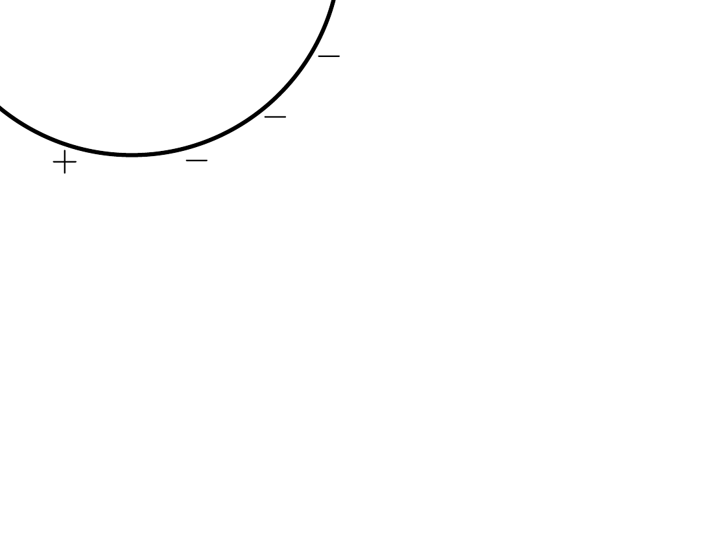

## Útmutatás

Induljunk ki az előző feladat b) részének megoldásából, és vizsgáljuk meg, hogyan változik a tükörtöltések helyzete és nagysága, ha a külső elektromos teret létrehozó pontszerú töltést távolítjuk a fémgömbtől! A fémgömb felületi töltéseloszlásának meghatározásához helyettesítsük a tükörtöltéseket $R$ sugarú, egyenletes térfogati töltéssűrúségú, egymást részben átfedő gömbökkel!

\section*{Magnetosztatika (időben állandó mágneses mezó)}

## Megoldás

Az előzó feladat megoldásában láttuk, hogyan írható le egy töltetlen fémgömbhéj és egy ponttöltés kölcsönhatása. Mivel a vezetó testek belsejében nincs elektrosztatikus tér, ezért az ottani eredmények tömör fémgömbre is érvényesek maradnak.
a) A homogén térbe helyezett fémgömb helyett tekintsük először azt az esetet, melyben a töltetlen gömbtől $d$ távolságra egy $+Q$ ponttöltés helyezkedik el! A gömbön kívüli térrészben az elektromos mező olyan, mintha azt a $+Q$ töltés és a gömb belsejében elhelyezkedő két tükörtöltés együttesen hozná létre. A tükörtöltések ellentétes elójelúek, nagyságuk
\[
\pm q= \pm \frac{R}{d} Q .
\]
A pozitív tükörtöltés a gömb középpontjában, a negatív pedig tőle $x=R^{2} / d$ távolságra található. Ha a fémgömb nem lenne jelen, akkor a $+Q$ töltés a gömb középpontjának helyén
\[
E_{0}=\frac{1}{4 \pi \varepsilon_{0}} \frac{Q}{d^{2}}
\]
nagyságú térerősséget hozna létre (1. ábra).

Távolítsuk most képzeletben a valódi ponttöltést a fémgömbtől úgy, hogy az általa keltett térerősség a gömb helyén a fenti, állandó $E_{0}$ érték maradjon! Ennek eléréséhez a $d$ távolsággal együtt a $Q$ töltés nagyságát is növelni kell, méghozzá a (2) egyenletből következő
\[
Q(d)=4 \pi \varepsilon_{0} E_{0} d^{2}
\]
összefüggés szerint. A $d$ távolság növelésével a valódi ponttöltés által a gömb helyén létrehozott elektromos tér szerkezete egyre inkább közelít a homogén térhez. A távolítás során a tükörtöltések abszolút értéke az (1) kifejezésnek megfelelően növekszik:
\[
q(d)=4 \pi \varepsilon_{0} E_{0} R d,
\]
távolságuk egyre kisebb lesz, viszont a $q \cdot x$ szorzat (a két tükörtöltés elektromos dipólmomentuma) állandó marad:
\[
p=q(d) \cdot x=4 \pi \varepsilon_{0} E_{0} R^{3} .
\]

A $d \rightarrow \infty$ határesetben tehát a gömbön kívüli elektromos mező egy, a gömb középpontjába helyezett, a (4) összefüggéssel megadott erősségü dipólus és az $E_{0}$ térerősségü homogén tér szuperpozíciójaként állítható elő. A fémgömb belsejében természetesen továbbra is zérus lesz a térerősség, tehát a fémgömb felületén felhalmozódó töltések önmagukban $-\boldsymbol{E}_{0}$ elektromos teret hoznának létre a gömb belsejében (2. ábra).

b) Olyan felületi töltéseloszlást kell találnunk, melynek elektromos tere éppen a 2. ábra első rajzán látható: kívül dipóltér, belül pedig homogén, $E_{0}$ térerősségü mező. Térjünk vissza arra az esetre, amikor a töltetlen fémgömböt nem homogén elektromos térbe, hanem a $+Q$ ponttöltés közelébe helyezzük! A fémgömb felületi töltéseinek hatását a gömbön kívül eddig a gömb belsejébe képzelt $+q$ és $-q$ nagyságú, pontszerú tükörtöltésekkel írtuk le (1. ábra). Módszerünk akkor is múködik, ha a tükörtöltéseket nem pontszerünek, hanem ( $+q$ és $-q$ össztöltésü) kiterjedt, homogén töltéseloszlású gömböknek képzeljük (még az sem okoz problémát, ha a két gömb között van átfedés).

Helyettesítsük ezért a két tükörtöltést egy-egy $+q$ és $-q$ össztöltésü, $R$ sugarú, homogén térfogati töltéseloszlású gömbbel, melyek középpontjainak távolsága $x$. A gömbök töltéssürúsége a töltés és a térfogat hányadosa:
\[
\varrho=\frac{q}{(4 \pi / 3) R^{3}}=\frac{3 \varepsilon_{0} E_{0} d}{R^{2}}=\frac{3 \varepsilon_{0} E_{0}}{x},
\]
ahol felhasználtuk a tükörtöltések nagyságára vonatkozó (3) összefüggést. A szuperpozíció miatt a „felfújt” töltésgömbök tere a gömbökön kívüli tartományban biztosan olyan lesz, mint a pontszerú tükörtöltések tere. De mi a helyzet abban a térrészben, ahol a töltésgömbök átfednek? Itt a töltéssürúség nulla, elektromos tér viszont van, mégpedig (ahogy azt az 56. feladatból már sejthetjük) homogén! Ennek belátásához tekintsük a 3. ábrát!

Ha csak a $+\varrho$ töltéssúrúségü gömb lenne jelen, akkor annak belsejében a térerósség (a középpontból induló $\boldsymbol{r}$ vektorral jellemzett helyen) Gauss törvénye se-
gítségével számolható:
\[
\boldsymbol{E}_{+} 4 \pi r^{2}=\frac{1}{\varepsilon_{0}} \frac{4 \pi r^{3}}{3} \varrho \frac{\boldsymbol{r}}{r},
\]
ebből
\[
\boldsymbol{E}_{+}=\frac{\varrho}{3 \varepsilon_{0}} \boldsymbol{r} .
\]
Ugyanígy, ha csak a negatív töltésú gömb lenne jelen, akkor belsejében a térerősség
\[
\boldsymbol{E}_{-}=-\frac{\varrho}{3 \varepsilon_{0}} r^{\prime}
\]
lenne, ahol $\boldsymbol{r}^{\prime}$ a gömb középpontjából az adott helyre mutató vektor. Mivel mindkét gömb jelen van, így az átfedési tartományban az eredő térerősség
\[
\boldsymbol{E}_{+}+\boldsymbol{E}_{-}=\frac{\varrho}{3 \varepsilon_{0}}\left(\boldsymbol{r}-\boldsymbol{r}^{\prime}\right)=E_{0} \frac{d}{R^{2}}\left(\boldsymbol{r}-\boldsymbol{r}^{\prime}\right)=-\boldsymbol{E}_{0}
\]
lesz, ahol felhasználtuk, hogy $\left|\boldsymbol{r}-\boldsymbol{r}^{\prime}\right|=x=R^{2} / d$. Az átfedés térrészében tehát az elektromos mező valóban homogén, a térerősség abszolút értéke pedig szerencsére éppen $E_{0}$.

Ha a +Q töltés gömbtől való távolításával - az $a$ ) pontban leírt módon - közelítünk a homogén térbe helyezett fémgömb esetéhez, a „felfújt” töltésgömbök középpontjainak távolsága egyre csökken, miközben térfogati töltéssúrúségük az (5) kifejezésnek megfelelően növekszik (végtelenhez tart), a töltésréteg vastagsága pedig egyre csökken (nullához tart). Határesetben a térfogati töltéseloszlás felületi töltéseloszlásba megy át (4. ábra).

Az egységnyi felületre jutó töltést a térfogati töltéssúrúség és a gömbök át nem fedő részei $\delta$ vastagságának szorzataként számíthatjuk. Így a homogén térbe helyezett fémgömb határesetében a felületi töltéssűrúség a külső elektromos térrel $\varphi$ szöget bezáró irányban:
\[
\sigma(\varphi)=\varrho \delta(\varphi)=\varrho x \cos \varphi=3 \varepsilon_{0} E_{0} \cos \varphi .
\]

Megjegyzések. 1. A felületi töltéssürúséget a Gauss-törvényből következő $\sigma=\varepsilon_{0} E$ összefüggés segítségével is meg lehet határozni, ahol $E$ az elektromos térerősség (előjeles) nagysága a fémgömbön kívül, a felület közvetlen közelében.
2. A leírtakhoz hasonló módon határozhatjuk meg egy homogén elektromos térbe helyezett, a térerősségre merőleges tengelyú, hosszú, semleges fémhenger elektromos terét és töltéseloszlását is.

C

\section*{Magnetosztatika (időben állandó mágneses mezõ)}
