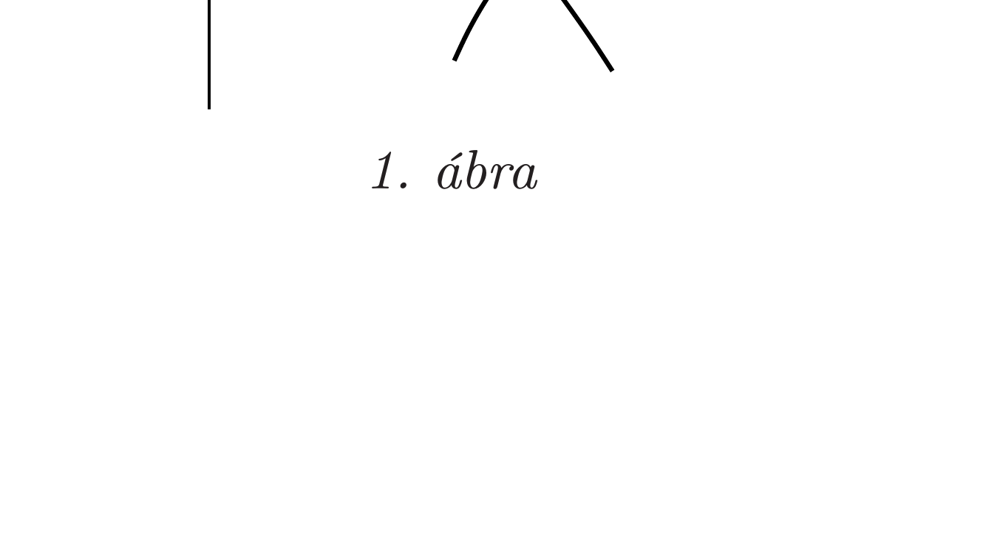
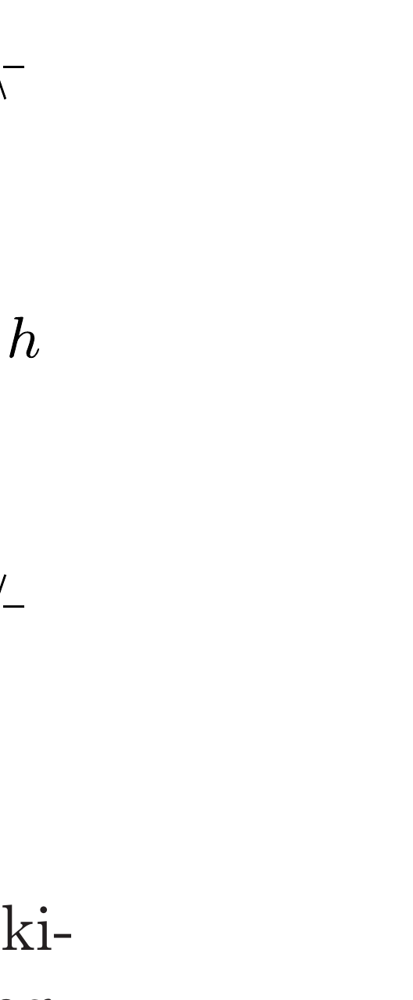

## Útmutatás

Határozzuk meg az $A$ mágnesre ható $F(x)$ eredő erốt (a mágneses eró, a nehézségi eró és a fonáleró összegét) mint a mágnesek közötti $x$ távolság függvényét! Ezt az $F(x)$ függvényt használhatjuk fel az egyensúlyi állapot és a stabilitás feltételének a meghatározására.

## Megoldás

a) Mozgassuk az $A$ mágnest, miközben a $B$ mágnes $d+s$ távolsága az $A$ mágnes eredeti („háborítatlan”) pozíciójától maradjon állandó. Az $A$ mágnesre ható vízszintes eró (amit növekvő $x$ irányban mérünk, azaz a feladathoz tartozó ábrán balra) így írható:
\[
F(x)=-\frac{K}{x^{n}}+m g \frac{(d+s-x)}{\ell} .
\]
Az egyensúly feltétele:
\[
\left.F(x)\right|_{x=d}=0 .
\]

A feladatban leírt kísérlet során az $A$ jelú mágnes természetesen nem csak az $x=d$ helyzetben, hanem minden $x>d$ távolság esetén is egyensúlyban volt. A mágnesek közelítése során azonban az $A$ mágnes egyensúlyának jellege éppen az $x=d$ távolságnál változott meg stabilról instabilra. Az egyensúlyi állapot stabilitása az $F(x)$ függvény viselkedésétől függ az $x=d$ hely közelében. A függvény lehet monoton módon növekvő vagy csökkenő, ahogy ez az 1. ábrán látható.

Stabil egyensúly esetén az erôfüggvény deriváltjának negatívnak kell lennie, ugyanis az egyensúlyi helyzetéből kicsit kitérített mágnesre ekkor hat visszatérítő irányú erő. Instabil esetben a derivált pozitív, míg a két esetet elválasztó határesetben a derivált nulla, azaz
\[
\left.F^{\prime}(x)\right|_{x=d}=0 .
\]
Az $F(x)$ eró (1) kifejezését felhasználva a (3) feltétel így írható:
\[
\frac{n K}{d^{n+1}}-\frac{m g}{\ell}=0 .
\]
A (2) feltétel pedig egyensúlyban így alakul:
\[
-\frac{K}{d^{n}}+\frac{m g}{\ell} s=0 .
\]
A (4) és (5) egyenletekből a hatványkitevőre és a $K$ állandó értékére a következő eredményeket kapjuk:
\[
n=\frac{d}{s}=4 \quad \text { és } \quad K=\frac{s}{\ell} m g d^{4} .
\]

Megjegyzés. A 281. feladatban látni fogjuk, hogy a mágnesek közötti erőhatás (a mágneses dipól-dipól kölcsönhatás egyik megnyilvánulása) valóban a távolság negyedik hatványával fordítottan arányos.
b) A 2. ábrán látható függőleges üvegcsőben az $A$ mágnesre ható függőleges erő (a felfelé mutató irányt választva pozitívnak)
\[
F_{\text {függ }}(x)=+\frac{K}{x^{4}}-m g .
\]

Egyensúlyi lebegtetés esetén a mágnesek közötti $h$ távolságra a függőleges erón nulla:
\[
\left.F_{\text {függ }}(x)\right|_{x=h}=0 .
\]
A (6) eredményünket felhasználva a $h$ távolságot kiszámíthatjuk:
\[
h=\left(\frac{K}{m g}\right)^{1 / 4}=d\left(\frac{s}{\ell}\right)^{1 / 4}=4 \mathrm{~cm} \cdot\left(\frac{1}{100}\right)^{1 / 4} \approx 1,3 \mathrm{~cm} .
\]

