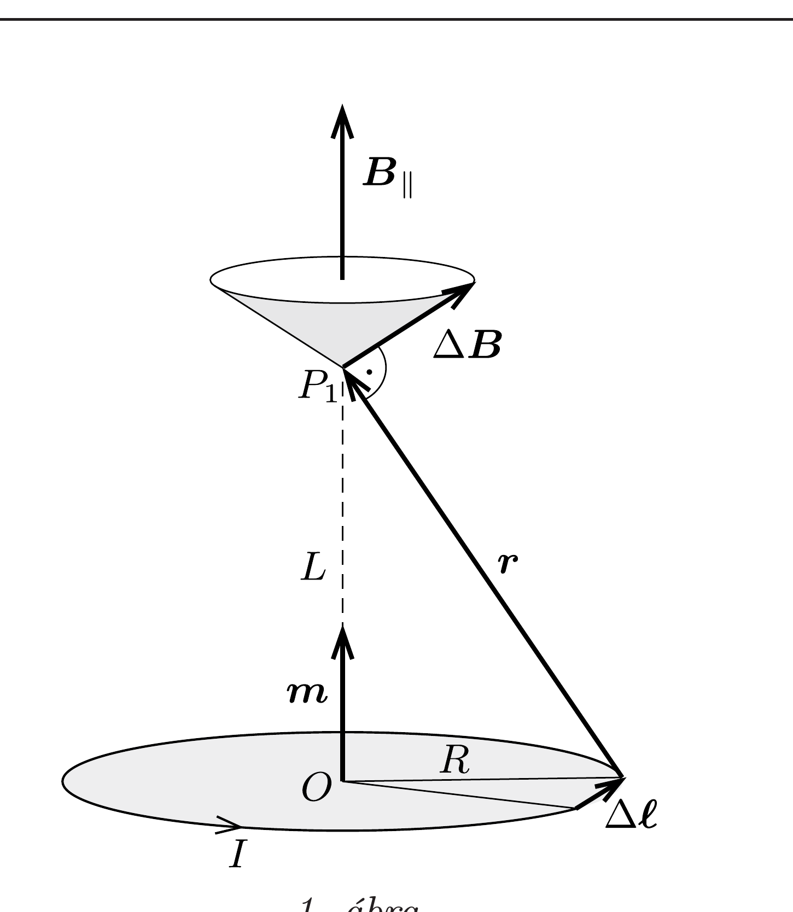
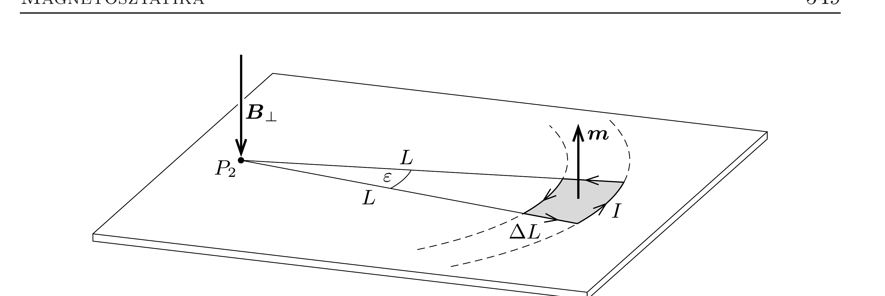
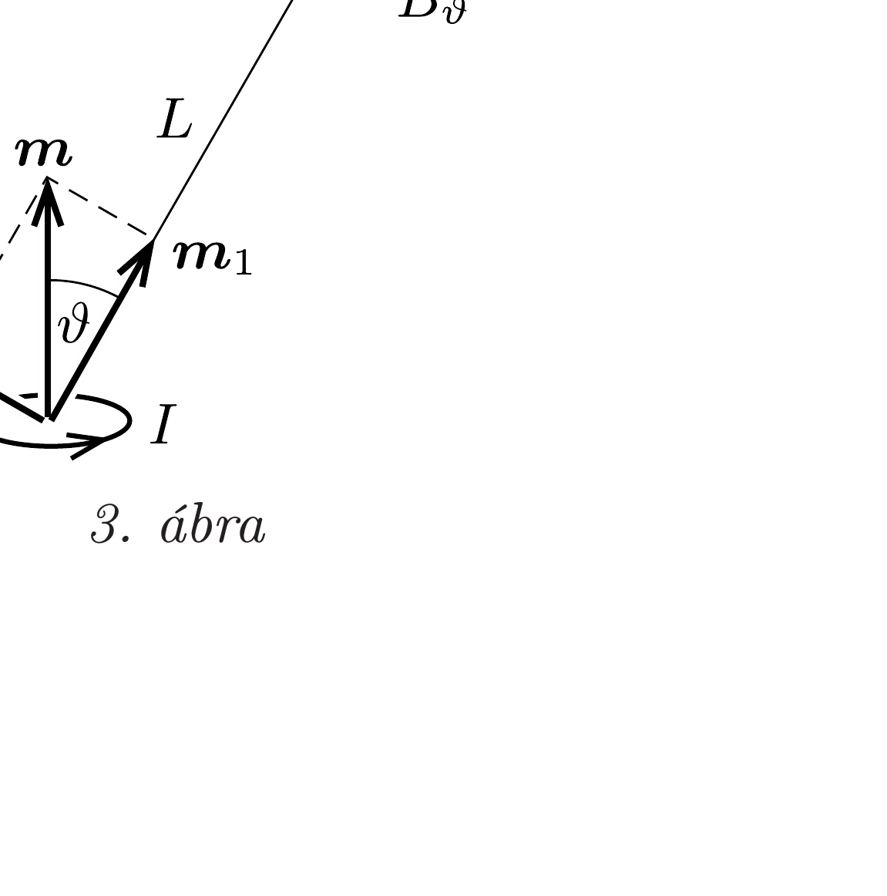

## Útmutatás

Az $a$ ) esetben a Biot-Savart-törvény segítségével egyszerú összegzéssel meghatározhatjuk az indukció értékét. A b) esetben induljunk ki abból a tényből, hogy egy síkbeli zárt vezető által létrehozott mágneses mező a vezetőtől távol egy pontszerú mágneses dipólus terével egyezik meg, és ennek a dipólusnak az eróssége (mágneses dipólnyomatéka) a vezetőben folyó áramnak és a vezető által határolt területnek a szorzata. Ha tehát a köráramot helyettesítjük egy más alakú (kényelmesebben kezelhető) áramvezetővel, amelynek területe ugyanakkora, mint az eredeti köráramé (vagyis $R^{2} \pi$ ), és a benne folyó áram erőssége is megegyezik a feladatban szereplő köráraméval, akkor a mágneses terük - legalábbis a vezetőktől távol - ugyanolyan lesz.

## Megoldás

a) A Biot-Savart-törvény szerint egy $I$ erósségú árammal átjárt kicsiny, $\Delta \boldsymbol{\ell}$ vektorral jellemezhető vezetékdarabka a hozzá képest $\boldsymbol{r}$ vektorral megadott helyen
\[
\Delta \boldsymbol{B}=\frac{\mu_{0} I}{4 \pi} \frac{\Delta \boldsymbol{\ell} \times \boldsymbol{r}}{|\boldsymbol{r}|^{3}}
\]
mágneses indukciót hoz létre. A teljes (zárt) vezető mágneses terét egyszerú (szimmetrikus) esetekben ezen $\Delta \boldsymbol{B}$ járulékok összegzésével, általános esetben pedig integrálásával kaphatjuk meg.

A körvezető szimmetriatengelyén, a tőle $L$ távolságban lévő $P_{1}$ pontban az eredő mágneses indukció a szimmetria miatt tengelyirányú (tehát a körvezető $\boldsymbol{m}$ dipólmomentumával párhuzamos), így elegendő a $\Delta \boldsymbol{B}$ járulékok ilyen irányú komponenseit kiszámítani, majd ezeket összegezni (lásd az 1. ábrát). Az ábra jelöléseivel:
\[
B_{\|}=\sum \frac{\mu_{0} I}{4 \pi} \frac{\Delta \ell}{r^{2}} \frac{R}{r}=\frac{\mu_{0}}{4 \pi} \frac{I R}{r^{3}} \sum \Delta \ell=\frac{\mu_{0}}{4 \pi} \frac{2}{r^{3}} \underbrace{\left(I R^{2} \pi\right)}_{|\boldsymbol{m}|} .
\]
Az utolsó kifejezés zárójeles része éppen a köráram $\boldsymbol{m}$ mágneses dipólmomentumának nagysága, így a mágneses indukcióvektor értéke a $P_{1}$ pontban (azaz a Gauss-féle első főhelyzetben)
\[
\boldsymbol{B}_{\|}=\frac{\mu_{0}}{4 \pi} \frac{2 \boldsymbol{m}}{\left(R^{2}+L^{2}\right)^{3 / 2}} \approx \frac{\mu_{0}}{2 \pi} \frac{\boldsymbol{m}}{L^{3}},
\]
nagysága pedig $|\boldsymbol{m}|=I R^{2} \pi$ felhasználásával:
\[
B_{\|}=\frac{\mu_{0} I R^{2}}{2 L^{3}} .
\]
b) Nehezebb feladat a körvezetó síkjában mérhető $\boldsymbol{B}_{\perp}$ indukcióvektor meghatározása (a merőlegességet kifejező index arra utal, hogy a mágneses momentum irányára merőleges irányban vizsgáljuk a mágneses indukciót). Ehhez helyettesítsük a körvezetőt egy vele azonos területú (és dipólnyomatékú) körgyürú-cikkel a 2. ábrán látható módon, és számoljuk annak mágneses terét a körcikk $P_{2}$ középpontjában! Ebben a helyettesítő vezetőkeretben az $I$ erősségú áram az $L$ és $L+\Delta L$ sugarú körívek $(\Delta L \ll L)$, valamint egymással kicsiny $\varepsilon$ szöget bezáró egyenes szakaszok mentén folyik.

Az $\varepsilon$ szög kicsiny volta miatt a vezetőkeret területe jó közelítéssel $L \varepsilon \Delta L$, így mágneses momentuma
\[
|\boldsymbol{m}|=I L \varepsilon \Delta L .
\]
A vezetőkeretet határoló körívek $P_{2}$ középpontjában a mágneses indukció meróleges az áramvezető síkjára, iránya $\boldsymbol{m}$-mel ellentétes, nagyságához pedig csak a két körív mentén folyó áramok adnak járulékot:
\[
B_{\perp}=\frac{\mu_{0}}{4 \pi} \frac{I \varepsilon L}{L^{2}}-\frac{\mu_{0}}{4 \pi} \frac{I \varepsilon(L+\Delta L)}{(L+\Delta L)^{2}} \approx \frac{\mu_{0}}{4 \pi} \frac{1}{L^{3}} \underbrace{(I L \varepsilon \Delta L)}_{|\boldsymbol{m}|} .
\]
Az utolsó zárójeles kifejezés éppen a mágneses dipólmomentum nagyságával egyezik meg, amely ugyanakkora az eredeti körvezető és a helyettesítő áramvezető esetén. A mágneses indukcióvektor értéke tehát a Gauss-féle második főhelyzetben (az irányokat is figyelembe véve):
\[
\boldsymbol{B}_{\perp}=-\frac{\mu_{0}}{4 \pi} \frac{\boldsymbol{m}}{L^{3}}
\]
alakban adható meg, amelynek nagysága a köráram adataival kifejezve
\[
B_{\perp}=\frac{\mu_{0} I R^{2}}{4 L^{3}},
\]
tehát éppen feleakkora, mint az első főhelyzetben.
Megjegyzés. A Gauss-féle fóhelyzetekhez tartozó mágneses indukciók ismeretében tetszőleges helyen ki tudjuk számítani a köráram (vagy általánosabban: egy dipól) mágneses terét. Ha például a dipól tengelyével $\vartheta$ szöget bezáró irányban, a dipóltól $L$ távolságra lévó $P$ pontban keressük a $\boldsymbol{B}$ indukcióvektort, akkor érdemes $\boldsymbol{m}$-et a 3. ábrán látható két vektor összegére bontani; ezek nagysága: $m_{1}=m \cos \vartheta$ és $m_{2}=m \sin \vartheta$. A $P$ pont a felbontásban szereplő dipóloknak első, illetve második Gauss-féle főhelyzete, tehát a mágneses indukció „radiális” és „tangenciális” komponense:
\[
B_{r}=\frac{\mu_{0}}{2 \pi} m \frac{\cos \vartheta}{L^{3}}, \quad \text { illetve } \quad B_{\vartheta}=\frac{\mu_{0}}{4 \pi} m \frac{\sin \vartheta}{L^{3}} .
\]

Ennek az eredménynek elektromos megfelelőjét használtuk fel a 241. feladatban az elektromos dipól erőterében mozgó töltött gyöngyszem mozgásegyenletének felírásakor.
