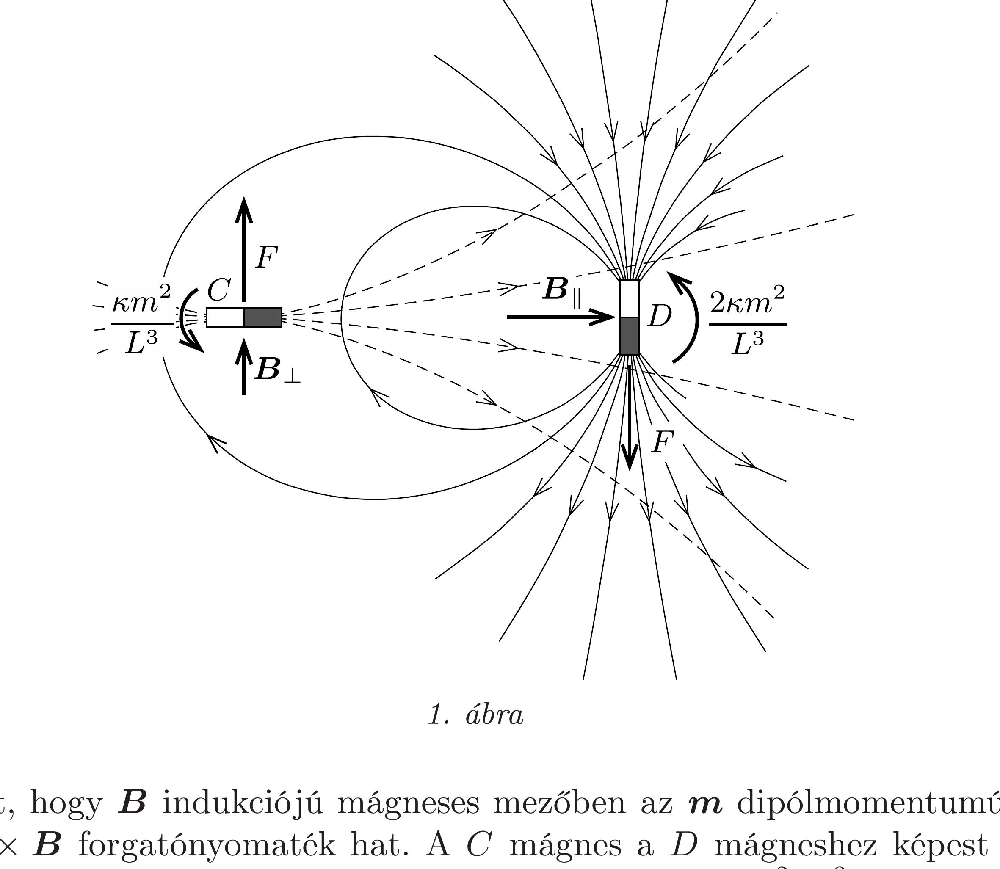
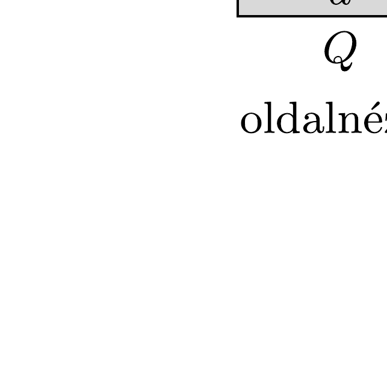
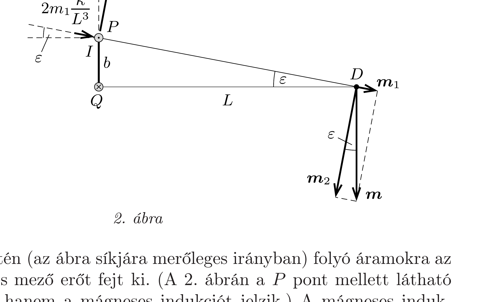

## Útmutatás

a) Az előzó feladat megoldásában láttuk, hogyan számolható egy mágneses dipól által keltett indukció a dipól tengelyén (az ún. Gauss-féle első főhelyzetben), illetve a dipól tengelyére merőleges síkban (a Gauss-féle második főhelyzetben). Az ottani (áramjárta körvezetőre kapott) eredmények kis mágnesekre is érvényesek.
b) Első pillantásra úgy túnhet, hogy a rendszer felfüggesztésével örökmozgót (perpetuum mobilét) készíthetünk! A paradoxon feloldásához gondoljuk meg, hogy a két mágnes kölcsönhatása csak az egymásra kifejtett forgatónyomatékokat jelenti-e, vagy - esetleg - még bizonyos eróhatásokat is figyelembe kell vennünk.

## Megoldás

a) Egy $\boldsymbol{m}$ dipólnyomatékú, kis méretú mágnesrúd („dipól”) erốtere a mágnestől távol ugyanolyan, mint egy $R^{2} \pi$ területú, $I$ erősségú árammal átjárt kicsiny, sík körvezető mágneses tere, amennyiben fennáll, hogy $I R^{2} \pi=|\boldsymbol{m}|$, ezért alkalmazhatjuk az előző feladat megoldásában kapott eredményeket. Ezek szerint az $\boldsymbol{m}$ dipólnyomatékú kis mágnes tengelyén (Gauss-féle I. főhelyzet) a mágneses indukcióvektor értéke
\[
\boldsymbol{B}_{\|}=2 \kappa \frac{\boldsymbol{m}}{L^{3}},
\]
a mágnesre illeszkedő, annak tengelyére merőleges síkban (Gauss-féle II. főhelyzet) pedig
\[
\boldsymbol{B}_{\perp}=-\kappa \frac{\boldsymbol{m}}{L^{3}},
\]
ahol bevezettük a $\kappa=\mu_{0} /(4 \pi)$ rövidítést.

Ismert, hogy $\boldsymbol{B}$ indukciójú mágneses mezőben az $\boldsymbol{m}$ dipólmomentumú mágnesre $\boldsymbol{m} \times \boldsymbol{B}$ forgatónyomaték hat. A $C$ mágnes a $D$ mágneshez képest éppen a Gauss-féle II. főhelyzetben helyezkedik el, ezért $C$-re $\kappa m^{2} / L^{3}$ nagyságú és az óramutató járásával ellenkezó forgásirányú forgatónyomaték hat (1. ábra). A $D$ mágnes viszont a $C$ mágnes I. főhelyzetében található, ezért a $C$ mágnes által a $D$-re kifejtett forgatónyomaték nagysága $2 \kappa m^{2} / L^{3}$, iránya pedig szintén az óramutató járásával ellentétes.
b) Mivel a mágnesek által egymásra kifejtett forgatónyomatékok eredője nem nulla, könnyen azt gondolhatnánk, hogy a súlypontjában felfüggesztett rúd forgásba jön. Ekkor azonban perpetuum mobilét készíthetnénk, ami ellentmondana az energiamegmaradás törvényének.

A paradoxon feloldása az, hogy a mágnesek nemcsak forgatónyomatékot fejtenek ki egymásra, hanem erốt is, hiszen egymás inhomogén terében helyezkednek el. Megmutatjuk, hogy pl. a $D$ jelú mágnes által a $C$ mágnesre kifejtett erő $F=3 \kappa m^{2} / L^{4}$ nagyságú, továbbá az iránya nem esik egybe a mágneseket összekötó egyenessel, hanem merốleges arra, $\boldsymbol{B}_{\perp}$ irányával megegyező. Ugyanekkora, de ellentétes irányú erő hat a $D$ mágnesre. A mágnesekre ható erők erőpárt alkotnak, aminek $F L=3 \kappa m^{2} / L^{3}$ forgatónyomatéka van. Ez a forgatónyomaték olyan nagyságú és olyan irányú, hogy éppen kioltja az $a$ ) részben kiszámolt forgatónyomatékok hatását. Így a rendszert felfüggesztve semmi meglepő dolog nem történik, a mágneseket tartó szerkezet - összhangban a szimmetrián alapuló megfontolásokkal és az energiamegmaradással - nem jön forgásba.

A mágnesek között ható erő kiszámításához helyettesítsük a $C$ mágnest egy $I$ árammal átjárt, $a$ és $b$ oldalélű, kicsiny, téglalap alakú vezetőkerettel. Az áramvezető mágneses nyomatéka éppen akkora, mint a rúdmágnesé, ha teljesül, hogy $a b I=m$. Helyezzük el ezt a vezetőkeretet a 2. ábrán látható módon, és számítsuk ki, mekkora erőt fejt ki az egyes (áramjárta) oldalélekre a másik $(D)$ mágnes erőtere. Az ábra bal oldalán látható oldalnézeten függőlegesen futó élekre ható eredő eró nulla, így elegendő a felső $(P)$ és az alsó $(Q)$ oldaléllel foglalkoznunk. Ezek az $a$ hosszúságú, egymástól $b$ távolságra lévó élek a 2 . ábra jobb oldali részén egy-egy pontnak látszanak.

A $P$ és $Q$ élek mentén (az ábra síkjára merőleges irányban) folyó áramokra az ott észlelhető mágneses mező erőt fejt ki. (A 2. ábrán a $P$ pont mellett látható nyilak nem az eróket, hanem a mágneses indukciót jelzik.) A mágneses indukció „függőleges” ( $P Q$ irányú) komponense az áramokra „vízszintes” ( $Q D$ irányú) eróket fejt ki. Ezen (egyforma nagyságú, de ellentétes irányú) erők eredője nulla, a forgatónyomatékukat pedig - a feladat $a$ ) részében - már figyelembe vettük.

A köráramra ható eredő erő a mágneses indukció vízszintes (a $Q D$ szakasszal párhuzamos) komponensétől származik; számítsuk ki tehát most ezeket a komponenseket.

A $Q$ él mentén a mágneses indukció $m \kappa / L^{3}$ nagyságú (hiszen ez az él a $D$ mágnes II. főhelyzetében található), függőlegesen felfelé mutat, a vízszintes komponense tehát nulla. A $P$ élnél a mágneses indukció kiszámítása már egy kicsit bonyolultabb, hiszen ez az él nem esik egybe a Gauss-féle második főhelyzettel, attól kicsiny $\varepsilon=\operatorname{arctg}(b / L)$ szöggel eltér. Bontsuk fel emiatt a $D$ mágnes dipólnyomatékát az $m \sin \varepsilon$ nagyságú, $D P$ irányú $\boldsymbol{m}_{1}$, illetve az erre merőleges, $m \cos \varepsilon$ nagyságú $\boldsymbol{m}_{2}$ vektorok összegére. Ezekhez képest a $P$ él már a Gauss-féle főhelyzetekbe kerül, és az eredő mágneses tér két tag összegeként kiszámítható. Az eredő mágneses indukció $Q D$ irányú komponense
\[
B_{Q D}=\frac{2 \kappa}{L^{3}} m_{1} \cos \varepsilon+\frac{\kappa}{L^{3}} m_{2} \sin \varepsilon=\frac{3 \kappa m}{L^{3}} \sin \varepsilon \cos \varepsilon \approx \frac{3 \kappa m}{L^{3}} \frac{b}{L}
\]
nagyságú, amely az áramjárta, $a$ hosszúságú oldalélre
\[
F=\frac{3 \kappa m}{L^{3}} \frac{b}{L} I a=\frac{3 \kappa m^{2}}{L^{4}}
\]
nagyságú Lorentz-erőt fejt ki (amint az 1. ábrán látható). Ez tehát a $C$ mágnesre ható eredő erő, amely az ábra síkjában, a mágneseket összekötő egyenesre merőlegesen, $Q P$ irányban hat. Ennek az erőnek és a $D$ mágnesre ható ellenerejének (mint erőpárnak) a forgatónyomatéka $F L=3 \kappa m^{2} / L^{3}$ nagyságú és az óramutató járásával megegyező irányú, így valóban egyensúlyt tart a két mágnes egymásra kifejtett forgatónyomatékának összegével.

Megjegyzés. A feladatban szereplő rendszer érdekes példát mutat olyan erő-ellenerő párra, amelyben az erók egyforma nagyságúak, párhuzamosak, de nem egybeesó egyenesek mentén hatnak, tehát nem centrálisak.
