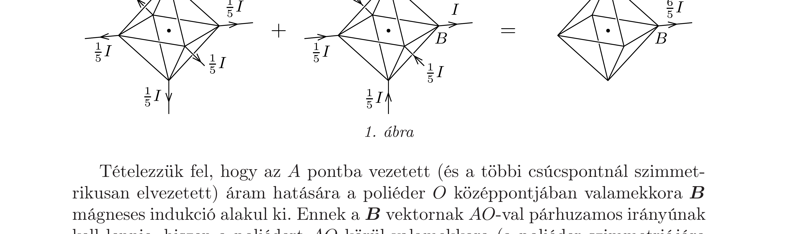
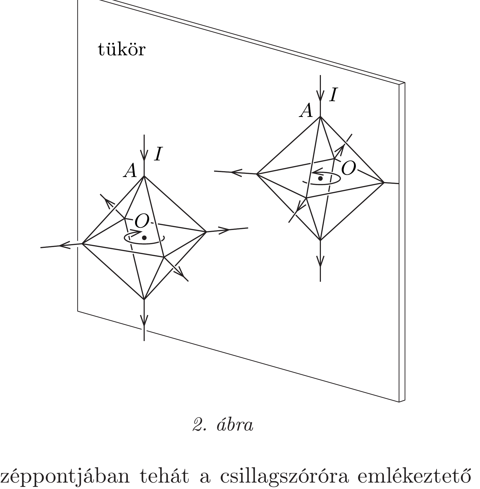

## Útmutatás

Az oldalélekben folyó áramok az áramerősséggel arányos nagyságú mágneses indukciót hoznak létre a tetraéder középpontjában. Az egyes indukciójárulékok iránya mindig párhuzamos a tetraéder valamelyik oldalélével.

## Megoldás

I. megoldás. Az elrendezésben a $C$ és a $D$ pontok teljesen szimmetrikus szerepet töltenek be, emiatt ekvipotenciálisak, közöttük nem folyik áram. Az $A C B$ és $A D B$ ágak ellenállása kétszerese az $A B$ ág ellenállásának, így a megfelelő áramerősségek:
\[
I_{A C}=I_{C B}=I_{A D}=I_{D B}=I / 4, \quad I_{A B}=I / 2 .
\]

A Biot-Savart-törvény szerint egy véges hosszúságú egyenes vezetődarab járuléka az általa létrehozott mágneses mezőhöz arányos a vezetékben folyó árammal, és a mező iránya valamely $O$ pontban merőleges arra a síkra, amely a vezetóre és az $O$ pontra illeszkedik. Így például az $A C$ szakasz járuléka az $O$ pontbeli mágneses indukcióvektorhoz
\[
\boldsymbol{B}_{A C}=k I \cdot \overrightarrow{B D},
\]
ahol $k$ (a tetraéder méretétól is függő) pozitív szám. (Felhasználtuk, hogy a szabályos tetraéder szemközti élei merőlegesek egymásra, így a $\overrightarrow{B D}$ vektor éppen
a Biot-Savart-törvénynek és a jobbkéz-szabálynak megfelelő irányú.) A többi él járuléka is hasonlóan számolható, és mivel a két hosszú egyenes vezető a középpontban nem hoz létre mágneses teret, a teljes mágneses indukció az $O$ pontban:
\[
\boldsymbol{B}=k I(\overrightarrow{B D}+\overrightarrow{A D}+\overrightarrow{C B}+\overrightarrow{C A}+2 \overrightarrow{D C})
\]
Ez a vektor viszont
\[
\overrightarrow{A D}+\overrightarrow{D C}=\overrightarrow{A C}=-\overrightarrow{C A} \quad \text { és } \quad \overrightarrow{B D}+\overrightarrow{D C}=\overrightarrow{B C}=-\overrightarrow{C B}
\]
miatt nullvektor, vagyis a mágneses indukció a tetraéder középpontjában nulla.
II. megoldás. Megmutatjuk, hogy mindegyik szabályos poliéderre (a tetraéder mellett a kockára, az oktaéderre, a dodekaéderre és az ikozaéderre is) igaz a következő állítás: a poliéder bármely két csúcsánál „centrálisan” oda-, illetve elvezetett áram hatására kialakuló mágneses mező a poliéder $O$ középpontjában nulla.

Képzeljük el a következő (csillagszóróra emlékeztető) elrendezést: a poliéder egyik (mondjuk $A$ jelű) csúcsához egy hosszú, egyenes, a középpont felé irányuló vezetéken $I$ áramot vezetünk, az összes többi csúcsból pedig hasonló irányítású huzalokon egyforma erősségú áramot vezetünk el. Hozzunk létre egy másik, hasonló árameloszlást: vezessünk el a $B$ pontból $I$ áramot, az összes többi csúcspontba pedig egyforma erősségú befolyó áramokkal folyamatosan pótoljuk a hiányzó töltéseket. Ezen két árameloszlás szuperpozíciója éppen az állításunkban szerepló áramelrendezést adja (1. ábra); így tehát ha sikerül belátnunk, hogy egyetlen „csillagszóró" mágneses tere a poliéder középpontjában nulla, akkor a két tetszőleges helyzetű külső vezetékes árameloszlásra is bizonyítottuk állításunkat.

Tételezzük fel, hogy az $A$ pontba vezetett (és a többi csúcspontnál szimmetrikusan elvezetett) áram hatására a poliéder $O$ középpontjában valamekkora $\boldsymbol{B}$ mágneses indukció alakul ki. Ennek a $\boldsymbol{B}$ vektornak $A O$-val párhuzamos irányúnak kell lennie, hiszen a poliédert $A O$ körül valamekkora (a poliéder szimmetriájára jellemző, az oktaéder esetén pl. 90°-os) szöggel elforgatva az eredetivel megegyező áramelrendezést kapjuk vissza, és ezzel a „diszkrét szimmetriával” nyilván a mágneses mező is rendelkezik.

Képzeljük el, hogy a poliéder középpontjának közelében egy töltött részecske az $A O$ tengely körül körpályán mozog. Ha alkalmasan választjuk meg a részecske
szögsebességét és keringési irányát, akkor az $O$ pontban mérhető mágneses mező éppen biztosítani képes a körmozgáshoz szükséges nagyságú és irányú centripetális erőt. Képzeljük el továbbá azt is, hogy az egész elrendezést (az árameloszlást, a kialakuló mágneses mezőt és a keringő részecskét) egy tükörből nézzük (2. ábra). A poliéder tükörképe az eredetivel megegyező poliéder lesz, az árameloszlás is ugyanolyan, mint a „tükör előtti világban", a részecske keringése azonban megfordul. Ha a részecske a valóságban az $A$ pont felől nézve mondjuk az óramutatóval megegyező irányban forog, akkor a „tükrön túl” a forgásának iránya éppen ellenkező lesz. A tükrözött elrendezésben tehát a mágneses mező fordított irányú, mint a valóságban, noha az árameloszlás mindkét esetben ugyanaz, tehát a $\boldsymbol{B}$ vektornak sem lenne szabad megváltoznia. Egyetlen olyan vektor van, amelyik önmaga $(-1)$-szerese: a nullvektor.

A poliéder középpontjában tehát a csillagszóróra emlékeztető elrendezésben nem lehet nullától különböző mágneses indukció, és az egyenletek linearitása (szuperponálhatósága) miatt ugyanez érvényes a csillagszórókból összetehető bonyolultabb áramelrendezésekre is.
