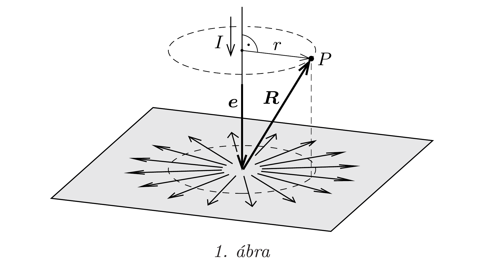
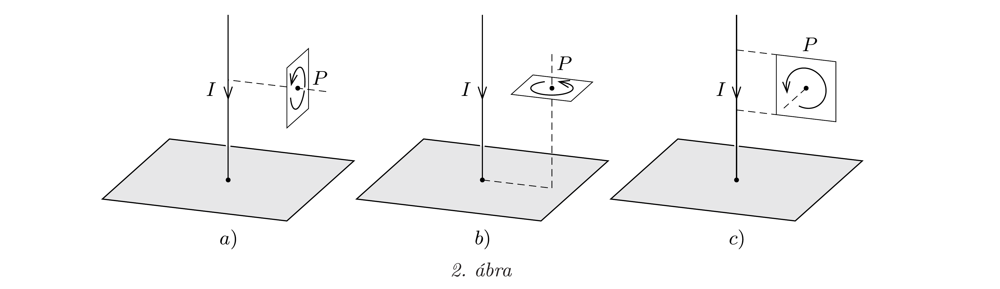

## Útmutatás

Az elrendezés szimmetriáját felhasználva lássuk be, hogy a mágneses eróvonalak az egyenes vezető körüli koncentrikus körök. Ha ez sikerül, akkor az indukció nagysága is könnyen kiszámítható az Ampère-féle gerjesztési törvény segítségével.

## Megoldás

I. megoldás. Jelöljük az egyenes vezetó irányát megadó (az áram irányába mutató) egységvektort $\boldsymbol{e}$-vel, az egyenes vezetó és a fémsík közös pontjából a $P$ pontba mutató vektort pedig $\boldsymbol{R}$-rel (1. ábra). Ez a két vektor (és az adott $I$ áramerősség) egyértelmúen meghatározza a mágneses indukcióvektort, az tehát $\boldsymbol{B}(\boldsymbol{e}, \boldsymbol{R})$ alakú, vagyis két vektorváltozótól függő, vektor értékú függvény.

A mágneses indukció irányának meghatározásában fontos szerepet játszik a „jobbkéz-szabály", és ez a tény erősen korlátozza a $\boldsymbol{B}(\boldsymbol{e}, \boldsymbol{R})$ függvény alakját. Két vektorból csak egyetlen olyan vektor képezhető, amely a jobbkéz-szabályra „érzékeny”: a két vektor vektoriális szorzata. Emiatt az indukciónak arányosnak
kell lennie $\boldsymbol{e} \times \boldsymbol{R}$-rel, és az arányossági tényező olyan skalár, amely már nem függ a jobbkéz-szabály (önkényes) előjel-megállapodásától:
\[
\boldsymbol{B}(\boldsymbol{e}, \boldsymbol{R})=(\boldsymbol{e} \times \boldsymbol{R}) \cdot f\left(\boldsymbol{e} \boldsymbol{R}, R^{2}\right) .
\]
Az $f$ függvény változói az $\boldsymbol{e}$-ből és $\boldsymbol{R}$-ből képezhető skalárok (egymással és önmagukkal képezhető skalárszorzatok, melyek közül $e^{2}$ hiányzik, hiszen az megállapodás szerint 1). Ezek a skalárok adott $r$ és $h$ esetén rögzített értéküek, hiszen
\[
R^{2}=r^{2}+h^{2}, \quad \text { illetve } \quad \boldsymbol{e} \boldsymbol{R}=-h .
\]

Az 1. ábrán látható körvonal mentén tehát a mágneses indukció érintő irányú, és a nagysága a gerjesztési törvénynek megfelelően
\[
B(r)=\mu_{0} \frac{I}{2 \pi r},
\]
tehát ugyanakkora, mint a „végtelen” egyenes vezetőnél lenne.
A fémlap alatt a mágneses indukció mindenhol nulla, hiszen a gerjesztési törvényben szereplő „körülölelt” áramerősség itt természetesen nulla.
II. megoldás. Illesszünk az egyenes vezetőre és a $P$ pontra egy síkot, majd tükrözzük az egész elrendezést erre a síkra! A tükrözés után az árameloszlás pontosan olyan marad, amilyen eredetileg volt, tehát a tükrözés során a mágneses mező sem változhat meg.

A mágneses indukció - jóllehet vektorként szoktuk ábrázolni - nem egy irányított szakasz, a tér egyik pontjából egy másikba mutató nyíl (ún. polárvektor, mint amilyen a helyvektor vagy az elektromos térerősség), hanem egy irányított körvonallal és egy nagysággal megadható mennyiség (mint pl. a szögsebesség vagy a forgatónyomaték). Az ilyen mennyiségeket axiálvektornak nevezik. A mágneses indukció irányát úgy kaphatjuk meg, ha megadjuk azt a síkot és körüljárási irányt, amely mentén egy megfeleló sebességgel mozgó töltött részecske (az adott pont közelében) körmozgást végezhet. A sík normálisa és a körmozgás körüljárási iránya biztosítja egyértelmúen az indukcióvektor irányítottságát.

Belátjuk, hogy a feladatban szereplő mágneses mezőnek nem lehet „radiális” (vagyis az áramvezetőtől a $P$ pontba mutató vektorra merőleges síkú körvonallal szemléltethető) komponense. Ez a komponens ugyanis az említett tükrözés
során előjelet váltana, de ugyanakkor változatlannak is kell maradnia, ez a két feltétel pedig csak úgy teljesülhet egyszerre, ha a vizsgált indukciókomponens nagysága zérus (2. ábra $a$ ) része). Ugyanilyen okok miatt a mágneses indukciónak nem lehet „hosszanti” (az egyenes vezetőre merőleges síkú körvonallal megadható) komponense sem, hiszen az is előjelet váltana a tükrözés során, pedig értékének változatlannak kell maradnia ( $b$ ) ábra). A mágneses indukció harmadik, a tükrözés síkjába eső körvonallal megadható komponenséről semmit nem állíthatunk, hiszen azt a tükrözés múvelete változatlanul hagyja $(c)$ ábra).

A mágneses mezőnek tehát az egyenes vezetőt körülvevő, örvényes vektormezónek kell lennie. Az indukció nagyságát a fémlap fölött a vezető szál körüli forgásszimmetria és a gerjesztési törvény felhasználásával határozhatjuk meg:
\[
B(r)=\mu_{0} \frac{I}{2 \pi r},
\]
a fémlap alatt pedig az indukció mindenhol zérus.
