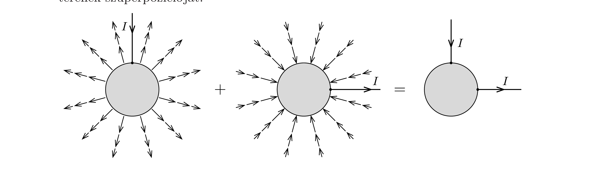
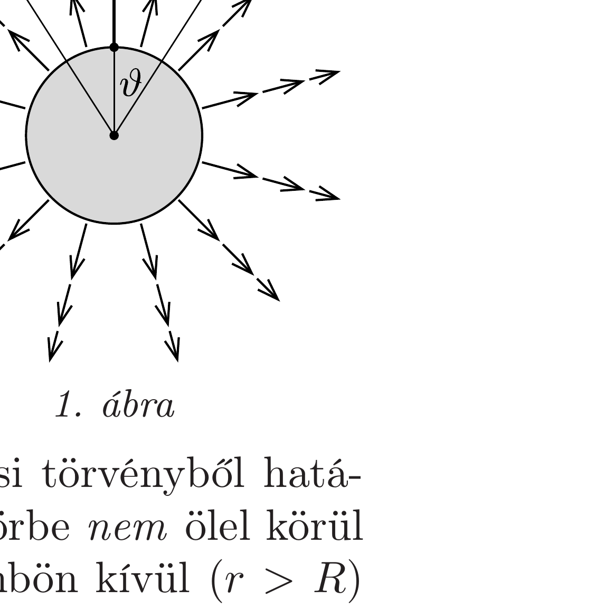
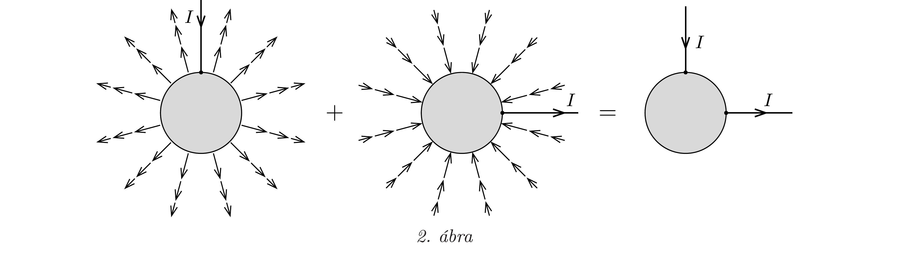

## Útmutatás

Alkalmazzuk a szuperpozíció-elvet (lásd még a 282. és a 306. feladatot)! Tekintsünk először egyetlen egyenes vezetőt. A rajta bevezetett áramot - a feladat szimmetriáját megtartva - a gömb felületéről egyenletes eloszlásban vezessük el, és határozzuk meg ezen árameloszlás mágneses terét. Ezek után ismételjük meg ezt a másik irányban kivezetett árammal, majd képezzük a két eset mágneses terének szuperpozícióját!

## Megoldás

Számítsuk ki először egyetlen félegyenes mentén befolyó, majd a gömb felületéről radiálisan, gömbszimmetrikusan távozó áram által létrehozott mágneses teret! (Ez az árameloszlás ténylegesen megvalósítható, ha az igen jól vezető gömböt valamekkora vezetőképességú „végtelen” közegbe helyezzük, és feszültséget kapcsolunk rá.)

Egyetlen áramvezető esetén a mágneses mező az egyenes vezető által kijelölt „tengely” körül forgásszimmetrikus, és az indukcióvonalak kör alakúak (lásd az előző feladat megoldását!).

A mágneses indukció nagyságát az Ampère-féle gerjesztési törvényből határozhatjuk meg. A gömb belsejében képzeletben felvett zárt görbe nem ölel körül áramot, ezért itt (amikor $r<R$ ) nincs mágneses tér. A gömbön kívül ( $r>R$ ) viszont a gerjesztési törvény így írható (lásd az 1. ábrát):
\[
2 \pi r \sin \vartheta \cdot B(r, \vartheta)=\mu_{0}\left(I-\frac{1-\cos \vartheta}{2} I\right) .
\]

Felhasználtuk, hogy az 1. ábrán szaggatottan jelölt körvonallal határolt $r$ sugarú gömbsüveg felszíne $2 \pi r^{2}(1-\cos \vartheta)$, az $r$ sugarú gömb felszíne pedig $4 \pi r^{2}$, emiatt a gömbszimmetrikusan kifolyó áram számításba vehető része $I(1-\cos \vartheta) / 2$ erósségú. A mágneses indukció nagysága tehát
\[
B(r, \vartheta)=\frac{\mu_{0} I}{4 \pi} \frac{1+\cos \vartheta}{r \sin \vartheta}=\frac{\mu_{0} I}{4 \pi} \cdot \frac{\operatorname{ctg}(\vartheta / 2)}{r} .
\]
Az áramvezetó közelében $(\vartheta \approx 0)$ a kis szögekre érvényes $\operatorname{ctg}(\vartheta / 2) \approx 2 / \vartheta$ összefüggés miatt éppen a végtelen egyenes vezető körüli mágneses mezőt kapjuk vissza; a bevezetett árammal ellentétes oldalon pedig $\left(\vartheta \rightarrow 180^{\circ}\right)$ az indukció fokozatosan eltúnik.

Végezzük el ugyanezt a számítást a 90°-kal elforgatott egyenes vezetőn kivezetett és gömbszimmetrikusan bevezetett áramokra is, majd szuperponáljuk a két elrendezés mágneses terét (2. ábra). A gömb belsejében továbbra is mindenhol nulla lesz az indukció, a kérdéses $P$ pontban pedig (a gömbön kívül)
\[
B_{P}=2 \cdot B\left(R, 45^{\circ}\right)=\frac{\mu_{0} I}{2 \pi R} \operatorname{ctg} 22,5^{\circ}=\frac{\mu_{0} I}{2 \pi R}(\sqrt{2}+1) .
\]

Megjegyzés. A gömb felületén folyó áram a bevezetési ponttól az áram kivezetési helyéig állandósult áramvonalak mentén jut el. Meg lehet mutatni, hogy ezek a (görbült felületen futó) vonalak síkgörbék, nevezetesen kör alakúak.
