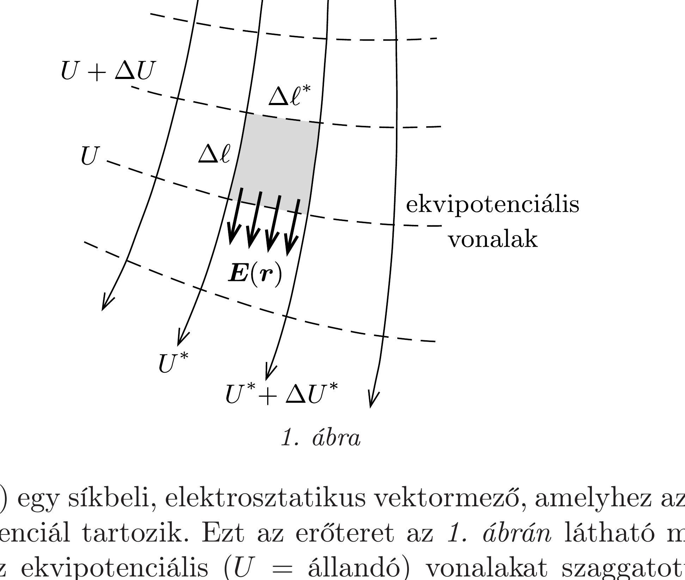
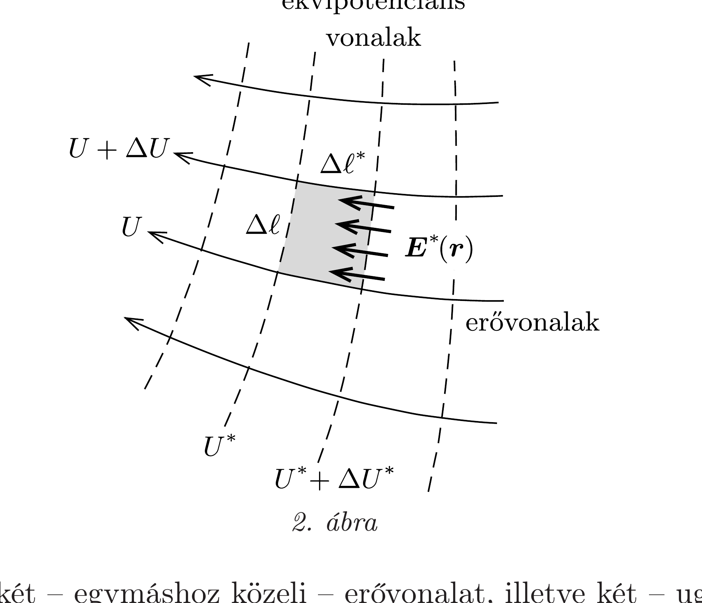
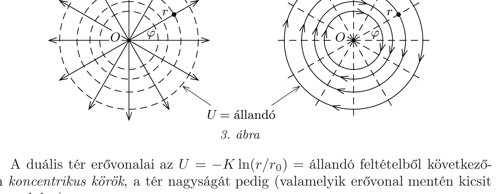
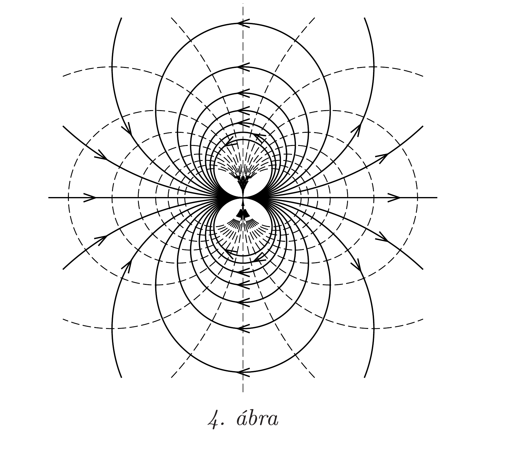
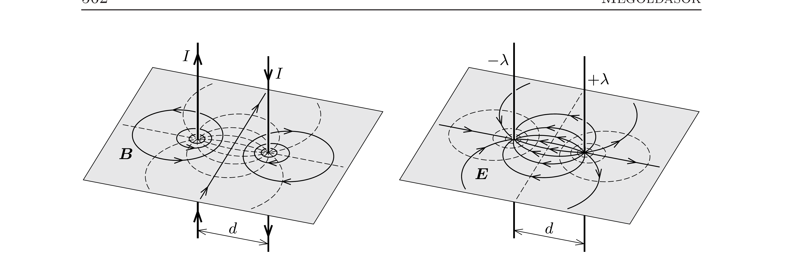
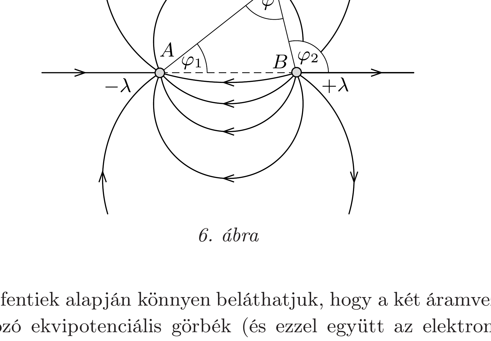

## Útmutatás

Keressünk hasonlóságot az áramjárta egyenes vezetők indukcióvonalai, valamint két párhuzamos, ellentétes előjelú vonalmenti töltéssúrúséggel egyenletesen feltöltött szigetelő pálca elektromos terének ekvipotenciális felületei között.

## Megoldás

A két párhuzamos áramvezető időben állandó, síkbeli mágneses mezőt hoz létre.

Megjegyzés. Egy vektormezőt akkor nevezünk (például az $x-y$ síkban) síkbelinek, ha a mező vektorainak $z$ komponense mindenhol nulla, és a nullától különböző vektorkomponensek sem függnek a $z$ koordinátától.

Ugyancsak síkbeli vektormező az olyan töltéseloszlás elektrosztatikus tere, amelyben a töltéssúrúség az egyik térkoordinátától nem függ. Erre példa a nagyon hosszú („végtelen” hosszúnak tekinthető), egyenletesen feltöltött szigetelő pálca, vagy több ilyen (egymással párhuzamos) pálca együttese.

A magnetosztatikus vektormezők forrásmentesek és örvénymentesek (tehát „potenciálosak”) a tér azon részeiben, ahol nem folynak áramok. Ugyanilyen tulajdonságúak az elektrosztatikus vektormezők is, ha a vizsgált térrészben nincsenek töltések. Mindkét (síkbeli) vektormezőben felvehetjük az erővonalakat és az ekvipotenciális vonalakat (az ekvipotenciális felületek síkbeli megfelelőjét), amelyek egymásra merőleges görbesereget alkotnak.

A továbbiakban megmutatjuk, hogy (töltés- és árammentes térrészekben, de egyébként teljesen általános körülmények között) a síkbeli, sztatikus elektromos és mágneses vektorterek egymással kapcsolatba hozhatóak, egymásnak megfeleltethetőek. Ebben az ún. duális kapcsolatban az egyik vektortér ekvipotenciális vonalai a másik erőtér erővonalainak felelnek meg, és viszont, az erővonalak duális megfelelói az ekvipotenciális görbék. Az örvény- és forrásmentesség még nem határozza meg egyértelmúen a vektortereket, azokat a határfeltételek teszik egyértelmúvé. Az elektromos eróvonalak a térrész határain elhelyezkedő töltésekből indulnak ki, vagy (a töltés előjelétől függően) azokba futnak be. A mágneses „erővonalak" (indukcióvonalak) mindig zárt görbék, amelyek a teret létrehozó áramokat fogják körül, azok körül „örvénylenek".

Legyen $\boldsymbol{E}(\boldsymbol{r})$ egy síkbeli, elektrosztatikus vektormező, amelyhez az $U(\boldsymbol{r})$ elektrosztatikus potenciál tartozik. Ezt az eróteret az 1. ábrán látható módon szemléltethetjük. Az ekvipotenciális ( $U=$ állandó) vonalakat szaggatottan, az eróvonalakat pedig folytonos, nyilakkal ellátott vonalakkal jelöltük. Ezek a vonalak két, egymást mindenhol merőlegesen metsző görbesereget alkotnak. (A térerősség iránya megállapodás szerint a potenciál csökkenésének irányába mutat.)

Minden eróvonalhoz kiszámíthatjuk, hogy közte és egy önkényesen kiválasztott referencia-eróvonal között mekkora fluxus halad át.

Megjegyzés. Háromdimenziós vektormezőknél a fluxust egy kicsiny felületdarabka területe és a rá merőleges térerősségkomponens szorzataként értelmezzük. Kétdimenziós vektormezőknél a fluxus egy kicsiny vonaldarab hosszának és a rá merőleges térerősségkomponensnek a szorzataként definiálható. A kétféle értelmezés összhangja jól látszik
akkor, ha a kétdimenziós vektormező 3-dimenziós fluxusát egy, a $z$ tengely irányában egységnyi magasságú, de az $x-y$ síkban kicsiny oldalélú „téglalapra” számítjuk ki.

Jelöljük az $\boldsymbol{r}$ helyvektorú ponton áthaladó erővonal és a referencia-erővonal között átmenő fluxust $U^{*}(\boldsymbol{r})$-rel. Az $U^{*}(\boldsymbol{r})$ függvény az erốtér minden pontjához hozzárendel egy skalár mennyiséget, és az eróvonalak egyenletét az $U^{*}(\boldsymbol{r})=$ állandó összefüggés határozza meg. (Az állandó értékét az 1. ábrán az eróvonalak mellett fel is tüntettük.)

Megjegyzés. Ha az eróvonalakat olyan súrún rajzoljuk be, hogy a hosszegységre jutó eróvonalszám a térerősség nagyságával legyen egyenlő, akkor $U^{*}(\boldsymbol{r})$ szemléletes jelentést nyer: megadja, hogy a kérdéses ponton hányadik erốvonal halad át, amennyiben azok számozását a referencia-vonalnál kezdjük.

Tekintsünk két - egymáshoz közeli - eróvonalat, illetve két - ugyancsak egymáshoz közeli - ekvipotenciális vonalat. Ezek a vonalak egy kicsiny (az 1. ábrán sötétebben jelölt, jó közelítéssel téglalapnak tekinthető) tartományt jelölnek ki a vektormező síkjában. A térerősség nagysága kétféleképpen is kifejezhető a „téglalap" oldalainak hosszával. Egyrészt a potenciál értelmezése szerint
\[
\Delta U=-|\boldsymbol{E}| \Delta \ell,
\]
(a negatív előojel a potenciál csökkenési irányába mutató térerősségre utal), másrészt a fluxus és a térerősség nagyságának kapcsolatából:
\[
\Delta U^{*}=|\boldsymbol{E}| \Delta \ell^{*} .
\]
Ezekből a térerősség nagyságát kiküszöbölve a következő összefüggést kapjuk:
\[
\frac{\Delta U}{\Delta \ell}+\frac{\Delta U^{*}}{\Delta \ell^{*}}=0 .
\]

A fenti, szembeötlően szimmetrikus reláció lehetőséget kínál arra, hogy az $\boldsymbol{E}(\boldsymbol{r})$ vektormezőhöz hozzárendeljünk egy másik, a szerepek felcserélésével adódó „duális" vektormezőt. Ha az $U^{*}(\boldsymbol{r})$ függvényt tekintjük egy $\boldsymbol{E}^{*}(\boldsymbol{r})$ vektormezó potenciálfüggvényének, $U(\boldsymbol{r})$-et pedig ezen mező fluxusát megadó mennyiségnek, akkor erre a mezőre is teljesül a forrás- és örvénymentesség követelménye, az (1) reláció (2. ábra). (Ne feledjük, hogy a duális térnél a szerepek felcserélődése miatt $\Delta \ell$-et és $\Delta \ell^{*}$-ot is fel kell cserélnünk.)

A fentieket egy nevezetes példával illusztrálhatjuk. Ha a potenciál
\[
U(r)=-K \ln \frac{r}{r_{0}}
\]
alakú (ahol $K$ és $r_{0}$ állandók, $r$ pedig a sík $O$ pontjától mért távolság), akkor az ekvipotenciális görbék koncentrikus körök, a térerősség nagysága
\[
E(r)=-\frac{\Delta U}{\Delta r} \approx-U^{\prime}(r)=\frac{K}{r},
\]
iránya pedig a kérdéses pontot $O$-val összekötő egyenessel adható meg (3. ábra bal oldala). A térerősség nagyságából a fluxus is kiszámítható. Egy $r$ sugarú köríven, amely egy önkényesen választott irányhoz képest $\varphi$ szögü ívet fed le, az áthaladó fluxus
\[
U^{*}=\frac{K}{r} \cdot r \varphi=K \cdot \varphi .
\]
Ez az erótér egy $\lambda=2 \pi \varepsilon_{0} K$ vonalmenti töltéssűrúségú „végtelen” hosszú pálca elektrosztatikus terével egyezik meg.

A duális tér erốvonalai az $U=-K \ln \left(r / r_{0}\right)=$ állandó feltételből következően koncentrikus körök, a tér nagyságát pedig (valamelyik erővonal mentén kicsit elmozdulva) az
\[
E^{*} \cdot r \Delta \varphi=-\Delta U^{*}=-K \Delta \varphi
\]
feltételből számíthatjuk ki: $\left|\boldsymbol{E}^{*}\right|=-K / r$. Ha a $K$ állandó nagyságát $\mu_{0} I /(2 \pi)$ nek választjuk, akkor a duális vektormező egy $I$ erősségú árammal átjárt hosszú, egyenes vezető mágneses terét (mágneses indukcióját) adja meg (3. ábra jobb oldala).

Megjegyzések. 1. A hosszú, egyenes vezető mágneses tere lokálisan örvénymentes (hiszen potenciálfüggvényből származtatható), de nem konzervatív, zárt görbékre vett integrálja nem feltétlenül nulla. Ezt a furcsaságot a matematikai leírás úgy teszi lehetővé, hogy a $\varphi$ szöggel arányos $U^{*}$ potenciál nem egyértékú függvény: ha az $O$ pontot (vagyis az áramvezetőt) körüljárjuk, a visszaérkezéskor a potenciál értéke nem lesz ugyanannyi, mint amennyi az elinduláskor volt. Az elektrosztatikus potenciálnál ilyen eset nem fordulhat elő, hiszen az perpetuum mobile készítését tenné lehetővé. A „mágneses potenciál” nem rendelkezik közvetlen fizikai jelentéssel, csupán matematikai segédmennyiség, így az örökmozgó lehetősége fel sem merül.

2. Egy síkbeli elektrosztatikus tér duálisának lehetséges fizikai jelentését csak a határfeltételek ismeretében tudjuk megadni. Nem igaz az, hogy a duális tér mindig csak mágneses mezőként értelmezhető. Egy síkkondenzátor homogén elektromos erőterének duálisa is homogén vektormező, amely lehet például egy 90°-kal elforgatott kondenzátor elektrosztatikus tere. Ugyancsak elektrosztatikus mezőként értelmezhető egy kétdimenziós, ideális elektromos dipól eróterének duálisa is: ez egy 90°-kal elforgatott dipól elektrosztatikus terével egyezik meg (4. ábra).

Térjünk most rá az eredeti problémára, az ellentétes áramirányú párhuzamos vezetók mágneses terének leírására. Ez az elrendezés az ellentétes töltésú, nagyon hosszú, párhuzamos szálak esetének a duálisa. Az 5. ábra bal oldala az áramok által keltett (síkbeli) mágneses mező́t szemlélteti. Az indukcióvonalakat a folytonos vonalak jelzik, a mágneses potenciál „szintvonalait” pedig a szaggatott vonalak. Az áramerősségek egyenlősége miatt az erőtér szimmetrikus az áramok felezősíkjára.

Az 5. ábra jobb oldalán látható duális elrendezés olyan elektromos eróteret mutat, amelyben a szereposztás éppen fordított: a szaggatottan jelölt ekvipotenciális vonalak ölelik körül a végtelen szálakat, és az ezekre merőleges (folytonos vonallal jelölt) görbesereg képezi az elektromos erővonalak rendszerét. Az elrendezés akkor lesz szimmetrikus, ha az elektromos eróteret két ellentétesen feltöltött, $+\lambda$ és $-\lambda$ vonalmenti töltéssúrúségú szál hozza létre.

Egyetlen, $\lambda$ vonalmenti töltéssúrúségú szál elektrosztatikus erőterét a (2) összefüggésben megadott potenciál szolgáltatja $K=\lambda /\left(2 \pi \varepsilon_{0}\right)$ helyettesítéssel. Két egyforma nagyságú, de ellentétes előjelú töltéssel rendelkező „végtelen” szál potenciálfüggvénye szuperpozícióval kapható:
\[
U(\boldsymbol{r})=\frac{\lambda}{2 \pi \varepsilon_{0}} \ln \frac{r_{1}}{r_{0}}-\frac{\lambda}{2 \pi \varepsilon_{0}} \ln \frac{r_{2}}{r_{0}}=\frac{\lambda}{2 \pi \varepsilon_{0}} \ln \frac{r_{1}}{r_{2}},
\]
ahol $r_{1}$ és $r_{2}$ a vizsgált pont és a szálak távolsága.
Az elektromos eset ekvipotenciális pontjait az $U=$ állandó feltétel, vagyis az $r_{1} / r_{2}$ hányados állandósága jellemzi, és ugyanez adja meg a duális problémában a mágneses indukcióvonalak egyenletét is. A síkban azoknak a pontoknak a mértani helye, melyek két adott ponttól vett távolságainak aránya állandó, az Apollónioszkör. A vizsgált mágneses térben az indukcióvonalak tehát körök.

Megjegyzés. A fentiek alapján könnyen beláthatjuk, hogy a két áramvezetőnél a mágneses térhez tartozó ekvipotenciális görbék (és ezzel együtt az elektromos problémánál az erővonalak) ugyancsak körök. Mindkettőt az $U^{*}=$ állandó feltétel határozza meg, ez pedig az egyetlen szál korábban már kiszámított „fluxusfüggvényét” felhasználva a $\varphi=\varphi_{2}-\varphi_{1}=$ állandó követelménnyel egyenértékú. (Itt $\varphi$ az a szög, amely alatt az
elektromos eróvonal valamely pontjából a két töltött szál helyét megadó $A$ és $B$ pont látszik, lásd a 6. ábrát.) Egy adott szakasz két végpontja a szakaszra illeszkedő kör (látószögkörív) pontjaiból látszik ugyanakkora szög alatt, az ellentétesen töltött szálak elektromos terének erốvonalai tehát körök. Ezt az eredményt - más módszerekkel, elemi geometriai megfontolásokkal - a 247. feladatban is megkaptuk.
