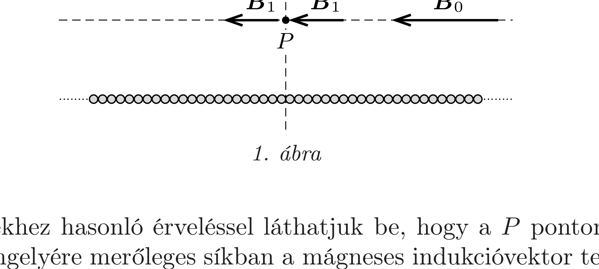
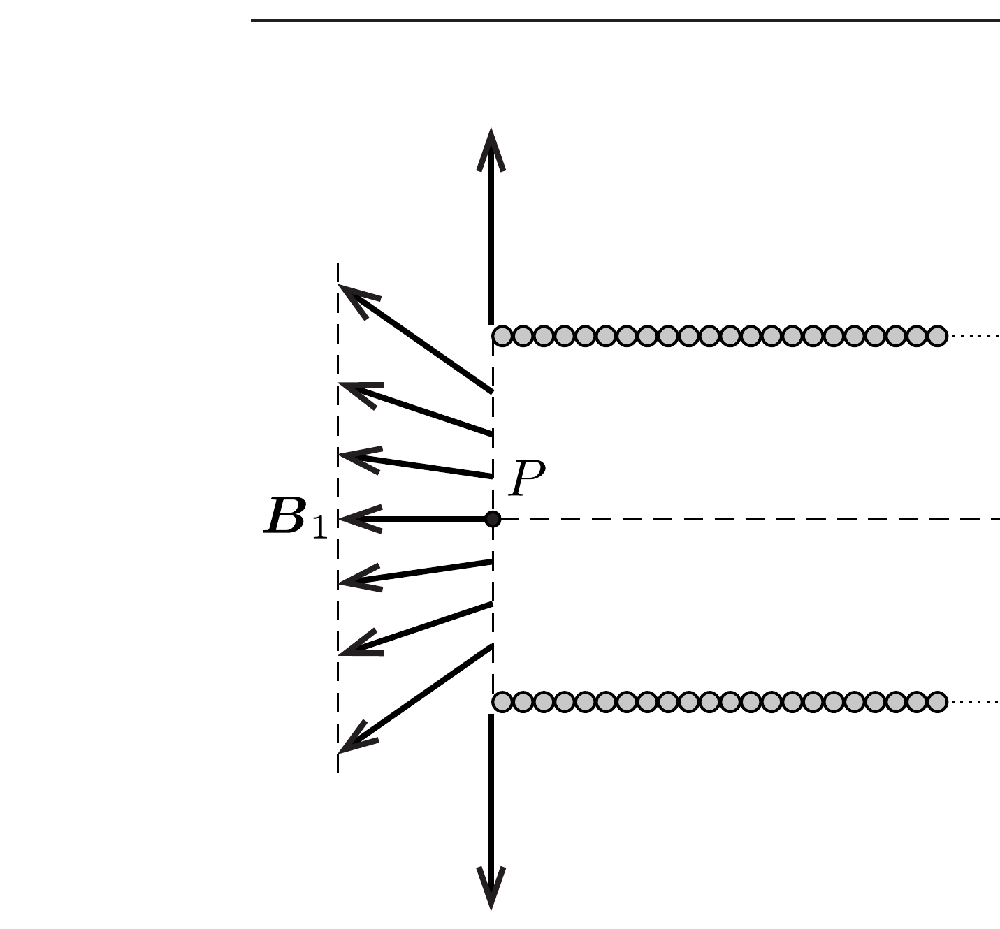
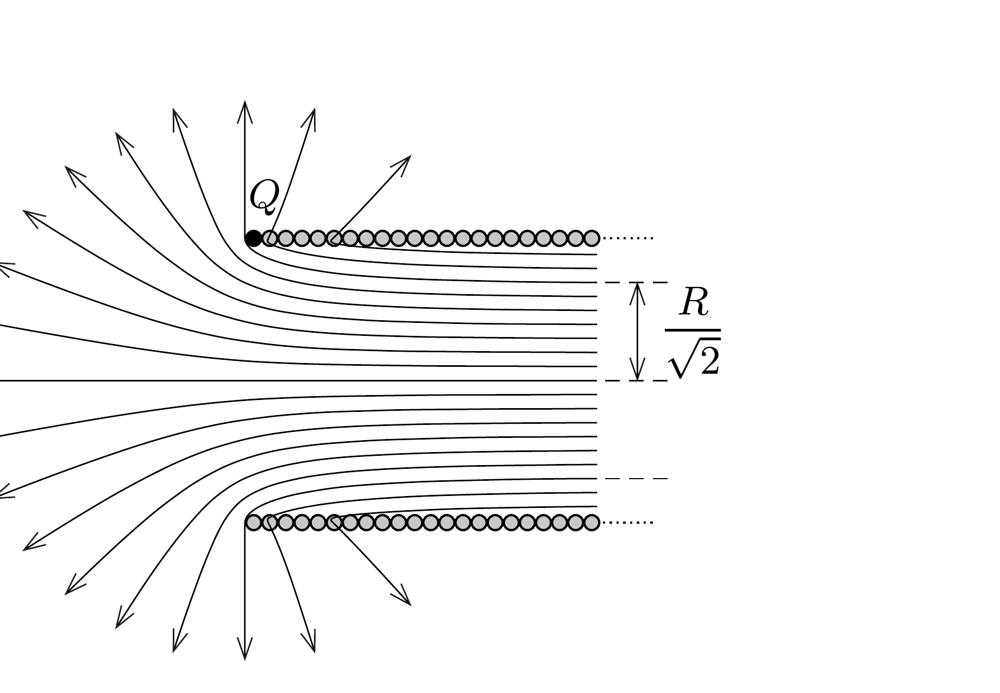

## Útmutatás

Alkalmazzuk a szuperpozíciós elvet! Ehhez egészítsük ki a szolenoidot a $P$ pontra tükörszimmetrikusan egy másik tekerccsel, amelyben ugyanakkora áram folyik, mint az eredetiben.

## Megoldás

Egészítsük ki - gondolatban - a szolenoidot a $P$ pontra tükörszimmetrikusan egy másik tekerccsel, amelyben az eredetivel megegyező erősségú áram folyik.
a) Ha a $P$ pontban mérhető mágneses indukciót $B_{1}$-gyel jelöljük, akkor a szimmetrikusan kiegészített tekercs másik fele is ugyanekkora indukciót hoz létre (1. ábra). De mivel a szuperponált mezők eredőjének $B_{0}$-t kell adnia, közvetlenül adódik, hogy $B_{1}=B_{0} / 2$.

b) A fentiekhez hasonló érveléssel láthatjuk be, hogy a $P$ ponton átmenő és a szolenoid tengelyére meróleges síkban a mágneses indukcióvektor tengelyirányú komponensének nagysága $B_{0} / 2$ mindaddig, amíg a tengelytől mért távolság $R$ nél kisebb, és nulla, ha $R$-nél nagyobb (2. ábra). A szolenoid „zárólapján” tehát összesen $R^{2} \pi \cdot\left(B_{0} / 2\right)$ mágneses fluxus halad keresztül, éppen fele a szolenoid belsején átmenő́ fluxusnak. Vajon hová „túnik” a fluxus másik fele?

c) A szolenoid indukcióvonalait (vázlatosan) a 3. ábra mutatja. A tekercs legszélső menetén (a $Q$ ponton) átmenó indukcióvonalnak a tekercsen kívül a tengelyre merőlegesen kell haladnia. Ettől balra a tekercs fluxusának fele halad, a másik fele a menetek között lép ki a tekercsből. A határesetet képező erővonalak a szolenoid belsejében (a végétől elegendően távol) a tengelytől $R / \sqrt{2}$ távolságban haladnak, mivel így osztódik két egyforma részre a teljes fluxus.
