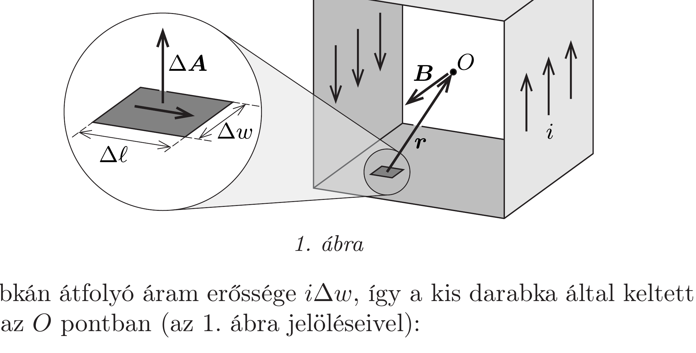
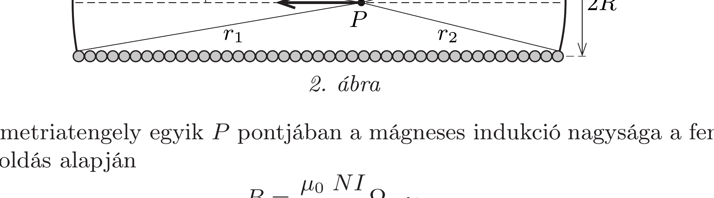

## Útmutatás

A töltött futószalag egy kis darabkájának járuléka az eredő indukcióhoz arányos azzal a térszöggel, amely alatt a darabka az $O$ pontból látszik.

## Megoldás

A mozgó futószalag töltései $i=\sigma v$ vonalmenti áramsúrúséget képviselnek. Az $O$ pontbeli eredő mágneses tér a szimmetria miatt a görgők tengelyével párhuzamos és a jobbkéz-szabálynak megfelelő irányú, nagyságának meghatározásához pedig a Biot-Savart-törvényt használhatjuk. Tekintsük ehhez a futószalagnak az 1. ábrán látható kicsiny, $\Delta \ell$ hosszú és $\Delta w$ széles darabkáját!

A darabkán átfolyó áram erőssége $i \Delta w$, így a kis darabka által keltett indukciójárulék az $O$ pontban (az 1. ábra jelöléseivel):
\[
\Delta \boldsymbol{B}=\frac{\mu_{0}}{4 \pi} \frac{i \Delta w \cdot \Delta \boldsymbol{\ell} \times \boldsymbol{e}_{r}}{|\boldsymbol{r}|^{2}},
\]
ahol $\boldsymbol{e}_{r}=\boldsymbol{r} /|\boldsymbol{r}|$ az $\boldsymbol{r}$ irányú egységvektor, $\Delta \boldsymbol{\ell}$ pedig az áram irányába mutató vektor. A $\boldsymbol{B}$ eredő mágneses indukcóvektor nagyságát ezen járulékok $\boldsymbol{e}_{B}=\boldsymbol{B} /|\boldsymbol{B}|$
irányú komponenseinek összegeként számíthatjuk ki:
\[
|\boldsymbol{B}|=\sum \boldsymbol{e}_{B} \cdot \Delta \boldsymbol{B}=\frac{\mu_{0} i}{4 \pi} \sum \Delta w \frac{\left(\Delta \boldsymbol{\ell} \times \boldsymbol{e}_{r}\right) \boldsymbol{e}_{B}}{|\boldsymbol{r}|^{2}} .
\]
Az összegzésben megjelenő vegyes szorzatot átalakíthatjuk:
\[
\left(\Delta \ell \times e_{r}\right) e_{B}=e_{B}\left(\Delta \ell \times e_{r}\right)=\left(e_{B} \times \Delta \ell\right) e_{r} .
\]
Ennek felhasználásával az eredó indukció nagysága így alakítható:
\[
|\boldsymbol{B}|=\frac{\mu_{0} i}{4 \pi} \sum \Delta w \frac{\left(\boldsymbol{e}_{B} \times \Delta \boldsymbol{\ell}\right) \boldsymbol{e}_{r}}{|\boldsymbol{r}|^{2}}=\frac{\mu_{0} i}{4 \pi} \sum \frac{\Delta \boldsymbol{A} \cdot \boldsymbol{e}_{r}}{|\boldsymbol{r}|^{2}},
\]
ahol felhasználtuk, hogy a $\Delta w\left(\boldsymbol{e}_{B} \times \Delta \boldsymbol{\ell}\right)$ mennyiség éppen a kiszemelt futószalagdarabka $\Delta \boldsymbol{A}$ felületelem-vektora. Az összegzésben megjelenő kifejezés nem más, mint a kis darabka $\Delta \Omega$ térszöge az $O$ pontból nézve, tehát
\[
|\boldsymbol{B}|=\frac{\mu_{0} i}{4 \pi} \sum \Delta \Omega .
\]
A kocka $O$ középpontjából szemlélve mindegyik oldallap térszöge egyforma, a teljes $4 \pi$ térszög hatodrésze. A futószalag a kocka négy oldallapján halad végig, ezért a hozzá tartozó térszög $4 \cdot(1 / 6) \cdot 4 \pi$, így a mágneses indukció értéke:
\[
|\boldsymbol{B}|=\frac{2}{3} \mu_{0} i=\frac{2}{3} \mu_{0} \sigma v .
\]
Érdekes, hogy a végeredmény független a futószalag $d$ szélességétól.
Megjegyzés. A megoldásban ismertetett módszerrel arra a kérdésre is választ kaphatunk, hogy milyen a mágneses tér egy véges hosszúságú szolenoid tekercs tengelyén. Tekintsük például a 2. ábrán látható, $N$ menetes, $\ell$ hosszúságú, $I$ erősségú árammal átjárt szolenoidot!

A szimmetriatengely egyik $P$ pontjában a mágneses indukció nagysága a fent ismertetett megoldás alapján
\[
B=\frac{\mu_{0}}{4 \pi} \frac{N I}{\ell} \Omega_{\text {palást }},
\]
ahol $\Omega_{\text {palást }}$ a tekercs palástjának a $P$ pontból látott térszöge, $N I / \ell=i$ pedig a tekercs palástján a vonalmenti áramsúrúség. Az $\Omega_{\text {palást }}$ térszöget felírhatjuk úgy, hogy a teljes $4 \pi$ térszögből kivonjuk a tekercs két végének $P$ pontból látott térszögét:
\[
\Omega_{\text {palást }}=4 \pi-\Omega_{\text {vêg }}^{(1)}-\Omega_{\text {vêg }}^{(2)} .
\]

A tekercsvégek térszögét úgy számíthatjuk ki, hogy a tekercs végeire illeszkedő, $P$ középpontú gömbsüveg felszínét (lásd a Függeléket) elosztjuk a gömb sugarának négyzetével. A 2. ábra jelöléseivel:
\[
\Omega_{\text {veg }}^{(j)}=\frac{2 \pi r_{j}^{2}\left(1-\cos \alpha_{j}\right)}{r_{j}^{2}}=2 \pi\left(1-\cos \alpha_{j}\right), \quad \text { ahol } \quad j=1,2 .
\]
Ennek felhasználásával a szolenoid palástjának térszöge
\[
\Omega_{\text {palást }}=2 \pi\left(\cos \alpha_{1}+\cos \alpha_{2}\right),
\]
a szolenoid tengelyén a $P$ pontban mérhetó mágneses indukció pedig
\[
B=\mu_{0} \frac{N I}{2 \ell}\left(\cos \alpha_{1}+\cos \alpha_{2}\right) .
\]
Egy $\ell$ hosszúságú, $R$ sugarú szolenoid közepén $\left(\alpha_{1}=\alpha_{2}=\alpha\right)$ például ez az összefüggés a következő eredményt adja:
\[
B=\mu_{0} \frac{N I}{\ell} \cos \alpha=\mu_{0} \frac{N I}{\sqrt{\ell^{2}+4 R^{2}}},
\]
amely az $R \ll \ell$ határesetben a jól ismert $\mu_{0} N I / \ell$ képletbe megy át.
