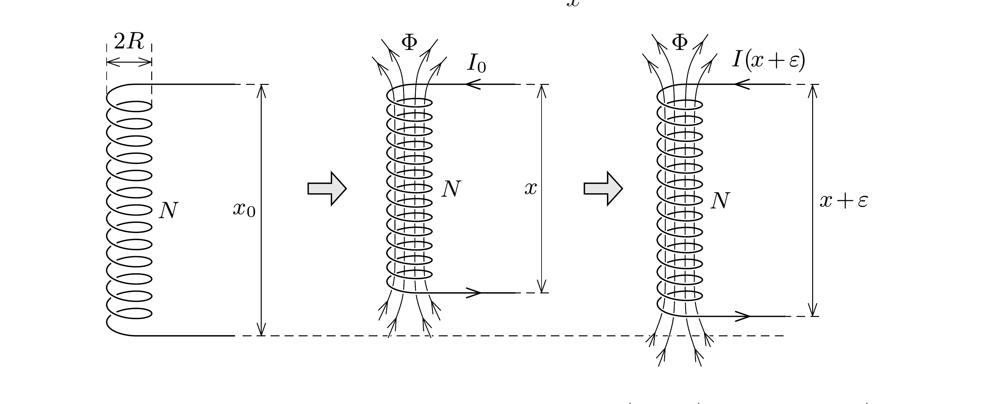

## Útmutatás

Az egymás közelében lévő menetekben egyirányban folyó áramok vonzó hatása miatt a rugó össze fog húzódni. Az áram okozta húzóeró (melynek meghatározása közvetlen számolással meglehetősen bonyolult) ugyanakkora lenne akkor is, ha a rugó (nagyon alacsony hómérsékletre lehútve) szupravezetővé válna. Egy ilyen szupravezető tekercsben akkor is folyhat áram, ha a végeit rövidre zárjuk. Tanulmányozzuk, hogyan függ ennek (a külvilághoz nem kapcsolódó, tehát energetikailag zártnak tekinthető) rendszernek az összenergiája a rugó hosszától!

## Megoldás

Tegyük fel, hogy a rugó hossza az $I_{0}$ erósségú áram hatására a kezdeti (feszítetlen állapotú) $x_{0}$-ról valamekkora $x$ értékre csökken, és itt a meneteiben folyó áram mágneses vonzása egyensúlyba kerül a deformáció miatt fellépő rugalmas erőkkel. Feladatunk ezen „egyensúlyi” $x$ hosszúság meghatározása.

Az erőegyensúly követelményét átfogalmazhatjuk az energiaminimum-elvre: Egyensúlyban lévő rendszer összenergiája az egyensúlyihoz közeli állapotokhoz képest minimális, vagyis egy kicsiny, elképzelt (virtuális) változás során az energia első közelítésben nem változik. (Ha nem így lenne, hanem pl. az energia csökkenne, akkor a rendszer „szívesen" átmenne a közeli állapotba, tehát nem lenne egyensúlyban. Akkor is ugyanez történne, ha valamilyen kicsiny állapotváltozásra az energia növekedne, hiszen ekkor az ellentételes irányú változás eredményezne energiacsökkenést.)

Az energiaminimum-elv (amit más megfogalmazásban „virtuális munka elvének" neveznek) csak energetikailag zárt rendszerekre alkalmazható. Ha az elképzelt változás során a rendszer a környezetétől energiát kaphat, vagy adhat le, akkor a módszer nem „múködik”. Ha valamilyen módon mégis szeretnénk használni az - egyébként nagyon egyszerú, célravezető - energetikai megfontolásokat, a rendszert - esetünkben az áramjárta rugót - függetlenítenünk kell a külvilágtól. Ezt úgy tehetjük meg, hogy a már egyensúlyba került rugót - gondolatban - nagyon alacsony hőmérsékletre lehútve szupravezetővé tesszük, és lekapcsoljuk az áramforrásról, végeit rövidre zárjuk. Ha ebben az állapotban a rugóban (mint rövidre zárt tekercsben) $I_{0}$ erősségú áram folyik, a mágneses erők és a rugalmas erők továbbra is egyensúlyt tartanak egymással, tehát érvényes (és alkalmazható) rá az energiaminimum elve.

Az egyensúlyi állapotban a tekercs belsejében $B=\mu_{0} I N / x$ a mágneses indukció, az $N$ menetes, $A=R^{2} \pi$ keresztmetszetú tekercs teljes mágneses fluxusa tehát
\[
\Phi=B A N=\mu_{0} \frac{I N^{2} A}{x} .
\]

Ha a tekercs hossza valamilyen ok miatt $x$-ról $(x+\varepsilon)$-ra változna (lásd az ábrát), a mágneses fluxus nem változhatna meg, hiszen az feszültséget indukálna, és ennek hatására a nulla ellenállású tekercsben „végtelen nagy" áram indulna el. Eszerint az $I / x$ hányadosnak az elképzelt változás során állandónak kell maradnia, tehát az áramerősség
\[
I(x+\varepsilon)=\frac{I_{0}}{x}(x+\varepsilon)
\]
módon függ a tekercs hosszától. Tudjuk továbbá, hogy egy $x$ hosszúságú tekercs önindukciós együtthatója
\[
L(x)=\mu_{0} \frac{N^{2} A}{x},
\]
az $I$ erősségú árammal átjárt tekercs mágneses energiája pedig $W_{\text {mágn }}=L I^{2} / 2$. A megváltozott hosszúságú tekercsben tárolt mágneses energia tehát
\[
W_{\text {mágn }}(x+\varepsilon)=\frac{1}{2} L(x+\varepsilon) \cdot I^{2}(x+\varepsilon)=\mu_{0} \frac{N^{2} I_{0}^{2} A}{2 x^{2}}(x+\varepsilon) \text {. }
\]
Ha ehhez hozzáadjuk a rugó
\[
W_{\mathrm{rug}}(x+\varepsilon)=\frac{1}{2} D\left(x+\varepsilon-x_{0}\right)^{2}
\]
rugalmas energiáját, a rendszer teljes energiájára
\[
W_{\text {össz }}=W_{\text {össz }}(x)+\left[\mu_{0} \frac{N^{2} I_{0}^{2} A}{2 x^{2}}+D\left(x-x_{0}\right)\right] \varepsilon+\frac{1}{2} D \varepsilon^{2}
\]
adódik. Ennek a kifejezésnek ( $\varepsilon$ függvényében) akkor lesz $\varepsilon=0$-nál minimuma, vagyis akkor nem változik tetszőleges előjelú, de kicsiny $\varepsilon$ hosszváltozásra a rendszer teljes energiája, ha a szögletes zárójelben álló kifejezés nulla.

Ezek szerint az áram hatására a rugó új egyensúlyi hossza az
\[
x=x_{0}-\mu_{0} \frac{N^{2} I_{0}^{2} A}{2 D x^{2}}
\]
(harmadfokú) egyenletnek tesz eleget. Ha viszont a rugó hosszváltozása kicsi (erre utal a feladat szövegében szereplő „viszonylag erős csavarrugó” kifejezés), akkor a fenti egyenletben a nevezőben szereplő $x$-et jó közelítéssel $x_{0}$-lal helyettesíthetjük, és a rugó keresett hosszváltozására (rövidülésére) az
\[
x-x_{0} \approx-\mu_{0} \frac{N^{2} I_{0}^{2} A}{2 D x_{0}^{2}}
\]
eredményt kapjuk.
