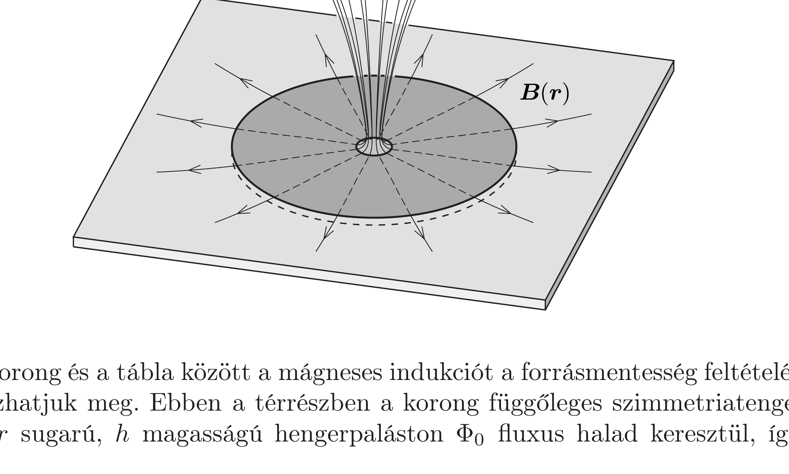

## Útmutatás

A szupravezetó táblába a mágneses tér nem tud behatolni, és a korong közepén lévő lyukon áthaladó mágneses indukcióvonalak száma sem változhat meg. Ez a két feltétel egyértelmúen meghatározza a korong és a tábla közötti $h$ vastagságú térrészben kialakuló mágneses mező szerkezetét. A korongra ható erőt a virtuális munka elvéből határozhatjuk meg. Vizsgáljuk meg, hogyan változik a mágneses térben tárolt energia, ha a korongot kicsit közelebb nyomjuk a táblához! Belátható, hogy a teljes energia megváltozásához a fő járulékot a korong és a tábla közötti tér energiaváltozása adja.

## Megoldás

Amikor a szupravezető korongot a szupravezetó tábla közelébe hozzuk, a mágneses mezó szerkezete drasztikusan megváltozik. A tábla felületén olyan áramok alakulnak ki, melyek a tábla belsejében leárnyékolják a korong terét, így akadályozva meg azt, hogy a mágneses eróvonalak behatoljanak a tábla belsejébe. A korong közepén lévő lyukon áthaladó mágneses fluxus ugyanakkor nem változhat meg (hiszen az végtelen nagy áramot indukálna a korongban). Mindezekből és az elrendezés hengerszimmetriájából következik, hogy a korong és a tábla közötti kicsiny $h$ vastagságú légrésben a mágneses indukcióvonalak sugárirányban futnak szét (lásd az ábrát).

A korong és a tábla között a mágneses indukciót a forrásmentesség feltételéből határozhatjuk meg. Ebben a térrészben a korong függőleges szimmetriatengelye körüli $r$ sugarú, $h$ magasságú hengerpaláston $\Phi_{0}$ fluxus halad keresztül, így a
mágneses indukció $r$ függvényében:
\[
B(r)=\frac{\Phi_{0}}{2 \pi r h} .
\]

A korongra ható taszítóerőt a virtuális munka elvéből számíthatjuk ki. Ennek értelmében, ha a korongot kicsiny $|\Delta h|$ értékkel közelebb nyomjuk a szupravezető táblához, akkor az ehhez szükséges $-F \Delta h$ munka a rendszer mágneses energiáját fogja növelni:
\[
-F \Delta h=\Delta W_{\text {mágneses }}
\]

Szükségünk van a mágneses mezőben tárolt teljes energiára. Ennek meghatározása nehéz feladat, mert a mágneses teret csak a korong és a tábla közötti vékony légrésben ismerjük. Az ehhez tartozó térenergiát a $B^{2} /\left(2 \mu_{0}\right)$ mágneses energiasúrúség térfogat szerinti integrálásával kaphatjuk:
\[
W_{\text {mágneses }}^{\text {légrés }}=\int_{R_{1}}^{R_{2}} \frac{B^{2}(r)}{2 \mu_{0}} \cdot 2 \pi r h \mathrm{~d} r
\]
A korábban kapott (1) eredmény felhasználásával az integrál kiértékelhető:
\[
W_{\text {mágneses }}^{\text {légrés }}=\frac{\Phi_{0}^{2}}{4 \pi \mu_{0} h} \int_{R_{1}}^{R_{2}} \frac{\mathrm{~d} r}{r}=\frac{\Phi_{0}^{2}}{4 \pi \mu_{0} h} \ln \frac{R_{2}}{R_{1}} .
\]
Látható, hogy a korong és a tábla közötti térrészben a mágneses mező energiája nagyon érzékenyen (mégpedig fordított arányosság szerint) függ a légrés $h$ vastagságától. A légrés méretét fokozatosan csökkentve a benne tárolt mágneses energia egyre nő, míg a külső mágneses mező szerkezete (és így energiája is) alig változik. Igen kis $h$ távolság esetén a teljes mágneses energia domináns részét a légrésbeli energia adja, jó közelítés tehát, ha csak ennek a tagnak a megváltozását írjuk a (2) egyenlet jobb oldalára.

A korongra ható mágneses taszítóerő a (2) egyenlet értelmében a mágneses energia $h$ szerinti deriváltja. Az előző bekezdésben részletezett közelítést használva kaphatjuk meg a választ a feladat kérdésére:
\[
F \approx-\frac{\mathrm{d} W_{\text {mágneses }}^{\text {légrés }}}{\mathrm{d} h}=\frac{\Phi_{0}^{2}}{4 \pi \mu_{0} h^{2}} \ln \frac{R_{2}}{R_{1}} .
\]

Megjegyzés. A feladat megoldható a „tükörmágnesek” módszerével is, amely hasonló az elektrosztatikából ismert tükörtöltések módszeréhez. Az az állítás, hogy a szupravezető belsejébe a mágneses tér nem hatolhat be, megfogalmazható úgy is, hogy a szupravezető anyag felületén a mágneses indukciónak nem lehet a felületre merőleges komponense. Ez a tábla sík felületén előírt határfeltétel úgy teljesül, hogy a korongban
folyó áramok tere és a tábla felületén folyó áramok terének szuperpozíciója mindenhol érintőirányú eredő mágneses indukciót eredményez. A tábla fölötti féltérben az eredő mágneses mező úgy írható le, mintha azt a korongban folyó áramok és a tábla síkjára szimmetrikusan elhelyezkedő „tükörkorong” ellentétes irányban folyó áramai együttesen hozták volna létre. A valódi korongra ható mágneses erốt a közte és a tükörkorong között múködő taszítás vizsgálatával határozhatjuk meg.
