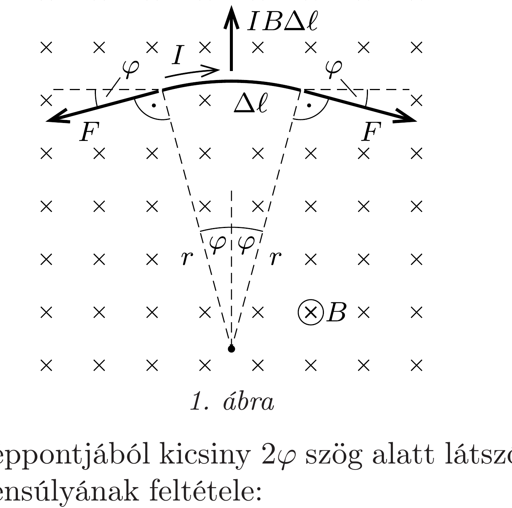
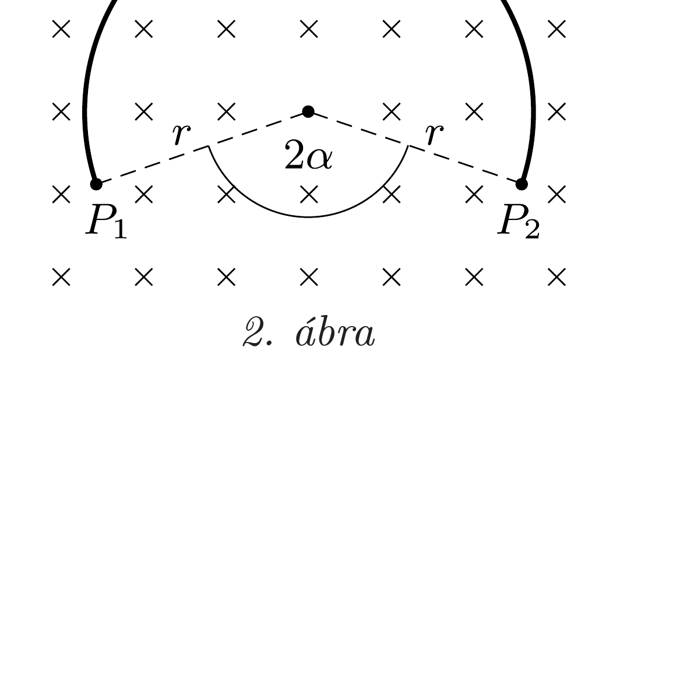
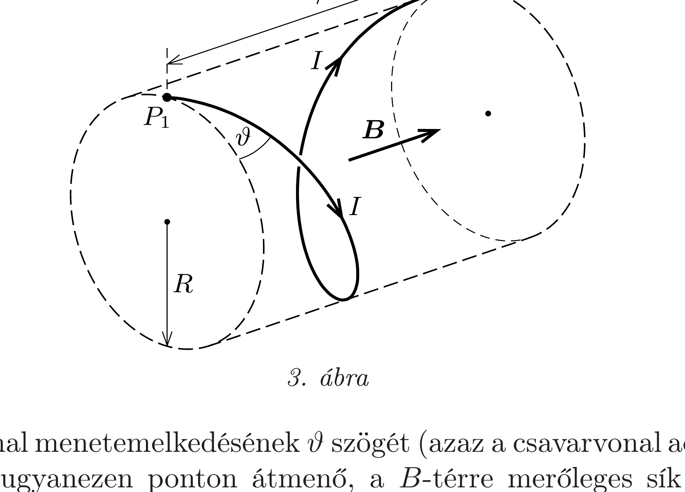

## Útmutatás

A huzal minden pontjában ugyanakkora erő ébred, az erő pedig összefüggésbe hozható a huzal görbületi sugarával. A keresett alak ezért mindkét esetben egy-egy állandó görbületi sugarú görbe lesz.

## Megoldás

a) A vezetőhuzal a mágneses indukcióra merőleges síkban fog elhelyezkedni (a vékony, tehát könnyú huzalra ható nehézségi erő hatását elhanyagoljuk). Mivel a mágneses tér által a vezető darabkáira kifejtett erő mindenhol merőleges a huzalra, ezért a vezeték minden pontjában ugyanakkora erő ébred. A vezeték $r$ görbületi sugarú darabkájában $F=I B r$ nagyságú eró ébred. Ez könnyen belátható a vezeték kis darabkájára ható erők vizsgálatával (1. ábra).

A görbületi kör középpontjából kicsiny $2 \varphi$ szög alatt látszó, $\Delta \ell=2 \varphi r$ hosszúságú huzaldarabka egyensúlyának feltétele:
\[
2 F \sin \varphi=I B \Delta \ell .
\]
A kis szögek miatt $\sin \varphi \approx \varphi$, ebből valóban az $F=I B r$ eredményre jutunk.
Az eddigiekből következik, hogy a huzal alakja állandó görbületi sugarú síkgörbe, tehát egy körív lesz. (Elvben a többmenetes „körtekercs" alak is egyensúlyi helyzet, ez azonban labilis, így nem is alakulhat ki, ahogy egy ceruzát sem lehet a hegyére állítani.)

A körív hossza, valamint a $P_{1}$ és $P_{2}$ pontok távolsága adott, ezért a körív $r$ sugarára és a 2. ábrán látható $\alpha$ szögre teljesülnie kell a következő összefüggéseknek:
\[
2 r \sin \alpha=\ell / 2, \quad 2 r(\pi-\alpha)=\ell .
\]
Innen a $2 \sin \alpha=\pi-\alpha$ transzcendens egyenletre jutunk, amelynek numerikus megoldása
\[
\alpha \approx 1,246 \mathrm{rad}=71,40^{\circ} .
\]
Ezt visszaírva a fenti egyenletekbe a kör sugarára $r \approx 0,264 \ell$, a vezetéket feszítő eróre pedig $F \approx 0,264 I B \ell$ értéket kapunk.
b) A vezetőhuzal darabkáira ebben az esetben sem hat a mágneses térrel párhuzamos irányú erő, ezért a vezetéket feszítő erő $B$ irányú komponense állandó. Továbbra is igaz, hogy a mágneses tér által a vezető darabkáira kifejtett erő mindenhol merőleges a huzalra, ezért a vezeték minden pontjában ugyanakkora erő ébred. Ebből a két tényből következik, hogy a vezetéket feszítő erő mágneses térre merőleges komponensének állandónak kell lennie, azaz ha a mágneses tér irányából nézünk a vezetékre, egy kört fogunk látni, a huzal alakja pedig egyenletes menetemelkedésú, a mágneses térrel párhuzamos tengelyú, egymenetes csavarvonal lesz (3. ábra). (Elvben a többmenetes csavarvonal alak is egyensúlyi helyzet, ez azonban könnyen beláthatóan instabil.)

A csavarvonal menetemelkedésének $\vartheta$ szögét (azaz a csavarvonal adott pontbeli érintőōe és az ugyanezen ponton átmenő, a $B$-térre merőleges sík által bezárt szöget) az ismert $\ell$ ívhosszból számíthatjuk ki:
\[
\sin \vartheta=\frac{\ell}{2 \ell} \text {, ebből } \vartheta=30^{\circ} \text {. }
\]
A csavarvonalra illeszkedő, képzeletbeli hengerpalást $R$ sugara:
\[
R=\frac{\ell \cos \vartheta}{2 \pi}=\frac{\sqrt{3} \ell}{4 \pi} \approx 0,138 \ell .
\]

Most térjünk rá az erő kiszámítására! A csavarvonal tengelyének irányából nézve azt látjuk, hogy az $R$ sugarú, teljes körnek látszó vezetéket a mágneses Lorentz-eró próbálja szétfeszíteni, ezt ellensúlyozza a vezetékben ébredő erőnek a mágneses térre merőleges $F \cos \vartheta$ nagyságú komponense:
\[
I B R=F \cos \vartheta .
\]
$R$ kifejezését felhasználva végül megkapjuk a vezetéket feszítő erőt:
\[
F=\frac{I B \ell}{2 \pi} \approx 0,159 I B \ell .
\]
Látszik, hogy a huzalban ébredő eró független a $P_{1}$ és $P_{2}$ pontok $d$ távolságától $(0<d<\ell)$.
