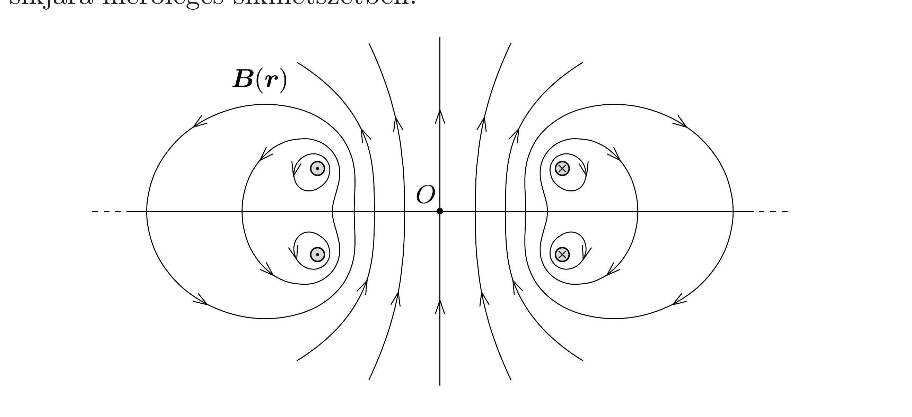

## Útmutatás

A körvezetők közötti felezősíkban a mágneses indukció iránya mindenhol meróleges erre a síkra, és a nagysága csak az $O$ ponttól mért távolságtól függ. Írjuk fel az elektronra ható erőt, és vizsgáljuk meg, mennyivel változtatja meg ennek az erónek a forgatónyomatéka az elektron perdületét!

## Megoldás

Az elektron a körvezetőkkel párhuzamos szimmetriasíkban fog mozogni; sebességének nagysága mindvégig $v_{0}$ marad (hiszen a mágneses tér nem végez munkát), a sebesség iránya pedig a Lorentz-erő hatására folyamatosan változik. A mágneses indukció nagysága (és így a Lorentz-erón nagysága is) meglehetősen bonyolult módon függ a helytől, ennek ellenére az elektron végsebességének irányáról mégis állíthatunk valami határozottat.

Jelöljük az $O$ ponttól már $r$ távolságra került elektron sebességének tangenciális (az $O$ pont irányához képest merőleges) komponensét $v_{\mathrm{t}}$-vel. Az elektron $O$ pontra vonatkozó perdülete $m r v_{\mathrm{t}}$, amelynek megváltozását a Lorentz-eró forgatónyomatéka okozza:
\[
\frac{\Delta\left(m r v_{\mathrm{t}}\right)}{\Delta t}=e \frac{\Delta r}{\Delta t} B(r) \cdot r,
\]
ahol $m$ az elektron tömege, $e$ az elemi töltés, és a feladat ábráján a függőlegesen fölfelé mutató irányt választottuk pozitívnak. Az (1) összefüggés felírásánál felhasználtuk, hogy a Lorentz-erónek csak a radiális sebességből származó komponense hoz létre forgatónyomatékot. Ezek szerint a részecske perdületének megváltozása az $r$ távolság kicsiny $\Delta r$-nyi növekedése során:
\[
\Delta\left(m r v_{\mathrm{t}}\right)=e B(r) r \Delta r=\frac{e}{2 \pi} \Delta \Phi,
\]
ahol $\Delta \Phi=B(r) 2 \pi r \Delta r$ a (tengelyszimmetrikus) mágneses mezőnek az $r$ átlagsugarú, $\Delta r$ szélességú körgyúrúre vonatkoztatott fluxusa.

A (2) egyenlet szerint az elektron perdületének megváltozása, mialatt az $O$ ponttól mért távolsága $r_{1}$-ről $r_{2}$-re változik, arányos a körvezetők mágneses terének az $r_{1}$ és $r_{2}$ sugarú körgyúrún létrehozott fluxusával. Mivel az elektron kezdeti perdülete nulla és $r_{1}=0$, így az elektron perdülete arányos az aktuális sugáron belüli teljes fluxussal. Ha az elektron már „elegendően messze” kerül a körvezetőktől $\left(r_{2} \rightarrow \infty\right)$, akkor
\[
\Phi_{\text {teljes }}=0,
\]
hiszen a mágneses mező forrásmentessége miatt az elektron pályasíkját ugyanannyi (önmagába záródó) mágneses indukcióvonal döfi fölülről lefelé, mint lentről felfelé. Az ábra a mágneses tér szerkezetét mutatja az $O$ ponton átmenő, a körvezetők síkjára merőleges síkmetszetben.

Az elektron perdülete tehát a körvezetőktől igen nagy távolságban ismét nullává válik, így itt a részecske tangenciális sebessége zérus. Ezek szerint az elektron az $O$ ponttól radiális irányban távolodva, $v_{0}$ sebességgel fog mozogni, amikor már igen távolra jutott a körvezetőktől.
