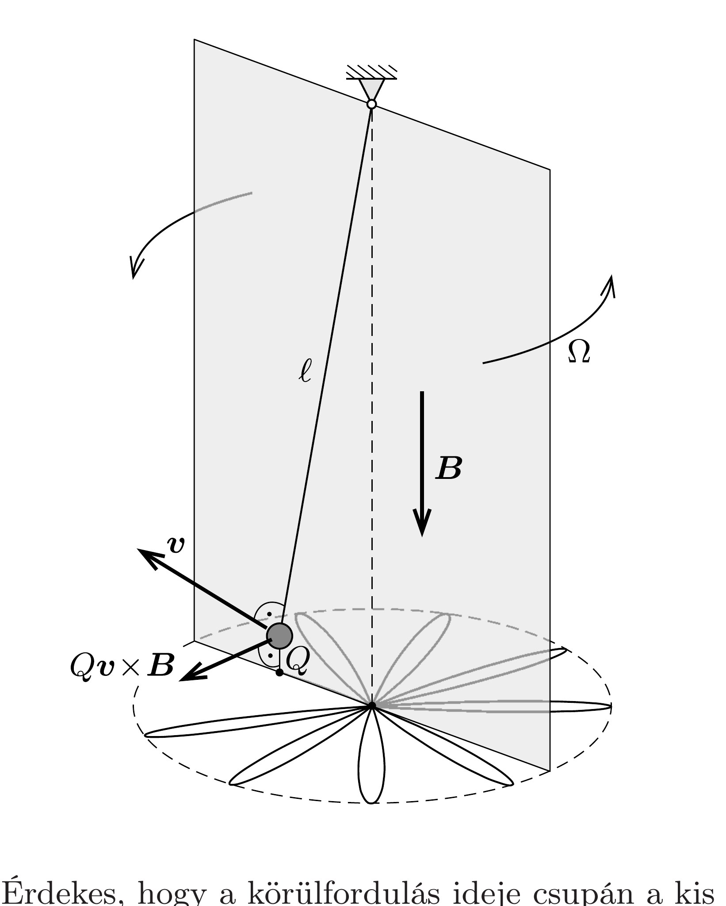

## Útmutatás

Ha felírjuk a mágneses térben lengő ingára a dinamika alapegyenletét, az nagyon hasonlít egy forgó koordináta-rendszerből szemlélt közönséges síkinga mozgásegyenletéhez (Foucault-inga az Északi-sarkon).

## Megoldás

A nyugalmi helyzetétől mért $\boldsymbol{r}$ helyen lévő, $\boldsymbol{v}$ sebességgel mozgó gömbre a fonálerő, a nehézségi erő és a mágneses tér okozta Lorentz-erő hat. Az ingamozgásnál szokásos közelítéseket alkalmazva a fonálerő vízszintes vetülete $-m \omega^{2} \boldsymbol{r}$, ahol $\omega=\sqrt{g / \ell}$ a fonálinga mágneses mező nélküli körfrekvenciája. A gömb mozgásegyenlete a mágneses mezó jelenlétében:
\[
m \boldsymbol{a}=Q \boldsymbol{v} \times \boldsymbol{B}-m \boldsymbol{r} \omega^{2} .
\]

Ez a meglehetősen bonyolult (vektoriális) differenciálegyenlet felsőbb matematikai ismeretek nélkül is megoldható, ha felismerjük, hogy (1) nagyon hasonló egy közönséges síkinga forgó koordináta-rendszerbeli mozgásegyenletéhez (Foucaultinga az Eszaki-sarkon). Ha egy $\omega_{0}$ körfrekvenciával jellemezhető síkinga kis amplitúdójú lengéseit egy olyan koordináta-rendszerből akarjuk leírni, amely $\boldsymbol{\Omega}$ szögsebességgel forog az inerciarendszerhez képest ( $\boldsymbol{\Omega}$ függőleges vektor), akkor a következő (a Coriolis-erốt és a centrifugális erốt is figyelembe vevő) mozgásegyenletet kell tanulmányoznunk:
\[
m \boldsymbol{a}=2 m \boldsymbol{v} \times \boldsymbol{\Omega}-m \boldsymbol{r} \omega_{0}^{2}+m \boldsymbol{r} \Omega^{2} .
\]
Ennek az egyenletnek a megoldását jól ismerjük: mivel a lengés síkja az inerciarendszerben állandó, ezért az $\boldsymbol{\Omega}$ szögsebességgel forgó koordináta-rendszerben $-\boldsymbol{\Omega}$ szögsebességgel forog, tehát $T=2 \pi / \Omega$ idő alatt tesz meg egy teljes fordulatot. Az (1) és (2) egyenleteket összehasonlítva leolvashatjuk, hogy $\boldsymbol{\Omega}=Q \boldsymbol{B} /(2 m)$, és a mágneses térben lengő inga síkjának szögsebességvektora $\boldsymbol{B}$-vel ellentétes irányú (lásd az ábrát). Az inga $\omega_{0}$ saját(kör)frekvenciája is kifejezhető a feladat többi paraméterével:
\[
\omega_{0}=\sqrt{\frac{g}{\ell}+\left(\frac{Q B}{2 m}\right)^{2}},
\]
de ez az inga síkjának elfordulása szempontjából érdektelen. A lengési sík tehát a mágneses mező hatására
\[
T=4 \pi \frac{m}{Q B}
\]
idő alatt fordul teljesen körbe.

2. A $Q B / m$ mennyiséget az adott mágneses térhez tartozó ciklotron-körfrekvenciának nevezik. (Ekkora körfrekvenciájú mozgást végez egy $Q / m$ fajlagos töltésú részecske, ha $B$ indukciójú, homogén mágneses térben kering.) A mágneses térben lengő inga síkja a ciklotron-körfrekvencia felének megfelelő szögsebességgel fordul körbe.
