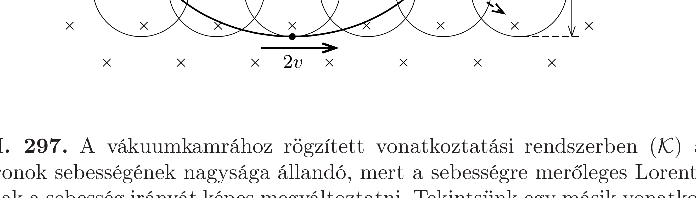

## Útmutatás

Ha $v$ sebességgel mozgunk a $B$ indukciójú mágneses mezó irányára merőlegesen, akkor $v B$ nagyságú elektromos mezőt érzékelünk. Alkalmasan választott sebességgel mozgó vonatkoztatási rendszerbe áttérve ez az elektromos mező kiejtheti a részecskére ható nehézségi erőtér hatását.

## Megoldás

Képzeljük el, hogy beülünk egy olyan koordináta-rendszerbe, amely az indukcióvonalakra merőlegesen, állandó $v$ nagyságú, vízszintes sebességgel mozog, és magunkkal viszünk egy $Q$ töltésú testet. A földhöz rögzített rendszerből azt látjuk, hogy a $v$ sebességú töltésre $F=Q v B$ nagyságú (a mozgásiránytól függően felfelé vagy lefelé mutató) eró hat.

A mozgó vonatkoztatási rendszerben a töltés áll, nem hat rá Lorentz-erő, mégis „éreznie” kell a függőleges irányban ható erốt. (Kölcsönhatásból származó erő nem függhet attól, hogy milyen vonatkoztatási rendszerből írjuk le az erőhatást.) A látszólagos ellentmondás úgy oldható fel, hogy megfontoljuk, hogyan transzformálódnak az elektromos és mágneses terek, ha egy álló rendszerből hozzá képest mozgóra térünk át. Jelen esetben az álló vonatkoztatási rendszerben csak mágneses tér van, elektromos nincs. Egy (a fényhez képest kis sebességgel) mozgó rendszerben megmarad ugyanez a mágneses mező, de mellette fellép egy $E=v B$
nagyságú elektromos térerősség is, ami biztosítja a mozgó rendszerben látszólag hiányzó $F=Q E=Q v B$ erốt.

Legyen a mozgó vonatkoztatási rendszer vízszintes $v$ sebessége akkora és olyan irányú, hogy a benne fellépő elektromos mezőtől származó erő éppen kiegyenlítse a feladatban szerepló testre ható nehézségi erőt:
\[
F=Q E=Q v B=m g, \quad \text { ebből } \quad v=\frac{m g}{Q B} .
\]

Írjuk le a vizsgált test mozgását ebből a vonatkoztatási rendszerből! Mivel az elektromos eró kiegyenlíti a nehézségi erő hatását, és a test ebben a rendszerben (a koordináta-rendszer mozgásirányát pozitívnak választva) $-v$ kezdősebességgel indul, ezért $Q v B$ nagyságú, függőlegesen lefelé mutató eredő erő (mágneses Lorentz-eró) hat rá. Ez az eró a testet lefelé kanyarodó, $r$ sugarú körpályán egyenletes körmozgásra kényszeríti:
\[
Q v B=m \frac{v^{2}}{r},
\]
ahonnan a körpálya sugarára (1) figyelembevételével a következőt kapjuk:
\[
r=\frac{m v}{Q B}=\left(\frac{m}{Q B}\right)^{2} g .
\]
A sebesség és a pályasugár ismeretében a körülfordulási időt könnyen meghatározhatjuk: $T=2 \pi m /(Q B)$.

A földhöz rögzített rendszerben a $v$ sebességú egyenletes körmozgáshoz egyenes vonalú, szintén $v$ sebességú egyenletes mozgás adódik hozzá, vagyis a részecske az ábrán látható módon (közönséges) ciklois alakú pályán halad: a kiindulási pontból $2 r$ mértékben lesüllyed, majd emelkedni kezd, $T$ idő múlva visszajut a kiindulási magasságba, miközben $v T=2 r \pi$ lesz a vízszintes elmozdulása. Itt a részecske egy pillanatra megáll, majd egy újabb ciklois-ív befutásába kezd.

