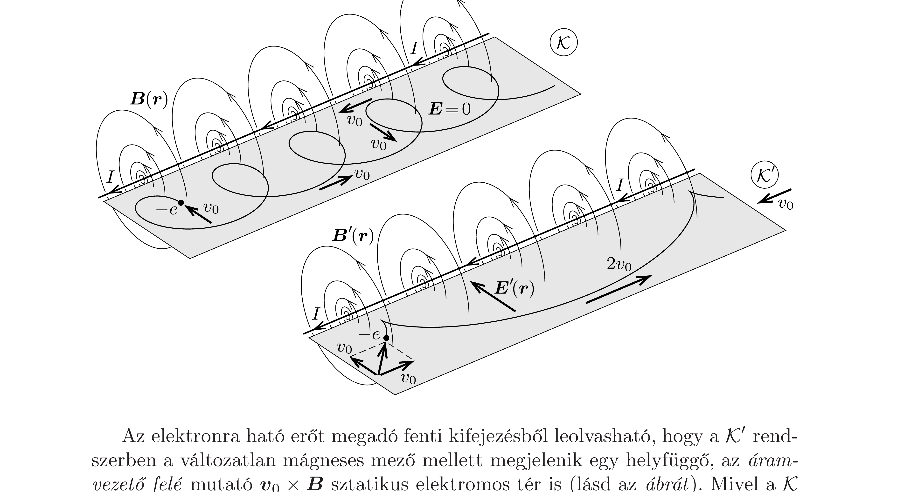

## Útmutatás

A feladat megoldható a vákuumkamrához rögzített koordináta-rendszerben is, de könnyebb a számolás, ha átülünk egy olyan vonatkoztatási rendszerbe, amely az áramjárta vezetővel párhuzamosan, az áram irányában mozog állandó, $v_{0}$ nagyságú sebességgel. Ebben a vonatkoztatási rendszerben a vezető mágneses tere mellett elektromos tér is megjelenik, az elektron sebessége pedig zérussá válik akkor, amikor a legközelebb kerül az áramjárta vezetőhöz. Az elektron kezdeti sebessége az energiamegmaradás segítségével határozható meg.

## Megoldás

A vákuumkamrához rögzített vonatkoztatási rendszerben $(\mathcal{K})$ az elektronok sebességének nagysága állandó, mert a sebességre merőleges Lorentzeró csak a sebesség irányát képes megváltoztatni. Tekintsünk egy másik vonatkoztatási rendszert $\left(\mathcal{K}^{\prime}\right)$, amely $\mathcal{K}$-hoz képest az egyenes vezetővel párhuzamosan, az
áram irányában állandó $\boldsymbol{v}_{\mathbf{0}}$ sebességgel mozog. A $Q=-e$ töltésú elektronra ható erőnek mindkét koordináta-rendszerben meg kell egyeznie:
\[
\boldsymbol{F}=Q(\boldsymbol{v} \times \boldsymbol{B})=Q\left(\boldsymbol{v}^{\prime}+\boldsymbol{v}_{0}\right) \times \boldsymbol{B}=Q\left(\boldsymbol{v}^{\prime} \times \boldsymbol{B}^{\prime}\right)+Q \boldsymbol{E}^{\prime}=\boldsymbol{F}^{\prime},
\]
ahol a vesszős mennyiségek a $\mathcal{K}^{\prime}$ rendszerben tapasztalható értékeket jelölik.
Könnyen beláthatjuk, hogy a vezetékben folyó áram erőssége mindkét koordináta-rendszerben ugyanakkora. A $\mathcal{K}$ rendszerben az egyenes vezető belsejében az elektronok mozognak, a pozitív töltésú rácsionok pedig nyugalomban vannak. A $\mathcal{K}^{\prime}$ rendszerben a vezetési elektronok sebessége (és ezzel együtt az általuk képviselt áramerősség) más lesz, de a mozgó rácsionok árama éppen kompenzálja ezt a változást. Ebből következik, hogy a mágneses indukció értéke ugyanakkora a két vonatkoztatási rendszerben $\left(\boldsymbol{B}=\boldsymbol{B}^{\prime}\right)$. (A fénysebességnél sokkal kisebb transzformációs sebességeknél általánosan igaz, hogy a mágneses tér értéke igen jó közelítéssel változatlan marad.)

Az elektronra ható erốt megadó fenti kifejezésből leolvasható, hogy a $\mathcal{K}^{\prime}$ rendszerben a változatlan mágneses mező mellett megjelenik egy helyfüggő, az áramvezetó felé mutató $\boldsymbol{v}_{0} \times \boldsymbol{B}$ sztatikus elektromos tér is (lásd az ábrát). Mivel a $\mathcal{K}$ rendszerben a mágneses indukció nagysága az $I$ árammal átjárt egyenes vezetőtől $r$ távolságban
\[
B(r)=\frac{\mu_{0}}{2 \pi} \frac{I}{r},
\]
a $\mathcal{K}^{\prime}$ rendszerben megjelenő elektromos tér nagyságát az
\[
E(r)=v_{0} B(r)=\frac{\mu_{0} v_{0} I}{2 \pi r}
\]
összefüggés adja meg. Nagyon hasonló az elektromos tere egy hengerkondenzátornak. Az analógiát felhasználva (vagy integrálás segítségével) felírhatjuk a $\mathcal{K}^{\prime}$ rendszerben az elektromos potenciált az egyenes vezetőtől $r$ távolságban:
\[
U(r)=\frac{\mu_{0} v_{0} I}{2 \pi} \ln \frac{r}{r_{0}} .
\]
(A potenciált a vezetőtől $r_{0}$ távolságban választottuk nullának.)
Vizsgáljuk az elektron mozgását a $\mathcal{K}^{\prime}$ rendszerben! A kezdősebesség nagysága $\sqrt{2} v_{0}$, ekkor az elektron távolsága az áramjárta vezetőtől $r_{0}$. Amikor a $Q=-e$ töltésú elektron $r_{0} / 2$ távolságra megközelíti a vezetéket, sebessége nullára csökken, ezért az energia megmaradása így írható:
\[
\frac{1}{2} m\left(\sqrt{2} v_{0}\right)^{2}-e \frac{\mu_{0} v_{0} I}{2 \pi} \ln \frac{r_{0}}{r_{0}}=-e \frac{\mu_{0} v_{0} I}{2 \pi} \ln \frac{r_{0} / 2}{r_{0}} .
\]
A számszerú adatok behelyettesítése után az elektronok kezdősebességére a
\[
v_{0}=\frac{\mu_{0} e I}{2 \pi m} \ln 2 \approx 2,46 \cdot 10^{5} \frac{\mathrm{~m}}{\mathrm{~s}} \approx 250 \frac{\mathrm{~km}}{\mathrm{~s}} .
\]
eredményt kapjuk.
Megjegyzések. 1. A kapott sebesség a makroszkopikus, földi testek sebességéhez képest nagy: az elsó kozmikus sebesség is csak mintegy 8 km/s, és a Naprendszer elhagyásához is elég egy 20 km/s-nál kisebb sebesség. A fény sebességéhez képest viszont kicsi, hiszen az 300000 km/s. Ezért is lehetett a relativisztikus tömegnövekedéstől eltekinteni a feladat megoldása során. Még a katódsugárcsóben (TV, oszcilloszkóp, elektronmikroszkóp) futó elektronok sebességéhez képest is kis sebességet kaptunk, hiszen már kb. 0,2 V gyorsítófeszültség hatására elérik az elektronok ezt a sebességet.
2. Érdekesség, hogy az $r_{0}$-ról így kilőtt elektron nemcsak hogy $r_{0} / 2$-re tudja megközelíteni az áramvezető̂t, de nem is tud $2 r_{0}$-nál messzebb eltávolodni tőle. Általánosságban, ha $r_{0} / n$-re tudja megközelíteni, akkor $n r_{0}$-ra tud eltávolodni tóle. Másképp fogalmazva: a legkisebb és a legnagyobb távolság mértani közepe az a távolság, ahol éppen az áramvezetőre merőlegesen halad. Ez az állítás a vákuumkamrához képest $-\boldsymbol{v}_{0}$ sebességgel mozgó koordináta-rendszerbe való transzformációval látható be.
