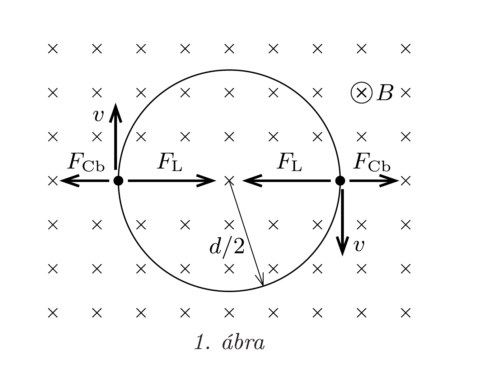
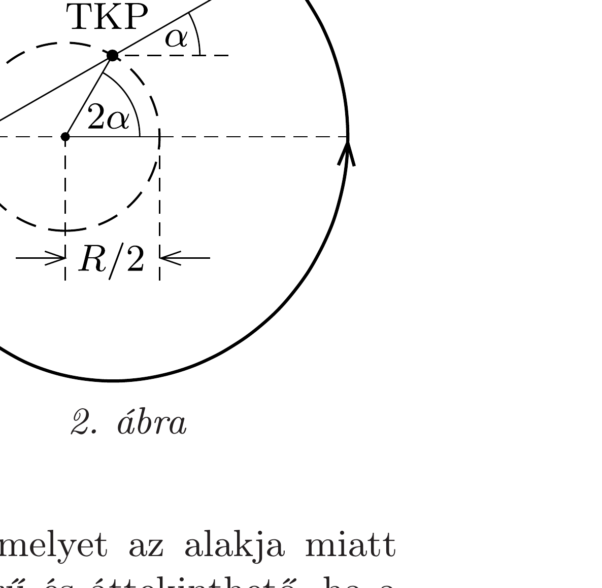

## Útmutatás

Érdemes a két elektron mozgásegyenletét vektoros alakban felírni. A két mozgásegyenlet összege a tömegközéppont mozgását írja le, a különbségük pedig az elektronok egymáshoz viszonyított (relatív) mozgását.

\section*{Áramkörök, elektromos vezetés}

## Megoldás

a) A mágneses térben mozgó elektronokra akkora Lorentz-erőnek kell hatnia, hogy legyőzze a köztük fellépő elektrosztatikus taszítóerőt, sőt biztosítsa még az egyenletes körmozgáshoz szükséges centripetális erót is. A két elektron ugyanazon a $d / 2$ sugarú körpályán, egymással szemben, ugyanakkora sebességgel fog mozogni, ezáltal nem változik a közöttük lévő $d$ távolság (1. ábra).

Írjuk fel egy elektron mozgásegyenletét! A - $e$ töltésú, $m$ tömegú és $v$ sebességgel mozgó részecskére
\[
F_{\mathrm{L}}=e v B
\]
nagyságú Lorentz-eró és
\[
F_{\mathrm{Cb}}=k \frac{e^{2}}{d^{2}}
\]

Coulomb-erő hat. Az előbbi (megfelelő irányú mozgás esetén) mindig a másik elektron felé mutató erő, az utóbbi azonban mindig taszító jellegú.

Megjegyzés. Elvben figyelembe kellene még vennünk a mozgó elektronok által keltett (pl. a Biot-Savart-törvényből számolható) mágneses teret, és az ebből származó
\[
F_{\text {mágn }}=e v \cdot \frac{\mu_{0}}{4 \pi} \cdot \frac{e v}{d^{2}}=\frac{v^{2}}{c^{2}} \cdot F_{\mathrm{Cb}}
\]
mágneses erőhatást is ( $c$ a fénysebesség). Ez az erő azonban egy klasszikusan (nemrelativisztikusan) mozgó részecskére $v \ll c$ miatt elhanyagolható a Coulomb-erő mellett, tehát nem kell számolnunk vele.

Az elektronok mozgásegyenlete az irányokat is figyelembe véve:
\[
e v B-k \frac{e^{2}}{d^{2}}=m \frac{v^{2}}{d / 2} .
\]
Ez a kiszámítandó $v$ sebességre nézve másodfokú egyenlet, melynek megoldásai:
\[
v=\frac{e d B}{4 m} \pm \sqrt{\left(\frac{e d B}{4 m}\right)^{2}-\frac{k e^{2}}{2 m d}} .
\]
Akkor oldható meg a feladat, ha $v$-re valós érték adódik, vagyis a diszkrimináns nemnegatív. Ebből $d$-re kapunk egy feltételt:
\[
d \geq 2 \sqrt[3]{\frac{k m}{B^{2}}}=d_{\text {krit }}
\]
Ezért szerepel a feladat szövegében az a kitétel, hogy a két elektron „elég messze” van egymástól, nem pedig azért, hogy elhanyagoljuk a köztük fellépő Coulomberốt. Ha kezdetben a két elektron a kritikus távolságnál közelebb van egymáshoz, akkor a feladatnak nincs megoldása, ha éppen a kritikus távolságra vannak egymástól, akkor egy megoldása van, ha a kritikus távolságnál messzebb vannak az elektronok, akkor két különböző sebességértékú megoldást találhatunk.
b) Ha csak az egyik elektront lökjük meg, a mozgás bonyolultabb lesz, még abban a speciális esetben is, amikor a távolságuk - a feladat kérdésének megfelelően - mindvégig ugyanakkora, $d$ nagyságú marad.

Közel jutunk a megoldáshoz, ha először a feltett - segítő - kérdésre („Milyen pályán mozog ekkor a rendszer tömegközéppontja?") keressük a választ. Írjuk fel - vektorosan, a szokásos jelöléseket használva - az elektronok mozgásegyenleteit!
\[
\begin{aligned}
& m \boldsymbol{a}_{1}=k \frac{e^{2}}{\left|\boldsymbol{r}_{1}-\boldsymbol{r}_{2}\right|^{3}}\left(\boldsymbol{r}_{1}-\boldsymbol{r}_{2}\right)-e \boldsymbol{v}_{1} \times \boldsymbol{B}, \\
& m \boldsymbol{a}_{2}=k \frac{e^{2}}{\left|\boldsymbol{r}_{1}-\boldsymbol{r}_{2}\right|^{3}}\left(\boldsymbol{r}_{2}-\boldsymbol{r}_{1}\right)-e \boldsymbol{v}_{2} \times \boldsymbol{B} .
\end{aligned}
\]

Tudjuk, hogy két egyforma tömegú részecske tömegközéppontjára
\[
\boldsymbol{r}_{\mathrm{tkp}}=\frac{\boldsymbol{r}_{1}+\boldsymbol{r}_{2}}{2}, \quad \boldsymbol{v}_{\mathrm{tkp}}=\frac{\boldsymbol{v}_{1}+\boldsymbol{v}_{2}}{2}, \quad \boldsymbol{a}_{\mathrm{tkp}}=\frac{\boldsymbol{a}_{1}+\boldsymbol{a}_{2}}{2} .
\]
Annak érdekében, hogy ezek a mennyiségek megjelenjenek a képleteinkben, adjuk össze a két elektron mozgásegyenletét!
\[
m\left(\boldsymbol{a}_{1}+\boldsymbol{a}_{2}\right)=0-e\left(\boldsymbol{v}_{1}+\boldsymbol{v}_{2}\right) \times \boldsymbol{B},
\]
amiből
\[
m \boldsymbol{a}_{\mathrm{tkp}}=-e \boldsymbol{v}_{\mathrm{tkp}} \times \boldsymbol{B}
\]
következik. (Látható, hogy a Coulomb-kölcsönhatás kiesett a tömegközéppont mozgásegyenletéből.)

Nagyon fontos felismeréshez jutottunk: a két elektronból álló rendszer tömegközéppontja úgy mozog, mint egyetlen elektron a $\boldsymbol{B}$ indukciójú, homogén mágneses térben, az indukcióvonalakra merőlegesen. Az pedig körpályán mozog, egyenletesen! A tömegközéppont tehát egyenletes körmozgást végez, miközben körülötte „kalimpál” a két elektron. A tömegközéppont mozgásának szögsebessége
\[
\omega_{\mathrm{tkp}}=\frac{a_{\mathrm{tkp}}}{v_{\mathrm{tkp}}}=\frac{e}{m} B=\omega_{\mathrm{c}},
\]
ami éppen az elektron ciklotronfrekvenciája (adott erősségú mágneses térben - pl. egy részecskegyorsító ciklotronban - ekkora körfrekvenciával keringenek a részecskék.) A tömegközéppont körpályájának sugara
\[
R_{\mathrm{tkp}}=\frac{v_{\mathrm{tkp}}}{\omega_{\mathrm{tkp}}}=\frac{v_{\mathrm{tkp}}}{\omega_{\mathrm{c}}} .
\]

Vajon hogyan mozognak az elektronok a tömegközéppont körül? Nyilván ennek a kérdésnek a megválaszolása vezet el a feladat hátralévő részének megoldásához. Írjuk fel az 1-es elektron helyvektorát $\boldsymbol{r}_{1}=\boldsymbol{r}_{\mathrm{tkp}}+\boldsymbol{R}$ alakban, vagyis jelöljük a tömegközépponttól az 1-es elektronhoz mutató vektort $\boldsymbol{R}$-rel. (Ekkor a másik
elektronhoz a tömegközépponttól a $-\boldsymbol{R}$ vektor mutat.) A tömegközéppontot megadó képlet felhasználásával adódik, hogy
\[
\boldsymbol{R}=\boldsymbol{r}_{1}-\boldsymbol{r}_{\mathrm{tkp}}=\boldsymbol{r}_{1}-\frac{\boldsymbol{r}_{1}+\boldsymbol{r}_{2}}{2}=\frac{\boldsymbol{r}_{1}-\boldsymbol{r}_{2}}{2} .
\]
Ezen vektor idóbeli változására úgy kaphatunk egyenletet, hogy képezzük az (1) és (2) mozgásegyenletek különbségét:
\[
m\left(\boldsymbol{a}_{1}-\boldsymbol{a}_{2}\right)=2 k \frac{e^{2}}{\left|\boldsymbol{r}_{1}-\boldsymbol{r}_{2}\right|^{3}}\left(\boldsymbol{r}_{1}-\boldsymbol{r}_{2}\right)-e\left[\left(\boldsymbol{v}_{1}-\boldsymbol{v}_{2}\right) \times \boldsymbol{B}\right] .
\]
A helyvektorok különbsége a fentebb megadott $\boldsymbol{R}$ vektor kétszerese, a sebességvektorok különbsége tehát az $\boldsymbol{R}$ vektor időbeli változását megadó $\boldsymbol{V}$ vektor kétszerese, és hasonló igaz a gyorsulásokra is:
\[
\boldsymbol{r}_{1}-\boldsymbol{r}_{2}=2 \boldsymbol{R}, \quad \boldsymbol{v}_{1}-\boldsymbol{v}_{2}=2 \boldsymbol{V}, \quad \boldsymbol{a}_{1}-\boldsymbol{a}_{2}=2 \boldsymbol{A} .
\]
Ezekkel a jelölésekkel a (3) egyenlet ilyen alakot ölt:
\[
m \boldsymbol{A}=k \frac{e^{2}}{|2 \boldsymbol{R}|^{3}} 2 \boldsymbol{R}-e(\boldsymbol{V} \times \boldsymbol{B}) .
\]

Ez az egyenlet lényegében ugyanolyan, mint a feladat első részében (az álló tömegközéppont esetében) kapott mozgásegyenlet, tehát - alkalmas kezdősebesség esetén - ennek is lehet egyenletes körmozgásos megoldása. Valóban, ha az $\boldsymbol{R}(t)$ vektor nagysága időben állandó $R$ érték, és az iránya $\omega$ szögsebességgel forog körbe, akkor az egyenletes forgómozgás ismert képletei szerint $\boldsymbol{A}=-\omega^{2} \boldsymbol{R}$ és $\boldsymbol{V} \times \boldsymbol{B}=\boldsymbol{R} \omega B$, és így (4) szerint a tömegközéppont körül keringő elektronpár $\omega$ szögsebességére a következő másodfokú egyenlet adódik:
\[
\omega^{2}-\frac{e}{m} B \omega+\frac{k}{m} \frac{e^{2}}{4 R^{3}}=0 .
\]
Ennek $\omega$-ra akkor van valós megoldása, ha a diszkrimináns nemnegatív, azaz ha
\[
R \geq \sqrt[3]{\frac{k m}{B^{2}}} .
\]
A minimális távolság, ami mellett ilyen mozgás létrejöhet:
\[
d_{\min }=2 R_{\min }=2 \sqrt[3]{\frac{k m}{B^{2}}}=d_{\text {krit }} .
\]
(Ez a feltétel akkor is érvényes, amikor a tömegközéppont áll, tehát nem meglepő, hogy a minimális távolság éppen a feladat első részében kapott $d_{\text {krit }}$ érték.)

Próbáljuk meg felvázolni a részecskék pályáját abban a speciális esetben, amikor $d=d_{\text {min }}$, vagyis
\[
R=R_{\min }=\sqrt[3]{\frac{k m}{B^{2}}} .
\]

Ezt az értéket (5)-be helyettesítve az elektronok tömegközéppont körüli keringésének szögsebességére
\[
\omega=\frac{e}{2 m} B=\frac{\omega_{\mathrm{c}}}{2},
\]
vagyis a tömegközéppont szögsebességének fele adódik.
Indítsuk el a rendszert úgy, ahogy a $b$ ) kérdésben szerepelt, vagyis csak az egyik elektront lökjük meg valamekkora $v_{0}$ sebességgel, a két részecskét összekötő egyenesre merőlegesen. (Ha a kezdősebesség iránya más lenne, akkor nyilván már a mozgás kezdetén megváltozna a két részecske távolsága.) A másik elektron áll, tehát a tömegközéppont $v_{0} / 2$ sebességgel indul el, és ugyanekkora nagyságú (de egymással ellentétes irányú) mindkét elektronnak a tömegközépponthoz viszonyított kezdősebessége.

A tömegközéppont körüli keringésre igaz, hogy
\[
\frac{v_{0}}{2}=R \omega=R \frac{\omega_{\mathrm{c}}}{2} .
\]
Ugyanekkor a tömegközéppont keringésére fennáll, hogy
\[
\frac{v_{0}}{2}=R_{\mathrm{tkp}} \omega_{\mathrm{c}}, \quad \text { vagyis } \quad R_{\mathrm{tkp}}=\frac{R}{2} .
\]

Ezek szerint a tömegközéppont feleakkora sugarú körpályán kering, mint körülötte az elektronok, továbbá a tömegközéppont keringési ideje is feleakkora, mint a hozzá képest mozgó elektronoké.

Ábrázoljuk vázlatosan a részecskék pályáját! A 2. ábrán a szemléletesség kedvéért (szaggatott vonallal) berajzoltuk a tömegközéppont pályáját is. Miközben a meglökött elektron $\alpha$ szöggel elfordul a tömegközéppont körül, a tömegközéppont $2 \alpha$ szöggel fordul el saját, feleakkora sugarú körpályáján.
$T=2 \pi / \omega_{\mathrm{c}}$ idő alatt a tömegközéppont egy teljes kört tesz meg; a két elektron azonban csak egy-egy félkört fut be körülötte - éppen helyet cserélnek! Ekkor, tehát
\[
T=2 \pi \frac{m}{e B}
\]

idő múlva áll meg először a meglökött elektron.
Megjegyzések. 1. A két elektron megrajzolt pályagörbéje (melyet az alakja miatt szívgörbének, kardioidnak is neveznek) csak akkor ilyen egyszerú és áttekinthető, ha a távolságuk a már említett legkisebb távolság az adott erôsségü mágneses térben. Ha nagyobb távolság állandóságát követeljük meg, akkor már nehezebben áttekinthető (általában nem is zárt) pályák és mozgások jöhetnek létre.
2. Még bonyolultabb lesz a helyzet akkor, ha a kezdősebesség nem teljesíti a távolság állandóságának megfelelő feltételt. Belátható, hogy még ebben az esetben sem tudnak a részecskék egymástól nagyon eltávolodni, vagy egymáshoz közel kerülni, a távolságuk mindig két szélsőérték között marad, azok között periodikusan ingadozik.

\section*{Áramkörök, elektromos vezetés}
