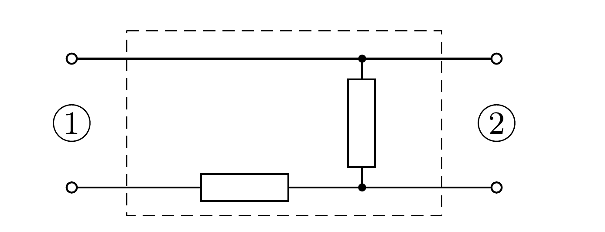

## Útmutatás

A dobozban megfelelő módon összekapcsolt két ellenállás található.

## Megoldás

Az ábrán látható, két egyforma ellenállást tartalmazó egyszerú kapcsolás teljesíti a megadott feltételeket.

