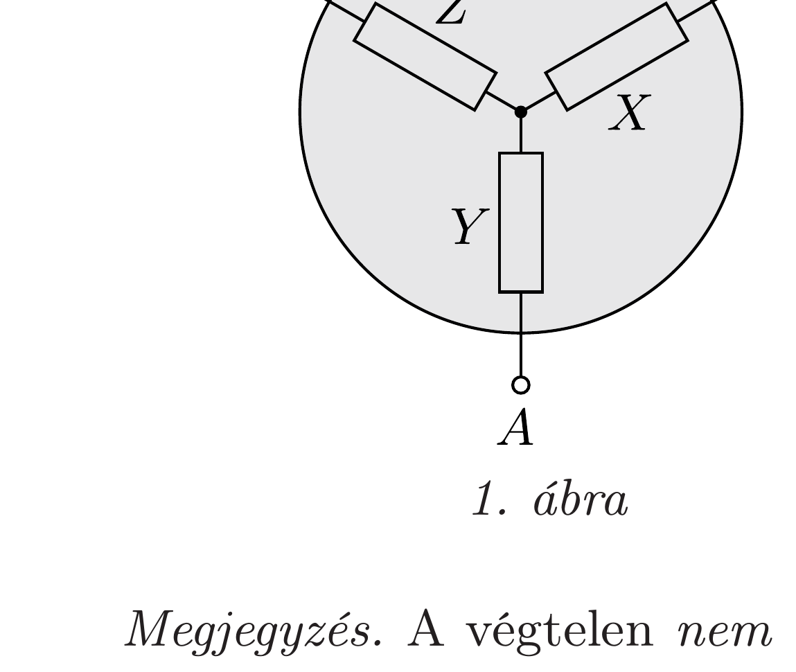
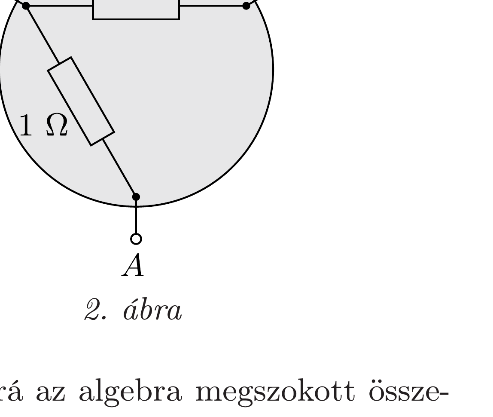

## Útmutatás

Próbáljuk meg a fekete doboz belsejében a deltakapcsolást csillagkapcsolással helyettesíteni!

## Megoldás

Az 1. ábrán látható ellenállásokra a következó egyenleteket írhatjuk fel:
\[
Y+Z=1, \quad X+Z=2 \quad \text { és } \quad X+Y=3 .
\]
Ennek megoldása: $X=2, Y=1$ és $Z=0$ ohm. A deltakapcsolás nyelvén ez annak felel meg, hogy $x=1, y=2, z$ helyén pedig szakadás, vagyis „végtelen nagy" ellenállás van (2. ábra).

Megjegyzés. A végtelen nem szám, nem érvényesek rá az algebra megszokott összefüggései, ez az oka, hogy a formális számolásunk ellentmondásra vezetett. Ha z-t nem végtelen nagynak, csak az $1 \Omega$-nál sokkal (nagyságrendekkel) nagyobb értéknek tekintjük (a fizikában a „végtelen" mindig így értendő!), akkor a feladat szövegében szereplő (1), (2) és (3) egyenletek (a megadott számadatok pontosságának megfelelő közelítésben) valóban teljesülnek.
