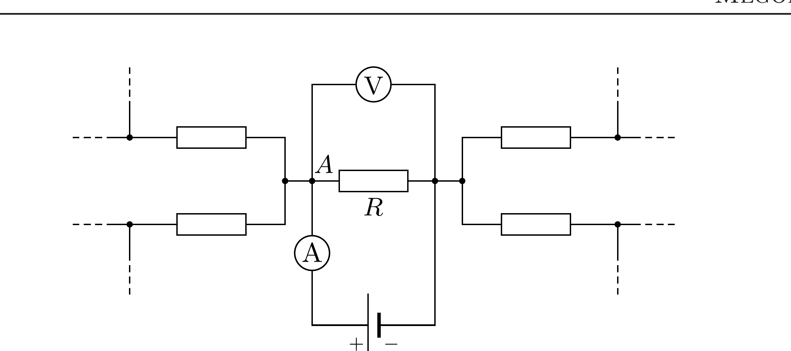
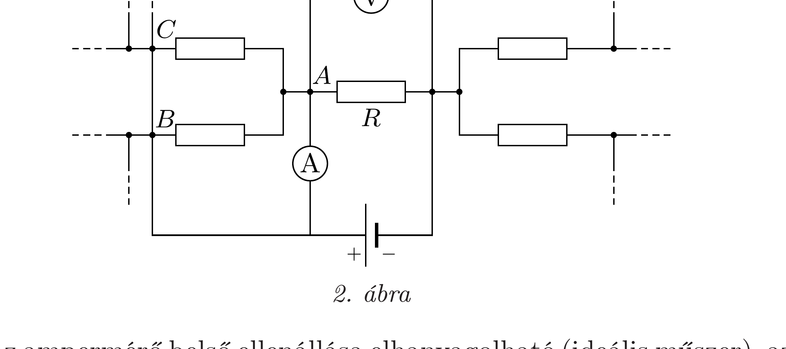

## Útmutatás

Csatlakoztassuk a telepet az ampermérőn keresztül a kiszemelt ellenállásra. Arról kell gondoskodnunk, hogy az amperméró árama teljes mértékben a kiválasztott ellenálláson folyjon át.

## Megoldás

Csatlakoztassuk először a telepet az ampermérőn keresztül a mérendő ellenállás kivezetéseire, majd a voltmérőt is kössük ugyanezekre a kivezetésekre, ahogy ezt az 1. ábra mutatja.

Helytelen az a feltételezés, miszerint a voltmérőn és az ampermérőn látható értékek hányadosa megadja a kérdéses ellenállás értékét, mert nem lehetünk abban biztosak, hogy az ampermérőből az ábrán látható $A$ csomópontba érkező összes áram az ellenállás felé halad tovább, és egyáltalán nem folyik semennyi áram ebből a csomópontból az áramkör más részei felé.

A gondot rövidzárak alkalmazásával oldhatjuk meg. Nulla ellenállású vezetékekkel kössük össze az $A$ pont összes szomszédos csomópontját a telepnek azzal a kivezetésével, amelyre az ampermérőt csatlakoztattuk, amint ez a 2. ábrán látható.

Mivel az ampermérő belső ellenállása elhanyagolható (ideális múszer), az összekötött $B, C, \ldots$ csomópontok és az $A$ pont ekvipotenciális. Ebből következőleg nem folyik áram a szomszédos csomópontok és az $A$ pont között, vagyis az ampermérő áramának teljes mértékben át kell folynia a kiszemelt $R$ ellenálláson. Az lehetséges, hogy a telepnek további áramokat is kell szolgáltatnia, melyek a $B, C, \ldots$ csomópontok felé folynak, azonban ezek nem befolyásolják a mi mérésünket.

Megjegyzés. Ha a kiszemelt $R$ ellenállással párhuzamosan kapcsolt ellenállásokat is tartalmaz az áramkör, akkor ezek értékét külön-külön nem tudjuk megmérni, ilyenkor (a mérendő elem kiforrasztása nélkül) csak az összes párhuzamosan kötött ellenállás eredốjét határozhatjuk meg. Ha megpróbálnánk ebben az esetben esetben is a fentebb ismertetett módszert alkalmazni, rövidre zárnánk az ideálisnak feltételezett telepet, ami „végtelen nagy" áramerősséget eredményezne!
