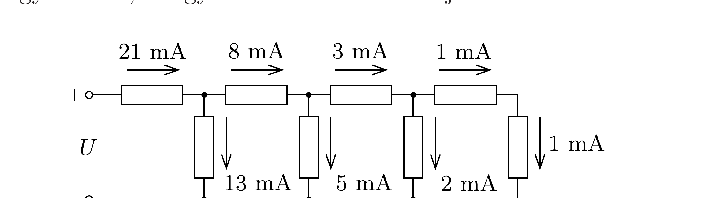
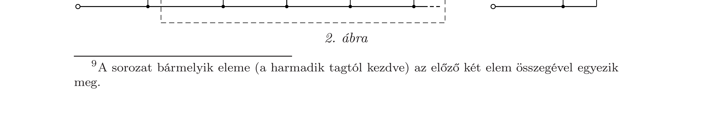

## Útmutatás

A lánc utolsó elemétől visszafelé haladva alkalmazzuk a Kirchhofftörvényeket! Keressünk kapcsolatot az egymás utáni ellenállásokon folyó áramok és a Fibonacci-számok között!

## Megoldás

A lánc jobb szélső elemétől kezdve haladjunk visszafelé, és számozzuk az ellenállásokat innen. Mivel az első ellenálláson 1 mA áram folyik, így a második elemen is 1 mA-nek kell folyni, így mindkét ellenálláson 1-1 V feszültség esik. Ennek következtében az ellenálláslánc harmadik ellenállására $(1+1) \mathrm{V}=$ 2 V feszültség jut, vagyis ezen 2 mA-es áram folyik. A következő ellenálláson $(1+2) \mathrm{mA}=3 \mathrm{~mA}$ áram folyik, majd a 2 mA -es és 3 mA -es áramú ellenállásokon
esó $(2+3) \mathrm{V}=5 \mathrm{~V}$ feszültségből határozhatjuk meg az ötödik ellenállás 5 mA-es áramát, és így tovább, ahogy ezt az 1. ábra mutatja.

Ha úgy tekintjük, hogy az ellenállásláncot a jobb szélső elemétől kezdve építjük fel, akkor egymást követően sorosan, majd párhuzamosan, újra sorosan, majd újra párhuzamosan csatlakoztatunk elemeket a lánc már meglévő részéhez. A sorosan csatlakoztatott ellenálláson (Kirchhoff csomóponti törvénye értelmében) az előző két ellenálláson folyó áram összege folyik. A párhuzamosan csatlakoztatott elem egy újabb hurkot hoz létre a láncban, az erre jutó feszültség Kirchhoff huroktörvénye szerint megegyezik az előző két ellenálláson eső feszültségek összegével. Mivel az $1 \mathrm{k} \Omega$-os ellenálláson a feszültség és az áramerősség (voltban és milliamperben mért) számértéke megegyezik, az előző két ellenállás áramának összege is megegyezik a párhuzamosan csatlakoztatott újabb ellenállás áramával. Tehát ebben az ún. létraáramkörben Kirchhoff csomóponti és huroktörvénye úgy teljesül, hogy az egyes ellenállásokon folyó áramok (és a rajtuk esó feszültségek is) megegyeznek az előző két elemen folyó áram (illetve feszültség) összegével. Vegyük észre, hogy az áramok (és a feszültségek) számértékei éppen a híres Fibonaccisorozat ${ }^{9}$ elemeivel egyeznek meg: 1, 1, 2, 3, 5, 8, 13, 21. A két utolsó ellenállásra $(21+13) \mathrm{V}=34 \mathrm{~V}$ feszültség esik, ami egyben megegyezik a létraáramkör bemenetére kapcsolt feszültséggel. Mivel a bemeneti 34 V feszültség hatására összesen 21 mA áram folyik, a lánc eredő ellenállása $\frac{34}{21} \mathrm{k} \Omega=1,61905 \mathrm{k} \Omega$.

Ha még egy elemet kapcsolunk a láncba (párhuzamosan), akkor azon is 34 V esik, a teljes áram viszont $(21+34) \mathrm{mA}=55 \mathrm{~mA}$ értékre nő. Ekkor az eredő ellenállás $\frac{34}{55} \mathrm{k} \Omega=0,61818 \mathrm{k} \Omega$. Ha ezután még egy elemet kapcsolunk a láncba (sorosan), akkor azon is 55 mA áram folyik, a bemenő feszültség pedig $(34+55) \mathrm{V}=$ 89 V-ra növekszik. Ekkor a lánc eredó ellenállása $\frac{89}{55} \mathrm{k} \Omega=1,61818 \mathrm{k} \Omega$.

\footnotetext{
${ }^{9}$ A sorozat bármelyik eleme (a harmadik tagtól kezdve) az előő két elem összegével egyezik meg.

Ha a létraáramkört egyre tovább és tovább építjük, akkor képzeletben „végtelen" hosszú lánchoz juthatunk. Ennek eredő ellenállását azzal a feltételezéssel számíthatjuk ki, hogy a lánc eredő ellenállásán további két tag hozzáadása már nem változtat. Vagyis az egész végtelen láncot egyetlen $R$ ellenállással helyettesítjük, amihez párhuzamosan és sorosan két 1-1 k $\Omega$-os ellenállást kapcsolunk, és elvárjuk, hogy ennek a három ellenállásból álló áramkörnek az eredő ellenállása szintén $R$ legyen (2. ábra). Ennek feltétele ( $\mathrm{k} \Omega$ egységekben számolva):
\[
R=1+\frac{1}{1+\frac{1}{R}},
\]
ami a következő másodfokú egyenlethez vezet:
\[
R^{2}-R-1=0 .
\]
Az egyenlet egyetlen pozitív gyöke adja meg a „végtelen” lánc keresett eredő ellenállását:
\[
R=\frac{1+\sqrt{5}}{2} \approx 1,61803 \mathrm{k} \Omega .
\]

Jól látható, hogy a nyolc vagy tíz elemből álló lánc eredő ellenállása milyen közel van a végtelen lánc ellenállásához, tehát a létraáramkör (az eredő ellenállás szempontjából) már viszonylag kevés elem után is végtelennek tekinthető. ${ }^{10}$

Megjegyzések. 1. A falusi elektromos hálózatok nullvezetéke létraáramkörnek tekinthető. Itt a nullvezetéket oszlopokon rögzítik, és bizonyos távolságonként (mondjuk minden tizedik oszlopnál) a nullvezetéket leföldelik. Az ilyen áramkör kétféle ellenállásból áll; a „végtelen” lánc eredő ellenállása a fentiekhez hasonlóan számítható.
2. Érdekes észrevenni, hogy a végtelen ellenállásláncra jellemző másodfokú egyenlet a híres aranymetszési egyenlet. ${ }^{11}$ Ennek megoldása az aranymetszés arányszáma: $(1+\sqrt{5}) / 2=1,61803 \ldots$, ami tehát megegyezik az egységnyi ellenállásokból álló végtelen lánc eredő ellenállásának számértékével. Az is látszik, hogy a Fibonacci-sorozat egymást követő elemeinek hányadosa az aranymetszés arányszámához tart, amit meglepően gyorsan közelít. Könnyen meggyőződhetünk arról, hogy a páros sorszámú elemeket az előző páratlannal osztva az arányszámot alulról közelítjük, míg a páratlanokat az előző párossal osztva a határértéket felülről közelítjük meg.
3. Az egységnyi ellenállású elemekból álló végtelen lánc eredő ellenállása egy (végtelen) emeletes törttel is kifejezhető. Ha a fogyasztókat a lánc elejéről kezdve rakjuk össze, ezt kapjuk:
\[
R=1+\frac{1}{1+\frac{1}{1+\frac{1}{1+\ldots}}} .
\]
A végtelen tört (is) mutatja, hogy $R-1=1 / R$.

\footnotetext{
${ }^{10}$ A véges hosszú létraáramkör eredő ellenállását csak azért adtuk meg ilyen sok tizedesjegyre (egyébként indokolatlan pontossággal), hogy a sorozat gyors konvergenciáját érzékeltessük.
${ }^{11} \mathrm{Az}$ aranymetszés problémájánál egy szakaszt úgy kell két részre vágnunk, hogy a rövidebb és a hosszabb rész aránya a hosszabb metszet és a szakasz teljes hosszának arányával legyen egyenlő.
