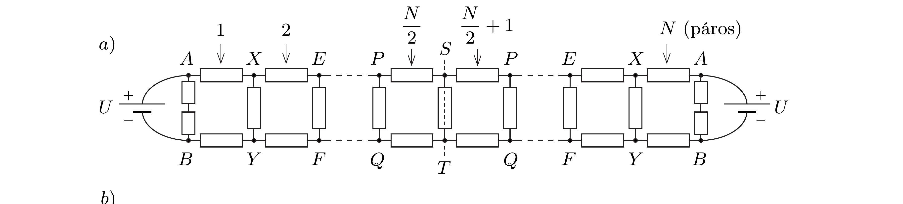
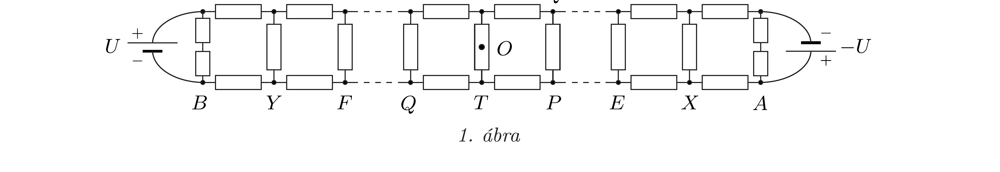
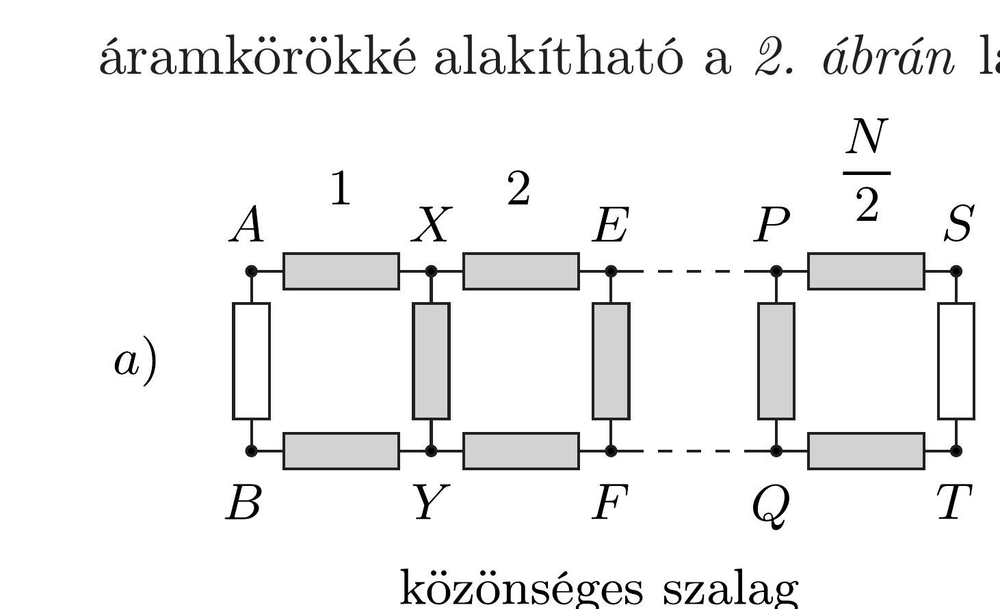
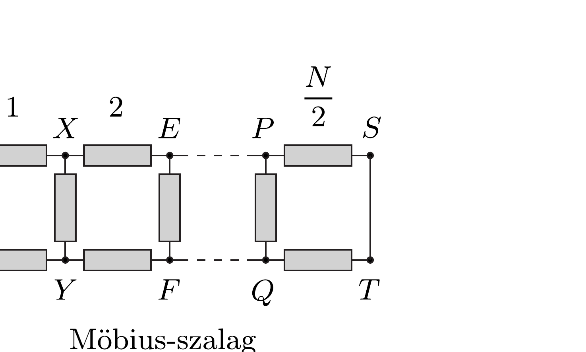
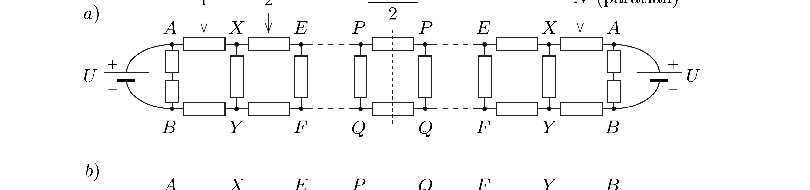
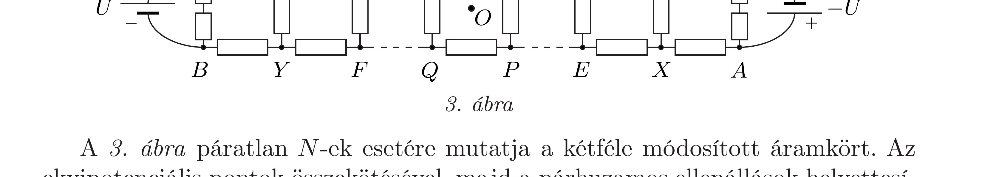
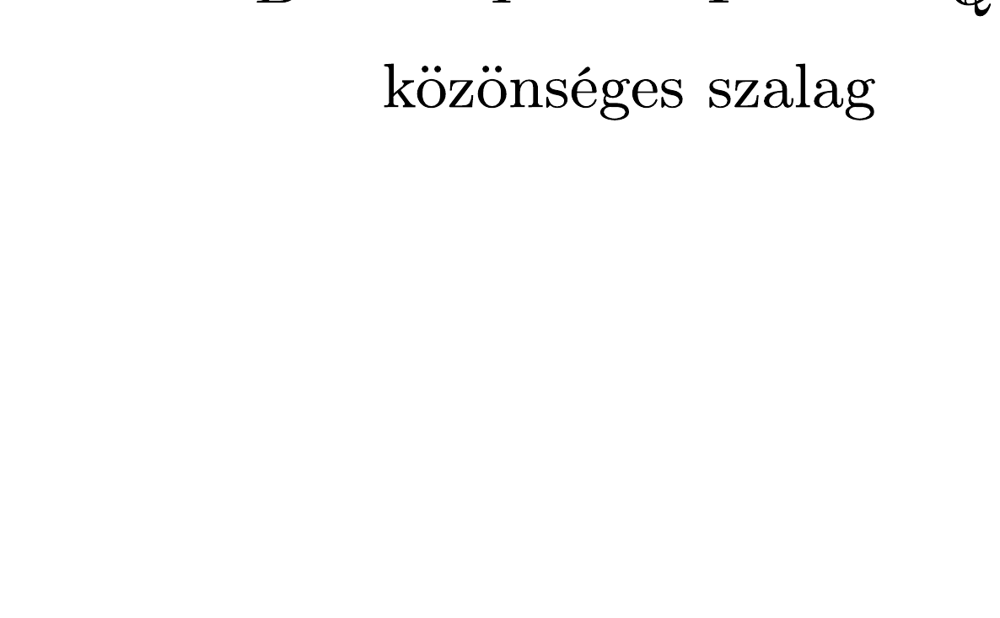
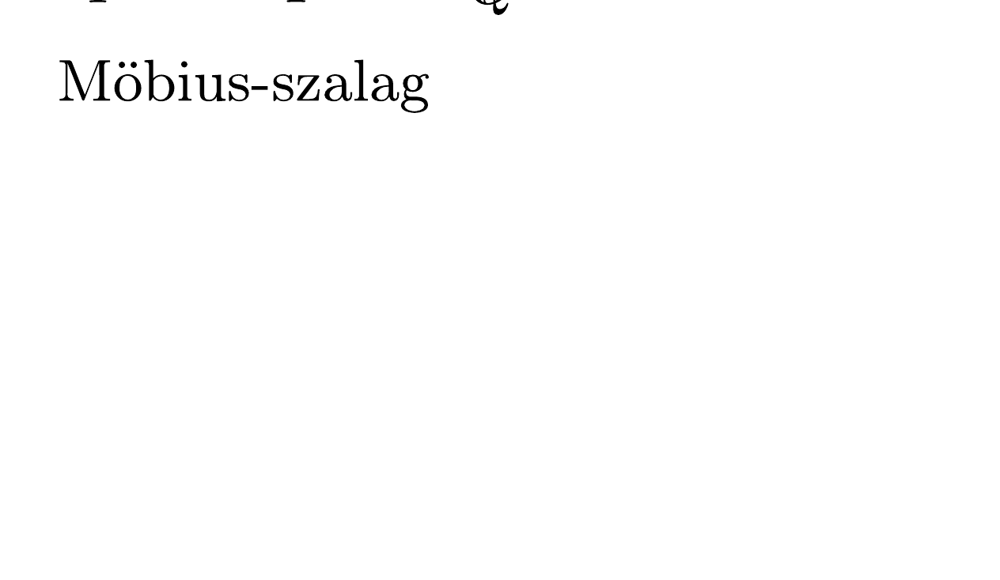

## Útmutatás

A kétféle szalag eredő ellenállásának kiszámítása nagyon nehéz feladat, de erre szerencsére nincs is szükség. Az ellenálláshálózatok alkalmas átrajzolásával és ekvipotenciális pontok keresésével eldönthető, melyik szalag esetén mérhető nagyobb ellenállás az $A$ és $B$ pontok között. Ne felejtsük el, hogy $N$ páros is, páratlan is lehet.

## Megoldás

Legyen a lánc minden egyes ellenállása - mondjuk - $1 \Omega$-os! Még a zárt szalagok elkészítése előtt gondolatban cseréljük ki az eredeti lánc elején lévő ellenállást az $A$ és $B$ pontok között kettő ellenállásra, és kapcsoljunk még két $1 \Omega$-os ellenállást sorosan a lánc jobb oldali végére, amint ezt az 1. ábra mutatja (páros $N$ esetén). Ha a lánc elején és végén lévő csatlakozókat páronként összekötjük (akár egyenesen, akár keresztbe), akkor a csatlakozó pontok között a két-két soros ellenállás párhuzamosan lesz kötve, vagyis ezek $1 \Omega$ eredő ellenállást adnak, ami megegyezik a feladatban leírt kétféle zárt szalag esetével. Ezzel a „trükkel” szimmetrikussá tettük a láncot, amit a következőkben fel is fogunk használni!

Ha adott $U$ feszültséget kapcsolunk a lánc bal oldali végére, és ugyanakkor $\pm U$ (azaz ugyanakkora nagyságú, de először azonos, másodszor viszont ellentétes polaritású) feszültséget kötünk a módosított lánc jobb oldali végére, akkor nem szükséges a lánc két végének páronkénti összekötése, mert az így létrehozott áramkör ekvivalens a kétféle zárt szalaggal. A kialakuló árameloszlás - valamint az áramok alapján kiszámítható eredő ellenállás - ugyanolyan lesz, mint a zárt szalagok esetében. A feladatban leírt $a$ ) eset a megegyező polaritású $(+U)$ bekötésnek, míg a $b$ ) eset az ellentétes polaritásúnak ( $-U$ ) felel meg.

Az azonos polaritással kapcsolt feszültségforrások (vagyis a közönséges szalag) esetében a potenciál- és árameloszlás tengelyesen szimmetrikus az $S T$ szakaszra, míg a Möbius-szalag esetében (amikor a két feszültségforrás ellentétes polaritású) a potenciáleloszlás középpontosan szimmetrikus a lánc $O$ pontjára nézve (lásd az 1. ábrát). Kössük össze az azonos potenciálú pontokat (ez semmilyen változást nem okoz az áramkörben), és ha ezután két $1 \Omega$-os ellenállást találunk párhuzamosan kötve, akkor helyettesítsük ezeket egyetlen $\frac{1}{2} \Omega$-os ellenállással! A további ábrákon az $1 \Omega$-os ellenállásokat továbbra is üres téglalappal jelöljük, míg a $\frac{1}{2} \Omega$-os ellenállásokat szürke téglalapokkal.

Az 1. ábra akkor mutatja helyesen a két lehetséges áramkört, ha $N$ páros. Az azonos potenciálú pontokat azonos betúk jelölik; még a $C$ és $D$ pontokat is rendre $A$-ra és $B$-re cseréltük. A két kapcsolás feleakkora hosszúságú, egyenértékú
áramkörökké alakítható a 2. ábrán látható módon.

2. ábra

A b) eset középpontos szimmetriája miatt az $S$ és $T$ pontok potenciálja megegyezik, így a közöttük lévő ellenálláson nem folyik áram, tehát ez az ellenállás kivehető, és a két pontot rövidre zárhatjuk. A két hálózat csak a jobb oldali utolsó hurokban különbözik, és a $b$ ) esetben a hurok ellenállása kisebb, tehát az $A$ és $B$ pontok közötti eredő ellenállás az $a$ ) esetben nagyobb, mint a Möbius-szalagnál.

A 3. ábra páratlan $N$-ek esetére mutatja a kétféle módosított áramkört. Az ekvipotenciális pontok összekötésével, majd a párhuzamos ellenállások helyettesítésével átalakított hálózatok a 4. ábrán láthatók, melyek újra csak a jobb oldali lezárásukban különböznek. A b) esetben még egy $\frac{1}{2} \Omega$-os ellenállás van a $P$ és $Q$ pontokra kötve, tehát a Möbius-szalag esetében az $A$ és $B$ pontok közötti eredő ellenállás kisebb. Most is arra jutottunk, hogy a kérdéses eredő ellenállás az $a$ ) esetben nagyobb.

4. ábra
