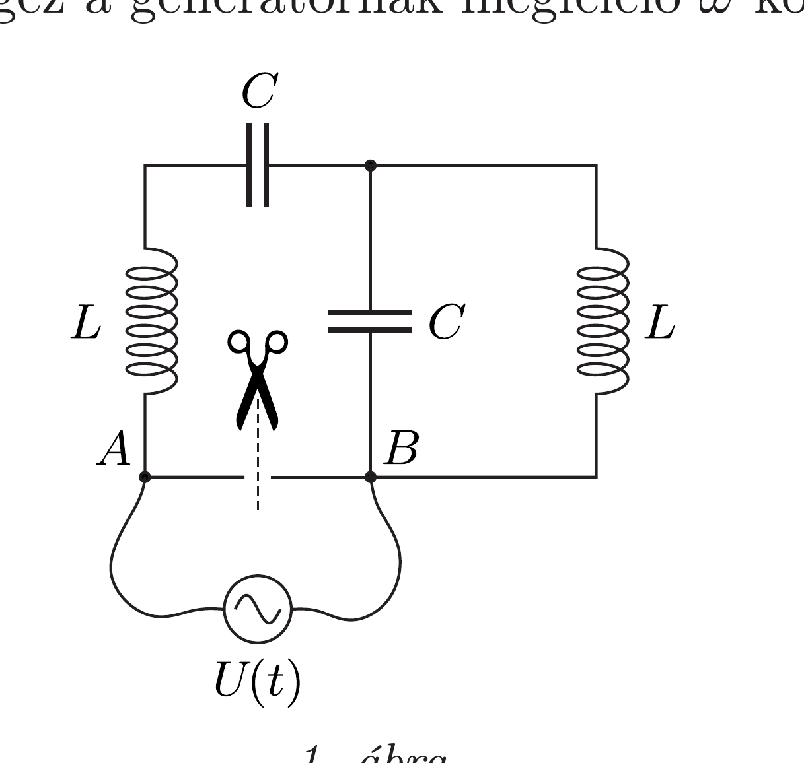
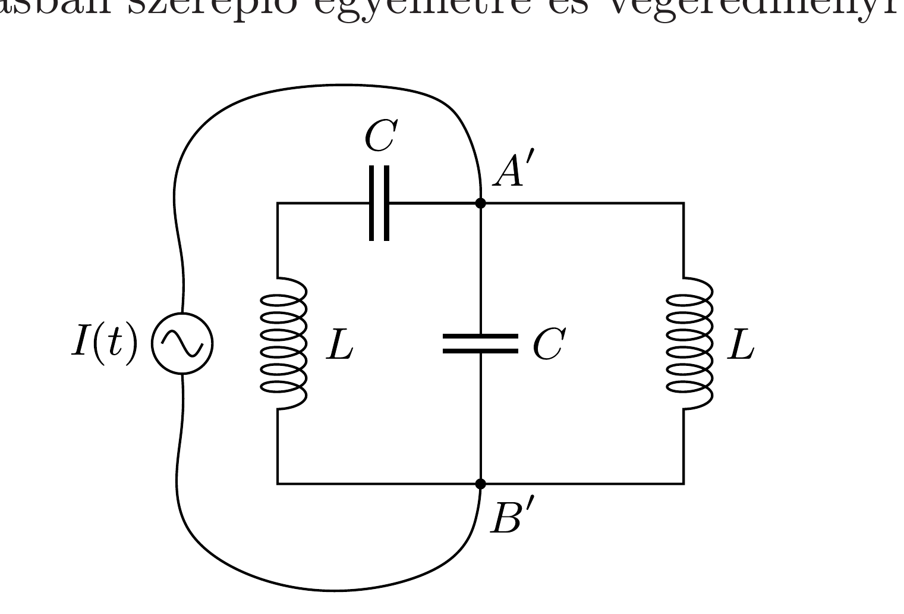
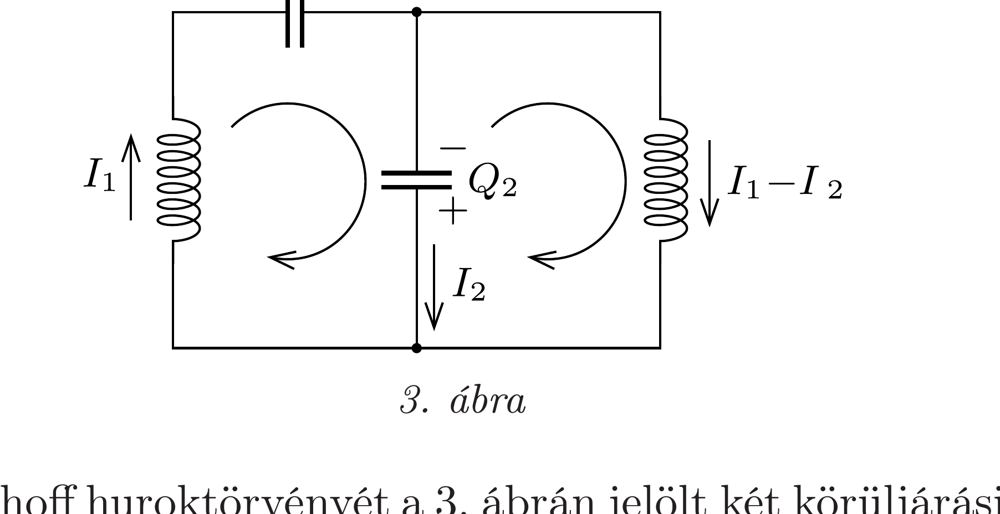

## Útmutatás

Egy megoldási lehetőśég, hogy felírjuk a két kondenzátor töltésének időfüggését leíró differenciálegyenleteket (vagyis az áramkörben kialakuló csatolt rezgéseket vezérlő egyenleteket), majd azokat „nyers erővel” megoldjuk. Létezik azonban ennél sokkal egyszerúbb (bár fortélyosabb) megoldási módszer is! Képzeljük el, hogy egy hangolható áramgenerátort csatlakoztatunk az egyik áramköri elem két kivezetéséhez. Mi történik a csatlakozási pontok közötti feszültséggel, ha a generátor frekvenciája megegyezik az áramkör egyik rezonanciafrekvenciájával?

A helyes megoldáshoz úgy is eljuthatunk, ha az áramkör valamelyik vezetékét gondolatban egy hangolható feszültséggenerátorral helyettesítjük.

## Megoldás

I.a. megoldás. Képzeljük el, hogy az áramkör valamelyik vezetékét (mondjuk az 1. ábrán látható $A B$ szakaszt) egy ollóval elvágjuk, a két ágat pedig egy hangolható (váltóáramú) feszültséggenerátorral kötjük össze. Az áramkör ekkor kényszerrezgést végez a generátornak megfelelő $\omega$ körfrekvenciával.

Ha a generátor frekvenciája közelít a rendszer valamelyik sajátfrekvenciájához, az $A$ és $B$ pontok között folyó áram erőssége hirtelen megnő a rezonancia miatt. Ilyen esetben nagyon kis gerjesztőfeszültségnél is nagy áram indul meg, hiszen a rezonanciafrekvencián feszültséggenerátor nélkül is rezegne a rendszer.

A rezonanciafrekvencián tehát az $A$ és $B$ pontok közötti $Z_{A B}$ impedancia nullához tart, amit komplex formalizmust használva így írhatunk fel:
\[
Z_{A B}=\mathrm{i} L \omega+\frac{1}{\mathrm{i} C \omega}+\frac{\mathrm{i} L \omega \cdot 1 /(\mathrm{i} C \omega)}{\mathrm{i} L \omega+1 /(\mathrm{i} C \omega)}=0 .
\]
Rövid rendezéssel ebből a következő egyenletre jutunk:
\[
\left(\frac{\omega}{\omega_{0}}\right)^{4}-3\left(\frac{\omega}{\omega_{0}}\right)^{2}+1=0,
\]
ahol bevezettük az $\omega_{0}=1 / \sqrt{L C}$ jelölést. A furcsa rezgőkör lehetséges sajátfrekvenciái tehát:
\[
\omega_{1,2}=\omega_{0} \sqrt{\frac{3 \pm \sqrt{5}}{2}}=\frac{\sqrt{5} \pm 1}{2} \omega_{0} .
\]
I.b. megoldás. Válasszuk ki valamelyik áramköri elem két végpontját, mondjuk a 2. ábrán látható $A^{\prime}$ és $B^{\prime}$ pontot! Csatlakoztassunk gondolatban e két pontra egy hangolható váltóáramú áramgenerátort!

Ha az áramgenerátor frekvenciáját változtatva közelítünk a rezgőkör valamelyik sajátfrekvenciájához, akkor a kiválasztott két pont között erősen megnő a feszültség. Rezonancia esetén akár nagyon kis áram betáplálásával is óriási feszültség jelenik meg, vagyis az $A^{\prime}$ és $B^{\prime}$ pontok közötti $Z_{A^{\prime} B^{\prime}}$ impedancia végtelenhez tart:
\[
Z_{A^{\prime} B^{\prime}}=\left(\frac{1}{\mathrm{i} L \omega}+\mathrm{i} C \omega+\frac{1}{\mathrm{i} L \omega+1 /(\mathrm{i} C \omega)}\right)^{-1} \longrightarrow \infty .
\]

Ez akkor következik be, amikor a zárójelben álló kifejezés értéke nullához közelít. Ebbő̌l az I.a. megoldásban szereplő egyenletre és végeredményre juthatunk.

II. megoldás. Jelöljük a két kondenzátor pillanatnyi töltését $Q_{1}$-gyel és $Q_{2}$-vel, a rajtuk átfolyó áramok erősségének pillanatnyi értékét pedig $I_{1}$-gyel és $I_{2}$-vel a 3. ábra szerint. Ekkor a tekercsekben $I_{1}$, illetve (a csomóponti törvény miatt) $I_{1}-I_{2}$ áram folyik.

Írjuk fel Kirchhoff huroktörvényét a 3. ábrán jelölt két körüljárási irány szerint:
\[
\begin{aligned}
\frac{Q_{1}}{C}+\frac{Q_{2}}{C}-L \dot{I}_{1} & =0, \\
-\frac{Q_{2}}{C}-L\left(\dot{I}_{1}-\dot{I}_{2}\right) & =0 .
\end{aligned}
\]
Felhasználva, hogy $I_{1}=-\dot{Q}_{1}$ és $I_{2}=-\dot{Q}_{2}$, továbbá bevezetve az $\omega_{0}=1 / \sqrt{L C}$ jelölést, rövid rendezés után a következő egyenletekre juthatunk:
\[
\begin{aligned}
& \ddot{Q}_{1}=-\omega_{0}^{2} Q_{1}-\omega_{0}^{2} Q_{2} \\
& \ddot{Q}_{2}=-\omega_{0}^{2} Q_{1}-2 \omega_{0}^{2} Q_{2}
\end{aligned}
\]
Ezek a (másodrendú) csatolt differenciálegyenletek írják le a kondenzátorok töltésének időbeli változását. A csatolt mechanikai rezgések elméletéből tudjuk, hogy
ilyenkor a $Q_{1}(t)$ és $Q_{2}(t)$ mennyiségek általában két különböző körfrekvenciájú, harmonikusan változó tag összegeként írhatók fel. Kereshetünk azonban olyan, a $Q_{1}(t)$-ből és $Q_{2}(t)$-ből képzett lineáris kombinációt, amely már tisztán szinuszosan változik:
\[
q(t)=Q_{1}(t)+\alpha Q_{2}(t) .
\]
Az $\alpha$ konstans meghatározásához adjuk hozzá az (1) egyenlethez a (2) egyenlet $\alpha$-szorosát:
\[
\ddot{Q}_{1}+\alpha \ddot{Q}_{2}=-\omega_{0}^{2}\left[(1+\alpha) Q_{1}+(1+2 \alpha) Q_{2}\right] .
\]
Emeljük ki a szögletes zárójelből $Q_{1}$ együtthatóját, hogy a jobb oldalon $q(t)$-vel megegyező alakú kifejezést kapjunk:
\[
\overbrace{\ddot{Q}_{1}+\alpha \ddot{Q}_{2}}^{\ddot{q}(t)}=-\underbrace{\omega_{0}^{2}(1+\alpha)}_{\omega^{2}}[\overbrace{Q_{1}+\underbrace{\frac{1+2 \alpha}{1+\alpha}}_{\alpha} Q_{2}}^{q(t)}] .
\]
A kapott egyenletből látszik, hogy a $q(t)$ lineáris kombináció akkor változik a $\ddot{q}=-\omega^{2} q$ egyenletnek megfelelően harmonikusan, ha
\[
\alpha=\frac{1+2 \alpha}{1+\alpha}, \quad \text { azaz } \quad \alpha_{1,2}=\frac{1 \pm \sqrt{5}}{2} .
\]
Tehát két megfelelő lineárkombinációt is találtunk:
\[
\begin{array}{ll}
q_{1}(t)=Q_{1}(t)+\alpha_{1} Q_{2}(t), & q_{1}(t)=q_{0,1} \sin \left(\omega_{1} t+\varphi_{1}\right), \\
q_{2}(t)=Q_{1}(t)+\alpha_{2} Q_{2}(t), & q_{2}(t)=q_{0,2} \sin \left(\omega_{2} t+\varphi_{2}\right),
\end{array}
\]
a nekik megfelelő sajátfrekvenciák pedig a (3) egyenlet alapján:
\[
\omega_{1,2}=\omega_{0} \sqrt{1+\alpha_{1,2}}=\omega_{0} \sqrt{\frac{3 \pm \sqrt{5}}{2}}=\frac{\sqrt{5} \pm 1}{2} \omega_{0} .
\]
A (4) és (5) egyenletekben szereplő $q_{0,1}$ és $q_{0,2}$ amplitúdókat, valamint a $\varphi_{1}$ és $\varphi_{2}$ kezdőfázisokat a kezdőfeltételekből, azaz a kondenzátorok kezdeti töltéséből és a tekercsek kezdeti áramerősségéből határozhatjuk meg, tehát a $q_{1}(t)$ és $q_{2}(t)$ függvények ismertek.

A rezgőkört tetszőleges kezdeti feltételekkel indítva a kondenzátorok töltése az idő függvényében kifejezhető a (4) és (5) egyenletekből:
\[
\begin{aligned}
& Q_{1}(t)=\frac{\alpha_{2}}{\alpha_{2}-\alpha_{1}} q_{1}(t)-\frac{\alpha_{1}}{\alpha_{2}-\alpha_{1}} q_{2}(t) \\
& Q_{2}(t)=\frac{1}{\alpha_{1}-\alpha_{2}} q_{1}(t)-\frac{1}{\alpha_{1}-\alpha_{2}} q_{2}(t) .
\end{aligned}
\]

Valóban azt kaptuk, hogy a kondenzátorok töltése az idő függvényében két szinuszos rezgés szuperpozíciója. A kezdeti feltételek megfelelő megválasztásával elérhető, hogy $q_{1}(t)$ vagy $q_{2}(t)$ közül az egyik azonosan zérus legyen, ilyenkor tisztán előállítható valamelyik ( $\omega_{1}$ vagy $\omega_{2}$ körfrekvenciájú) sajátrezgés.
