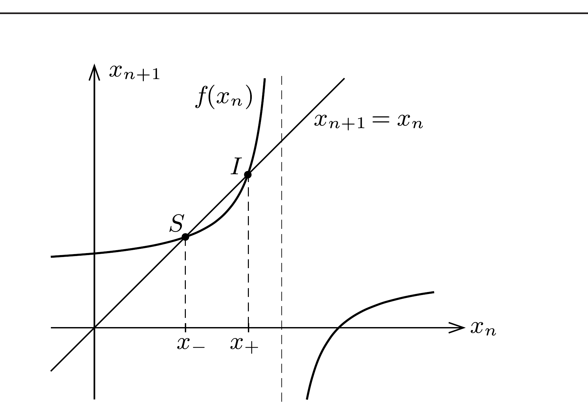
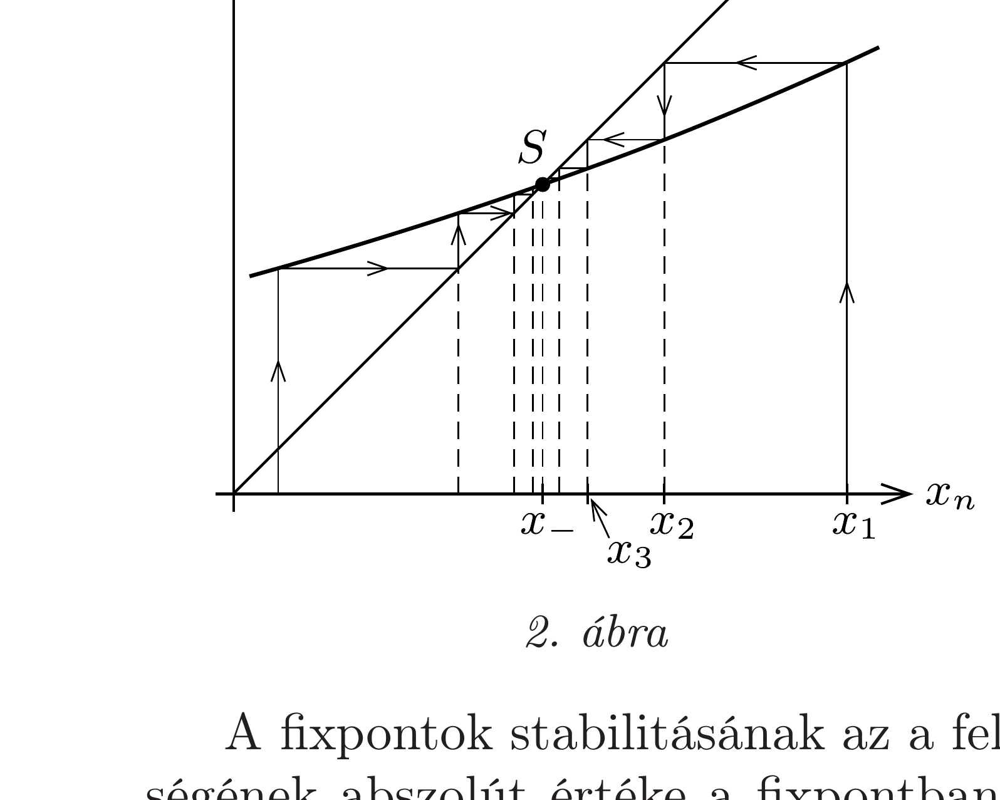
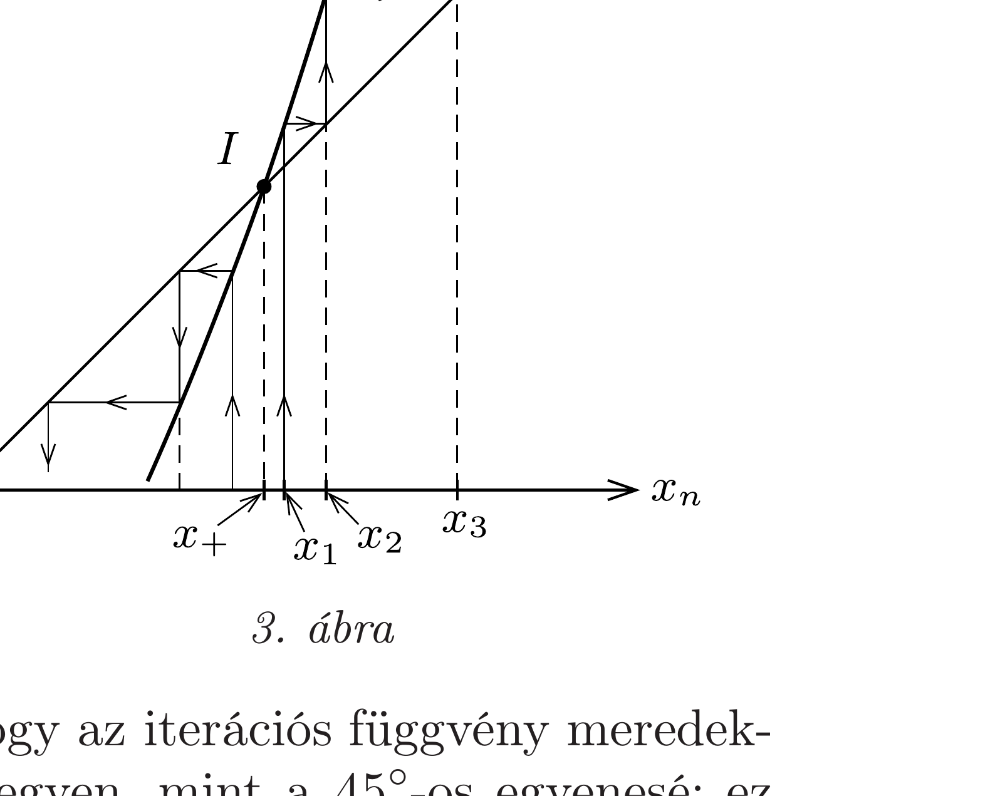
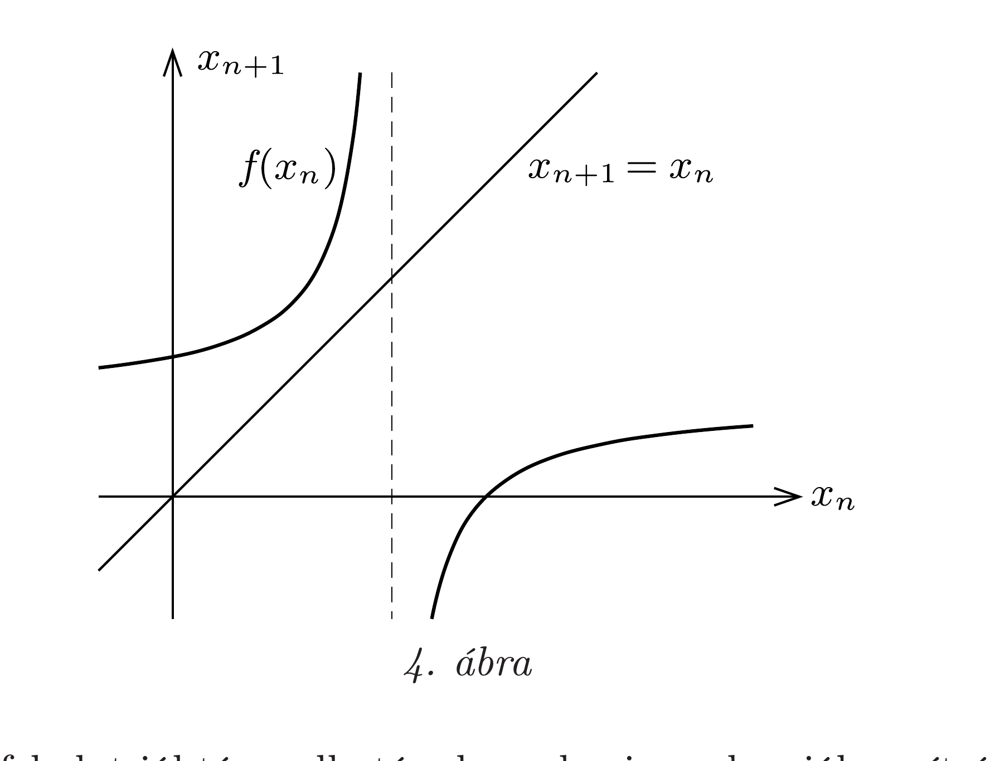

## Útmutatás

Tekintsünk először egy véges, $n$ tekercset és $n$ kondenzátort tartalmazó láncot! Mivel a lánc nem tartalmaz ohmos ellenállást, a rajta átfolyó áram és a rá jutó feszültség közötti fáziseltolódás vagy +90°, vagy -90°. Az egyik esetben a lánc helyettesíthető egy bizonyos $C_{n}$ kapacitású kondenzátorral, a másik esetben pedig egy alkalmasan választott induktivitású tekerccsel. Tételezzük fel, hogy az előbbi eset áll elő, és határozzuk meg $C_{n}$ értékét az első néhány $n$-re. (Ha $C_{n}$-re negatív szám adódna, az annyit jelent, hogy a lánc tekercsként viselkedik.)

Keressünk kapcsolatot $C_{n}$ és $C_{n+1}$ között, majd határozzuk meg ezen rekurziós összefüggés „fixpontját”. Ez (vagy ezek valamelyike) lehet a „végtelen hosszú" lánccal egyenértékú kapacitás.

## Megoldás

Egy $C$ kapacitású kondenzátoron esó feszültség nagysága és a rajta átfolyó ( $\omega$ körfrekvenciájú) váltóáram nagysága között
\[
\frac{U_{C}}{I_{C}}=\frac{1}{\omega C}
\]
a kapcsolat, azaz a kondenzátor váltóáramú ellenállása $1 /(\omega C)$; továbbá a szinuszosan váltakozó áram fázisa a feszültséghez képest 90°-ot siet. ( $U_{C}$ és $I_{C}$ jelentheti a feszültség és áramerősség csúcsértékét vagy effektív értékét is.) Ugyanez az arány tekercsnél
\[
\frac{U_{L}}{I_{L}}=L \omega
\]
(vagyis egy $L$ öninduktivitású tekercs váltóáramú ellenállása $L \omega$ ), viszont a rajta átfolyó áram a feszültséghez képest 90°-ot késik, tehát éppen ellenkező előjelú, mint amilyen egy kondenzátornál lenne. Emiatt egy tekercs (adott frekvenciájú váltóáramú körben) úgy tekinthető, mintha negatív (bizonyos $C_{L}<0$ ) kapacitású kondenzátor lenne:
\[
L \omega=-\frac{1}{\omega C_{L}}, \quad \text { azaz } \quad C_{L}=-\frac{1}{\omega^{2} L}
\]
Célszerú bevezetni a
\[
k^{2}=\frac{1}{\omega^{2} L C}=\left(\frac{\omega_{0}}{\omega}\right)^{2}
\]
jelölést. A dimenziótlan $k$ szám azt mutatja meg, hogy egy-egy $L$ és $C$ elemből álló egyszerú rezgőkör $\omega_{0}$ körfrekvenciája hányszorosa lenne a feladatban szereplő (a lánc paramétereitől független, kívülről megszabott) $\omega$ körfrekcenciának. Ezzel a jelöléssel a láncban szereplő tekercsek mindegyikének „effektív kapacitása” így írható: $C_{L}=-k^{2} C$.

Egy fizikafeladatban a „végtelen lánc" kifejezés értelemszerúen azt jelenti, hogy a lánc „nagyon hosszú", elemeinek száma nagyon nagy (de véges). Tekintsük először az $n$ hosszúságú ( $n$ tekercset és $n$ kondenzátort tartalmazó) láncot! Mivel a lánc nem tartalmaz ohmos ellenállást, a rajta átfolyó áram és a rá esó́ feszültség közötti fáziseltolódás vagy $+90{ }^{\circ}$, vagy $-90^{\circ}$. Az egyik esetben a lánc helyettesíthető egy bizonyos $C_{n}$ kapacitású kondenzátorral, a másik esetben pedig egy alkalmasan választott induktivitású tekerccsel. Tételezzük fel, hogy az előbbi eset áll elő, és határozzuk meg $C_{n}$ értékét! (Ha $C_{n}$-re negatív szám adódna, az annyit jelent, hogy a lánc tekercsként viselkedik.)

Az $n=1$ esetben egy $C$ kapacitású kondenzátor és egy $L$ induktivitású tekercs (vagyis egy másik, $C_{L}$ kapacitású kondenzátor) soros eredőjét kell meghatároznunk:
\[
\frac{1}{C_{1}}=\frac{1}{C}+\frac{1}{C_{L}}, \quad \text { ahonnan } \quad C_{1}=\frac{C C_{L}}{C+C_{L}}=\frac{C \cdot\left(-k^{2} C\right)}{C+\left(-k^{2} C\right)}=\frac{k^{2}}{k^{2}-1} C .
\]
$n=2$ esetén egy $C$ kapacitású kondenzátor sorosan kapcsolódik egy tekercs és $C_{1}$ párhuzamos eredőjéhez:
\[
\frac{1}{C_{2}}=\frac{1}{C}+\frac{1}{C_{1}+\left(-k^{2} C\right)},
\]
általában pedig
\[
\frac{1}{C_{n+1}}=\frac{1}{C}+\frac{1}{C_{n}-k^{2} C},
\]
ahonnan
\[
C_{n+1}=\frac{C\left(C_{n}-k^{2} C\right)}{C_{n}+\left(1-k^{2}\right) C} .
\]
Célszerú valamennyi kapacitást $C_{n}=x_{n} \cdot C$ módon $C$ egységekben kifejezni, mert akkor a fenti rekurziós formula a viszonylag egyszerú
\[
x_{n+1}=\frac{x_{n}-k^{2}}{x_{n}+1-k^{2}}
\]
alakot ölti.
Kérdés: van-e az $x_{n}$ számsorozatnak (vagyis a $C_{n}$ kapacitásértékeknek) határértéke, ha $n \rightarrow \infty$ ? Mondhatjuk azt, hogy ha $n \gg 1$, akkor $x_{n} \approx x_{n+1}$, és az (1) rekurziós összefüggés (a közelítőleg egyenlő $x_{n}$ számértékeket $x$-szel jelölve) egy másodfokú egyenletre vezet:
\[
x=\frac{x-k^{2}}{x+1-k^{2}}, \quad \text { vagyis } \quad x^{2}-k^{2} x+k^{2}=0 .
\]
Ennek az egyenletnek $k>2$ esetben két valós gyöke van:
\[
x_{ \pm}=\frac{k^{2}}{2} \pm \frac{k}{2} \sqrt{k^{2}-4} .
\]

Vajon melyik gyök az „igazi", vagy esetleg mindkettőnek lehet fizikai jelentése? Gyanítható, hogy a (2)-ben szereplő gyökök közül a kisebb $x_{-}$a „helyes”. Ha ugyanis olyan tekercset választunk, amelyre $L$ nagyon kicsi (vagyis $\omega_{0} \gg \omega$ ), akkor a tekercsek rövidzárként viselkednek, az $A$ és $B$ pontok közötti eredő váltóáramú ellenállás tehát egyetlen $C$ kapacitású kondenzátoréval egyezik meg. Valóban, $k \gg 1$ esetben $x_{-} \approx 1$, tehát az $A$ és $B$ pontok közötti eredő váltóáramú ellenállás $1 / \omega C$, viszont $x_{+} \approx k^{2} \gg 1$ nem felel meg fenti várakozásnak.

Vizsgáljuk meg a kérdést más oldalról is. Térjünk vissza az (1) rekurziós összefüggéshez. Ábrázoljuk az $x_{n+1}=f\left(x_{n}\right)$ függvényt egy derékszögü koordinátarendszerben, és rajzoljuk be ugyanebbe az $x_{n+1}=x_{n}$ egyenes képét is. Ha $k>2$, a rekurziós összefüggésnek megfelelő görbének (hiperbola) és a 45°-os egyenesnek két közös pontja van (1. ábra), a korábban kiszámított $x_{-}$-nak megfeleló $S$, valamint az $x_{+}$-nak megfelelő $I$.

Induljunk ki $x_{1}$ ismert értékéből (vagy bármilyen más módon választott $x_{1}$ számból), majd a hiperbola és az egyenes segítségével grafikusan határozzuk meg az $x_{2}, x_{3}, x_{4}$ stb. pontokat (2. ábra). Látható, hogy ezek igen gyorsan befutnak az $S$ pontnak (az ún. stabil fixpontnak) megfelelő $x_{-}-\mathrm{ba}$. Ha a kezdeti $x_{1}$ értéket $x_{+}$közelébe (attól tetszőlegesen kicsi, de véges távolságra) választjuk, az iteráció eredményeképpen adódó pontok gyors ütemben eltávolodnak $x_{+}$-tól; az iteráció $I$ fixpontja tehát instabil (3. ábra).

A fixpontok stabilitásának az a feltétele, hogy az iterációs függvény meredekségének abszolút értéke a fixpontban kisebb legyen, mint a 45°-os egyenesé; ez $S$-re teljesül, $I$-re viszont nem.

Mindez azt mutatja, hogy $\omega<1 /(2 \sqrt{L C})$ körfrekvencián a „végtelen lánc" eredő váltóáramú ellenállása - a távoli végének lezárásától, tehát $x_{1}$ számértékétől függetlenül - csak egy jól meghatározott érték lehet:
\[
Z_{\text {lánc }}=\frac{1}{\omega x_{-} C}=\frac{1+\sqrt{1-4 \omega^{2} L C}}{2 \omega C} .
\]

Mi a helyzet
\[
\omega>\frac{1}{2 \sqrt{L C}}=\frac{\omega_{0}}{2}
\]
esetben? Ilyenkor az (1) iterációnak nincs fixpontja (vagyis a hiperbolának és a 45º-os egyenesnek nincs közös pontja, lásd a 4. ábrát). Ebben az esetben az $x_{n}$ számsorozatnak nincs határértéke, tehát a hosszú (de nem végtelen hosszú!) lánc váltóáramú ellenállása attól függ, hogy ténylegesen milyen hosszú is a „nagyon hosszú".

Megjegyzés. A feladat jól tárgyalható a komplex impedanciák segítségével is. Ezekkel felírva az (1)-nek megfelelő rekurziós összefüggést, majd keresve ennek fixpontját azt kapjuk, hogy a végtelen lánc eredő impedanciája $\omega>1 /(2 \sqrt{L C})$ esetén ohmos részt is tartalmaz. Ez azért meglepő, mert akármilyen hosszú, de véges sok (ideális) tekercsből és kondenzátorból álló láncnak csak meddő ellenállása van (impedanciája tisztán kapacitív vagy tisztán induktív).

A végtelen lánc ohmos ellenállásának megjelenése a lánc mentén terjedő hullámokkal áll kapcsolatban. (Ezek a hullámok csak $\omega>\omega_{0} / 2$ frekvencia esetén léphetnek fel.) Egy megadott frekvenciájú bemenő jelnek időben végtelen hosszúnak kellene lennie, ilyen a valóságban nem létezik. Reálisan megvalósítható azonban egy nagyon hosszú, $T_{\text {hullám }}$ ideig tartó, majdnem pontosan szinuszosan változó „hullámcsomag”, amely a lánc mentén terjedni képes. Ez a hullám előbb-utóbb eléri a véges (de nagyon hosszú) lánc végét, majd onnan visszaverődik, és valamekkora $T_{\text {visszhang }}$ idő múlva visszaér a lánc elejére. Ideális esetben az $L C$-lánc elején ugyanannyi energiát kapunk vissza, mint amennyit korábban betápláltunk, a láncnak tehát csak meddő ellenállása van. Ez azonban csak akkor figyelhetó meg, ha teljesül a $T_{\text {hullám }} \gg T_{\text {visszhang }}$ feltétel. A másik határesetben, amikor $T_{\text {visszhang }} \gg T_{\text {hullám }}$, a lánc elején befektetett energia látszólag eltűnik (disszipálódik), ilyenkor az $L C$-lánc ohmos ellenállást is tartalmazó áramköri elemként viselkedik.
