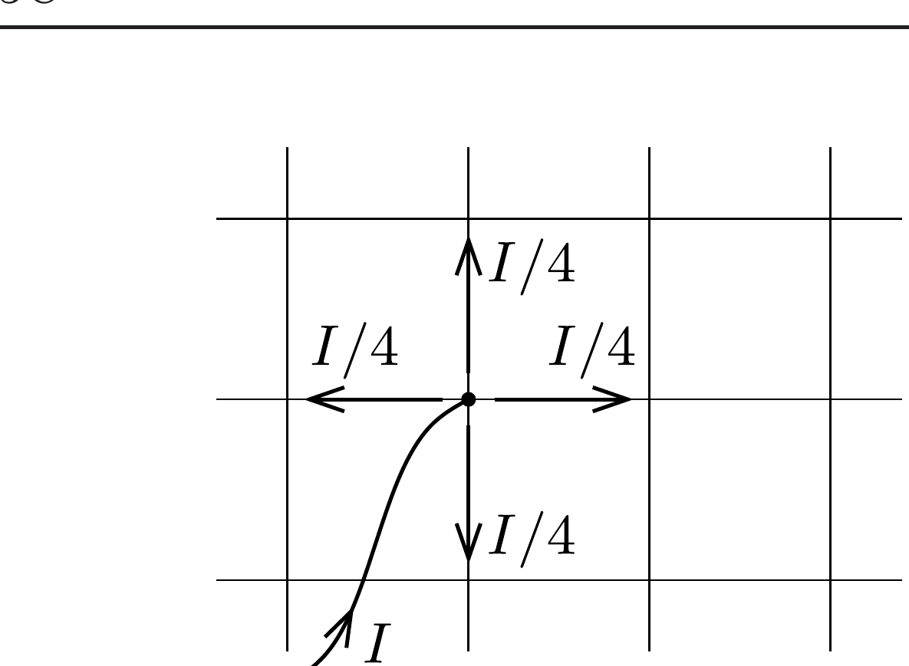
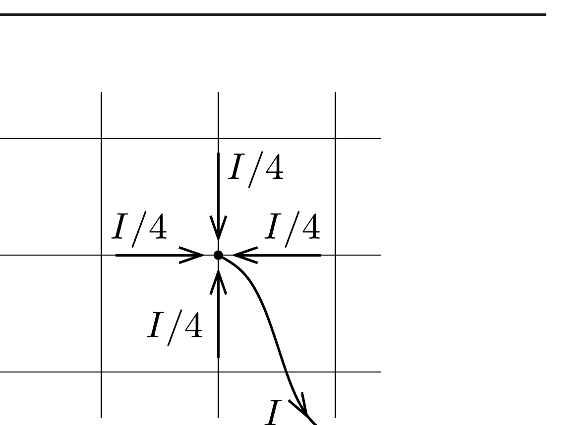
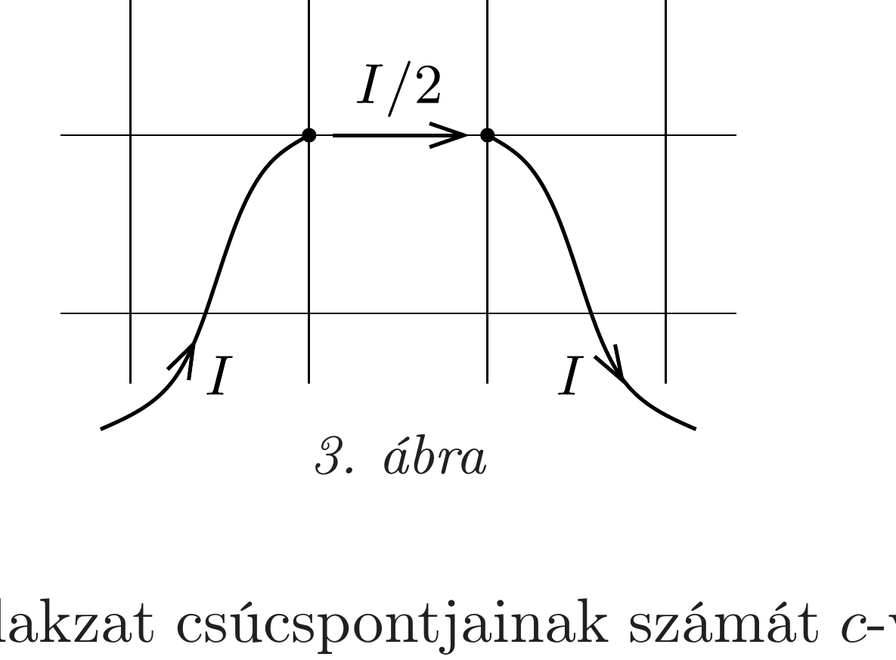

## Útmutatás

Tekintsünk két különböző esetet: először vezessünk be $I$ erősségú áramot az egyik rácspontba, a második esetben pedig vezessünk ki $I$ áramot az előző bevezetési hellyel szomszédos rácspontból. Használjuk ki mindkét esetben az áramkör szimmetriáját, majd „szuperponáljuk” a két esetben kialakuló áramés feszültségeloszlást!

## Megoldás

Hajtsuk végre a következő gondolatkísérletet. Válasszunk ki egy rácspontot, és vezessünk be ezen a ponton $I$ erősségú áramot. A kiválasztott pontból (szimmetriaokok miatt) a lehetséges négy irány mindegyikébe ugyanakkora, $I / 4$ erósségú áramok indulnak, amint ezt az 1. ábra mutatja.

Második lépésben tekintsük a kiválasztott pont egyik szomszédját, és az előző gondolatkísérlettől függetlenül most „vegyünk ki” ebből a pontból $I$ áramot. A szomszédos rácspontokba befutó négy egyenrangú ellenálláson most is azonos nagyságú, $I / 4$ erősségú áramok folynak (2. ábra).

Végül vegyük a két eset szuperpozícióját, tekintsük őket együtt. A skalár mennyiségek (áram, potenciál) az áramköri egyenletek linearitása miatt egyszerúen algebrailag összegződnek. A két szomszédos pont között $U$ feszültség (potenciálkülönbség) jelenik meg, az egyik ponton $I$ áram megy be a rácsba, a másikon $I$ áram folyik ki. Egyszerú módon nem tudjuk megmondani, hogy a rács éleiben mekkora áramok folynak, csak a két szomszédos rácspont között folyó áramot határozhatjuk meg könnyen. Itt ugyanis a fenti két esetben tárgyalt áramok éppen összeadódnak, így összesen $I / 2$ áram folyik át ezen az élen (3. ábra). Ha viszont $R$ ellenálláson $I / 2$ erősségú áram folyik, akkor az ellenállás két végén $U=R \cdot I / 2$ feszültség mérhető. A végtelen rács két szomszédos pontja között mérhető eredő ellenállás tehát $R_{\mathrm{e}}=U / I=R / 2$.

