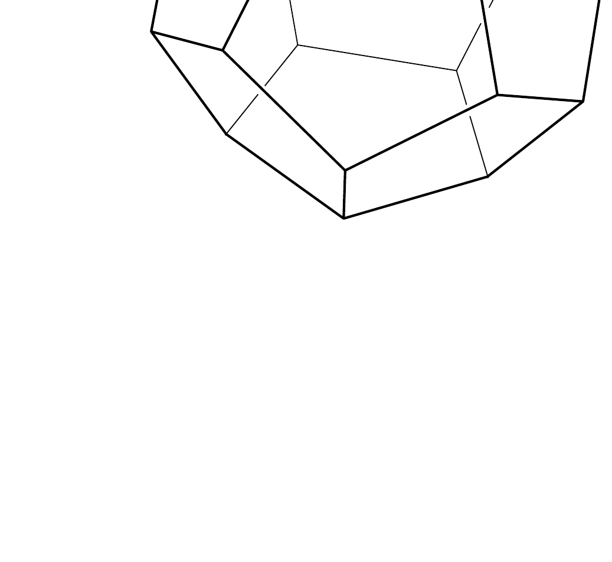
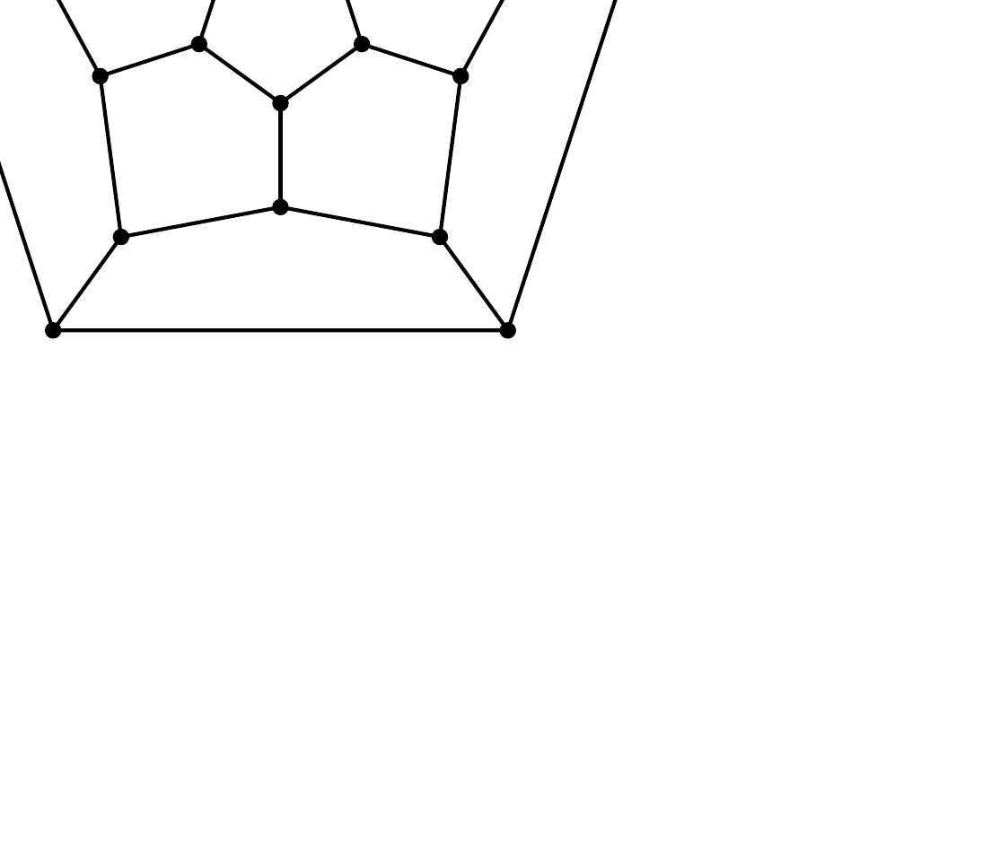
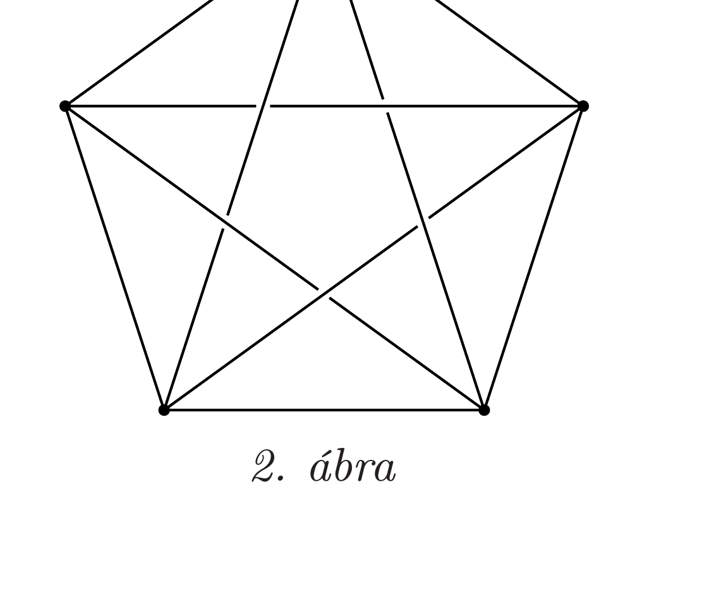

## Útmutatás

Alkalmazzuk az előzó feladatban megismert, szuperpozíción alapuló módszert! Vigyázzunk, az elektromos töltésmegmaradás miatt most nem tehetjük meg azt, hogy egy rácspontban bevezetünk áramot és sehol nem vezetjük el azt. Oldjuk meg ezt a dilemmát úgy, hogy közben nem rontjuk el a feladat szimmetriáját! (Hasonló problémát tárgyal a 282. feladat is.)

## Megoldás

Jelöljük az alakzat csúcspontjainak számát $c$-vel, az egyes csúcspontokból kiinduló élek számát pedig $n$-nel. (Az 1. ábrán látható dodekaédernél és síkbeli hálójánál például $c=20$ és $n=3$.) Ha valamelyik csúcsnál $I_{0}$ áramot vezetünk be, az összes többi csúcsból pedig $I_{0} /(c-1)$ erősségú áramot elvezetünk, akkor a szimmetria miatt a bevezetési csúcsból kiinduló éleken $I=I_{0} / n$ áram folyik.

Szuperponáljunk erre az árameloszlásra egy olyat, amelyet a szomszédos pontból kivezetett $I_{0}$ erősségú áram és a többi rácspontba bevezetett $I_{0} /(c-1)$ erősségü áram hoz létre. A „közös” ellenálláson folyó $I=2 I_{0} / n$ áram hatására $U=2 R I_{0} / n$ feszültség esik, és mivel az áramkörön átfolyó teljes áram most
\[
I=I_{0}+\frac{I_{0}}{c-1}=\frac{c}{c-1} I_{0},
\]
így az eredő ellenállás:
\[
R_{\mathrm{e}}=\frac{U}{I}=\frac{2(c-1)}{n c} R .
\]
A dodekaéder esetében ennek értéke $\frac{19}{30} R$, kockánál pedig $\frac{7}{12} R$.
Megjegyzés. A fenti gondolatmenet szabályos poliédereken kívül érvényes minden olyan szabályos alakzatra, amelyben a csúcsok is és az egy csúcsból kiinduló élek is „egyenértékúek”. A 2. ábrán látható, legkisebb nem síkbarajzolható teljes gráfra ( $K_{5}$ gráf, vagy pentachoron) például $c=5$ és $n=4$, az eredő ellenállás két csúcs között tehát $\frac{2}{5} R$. A végtelen négyzetrácsnál $c \rightarrow \infty$ és $n=4$, így az eredő ellenállás a szomszédos rácspontok között $R / 2$, ahogy ezt az előzó feladatban is megkaptuk.

