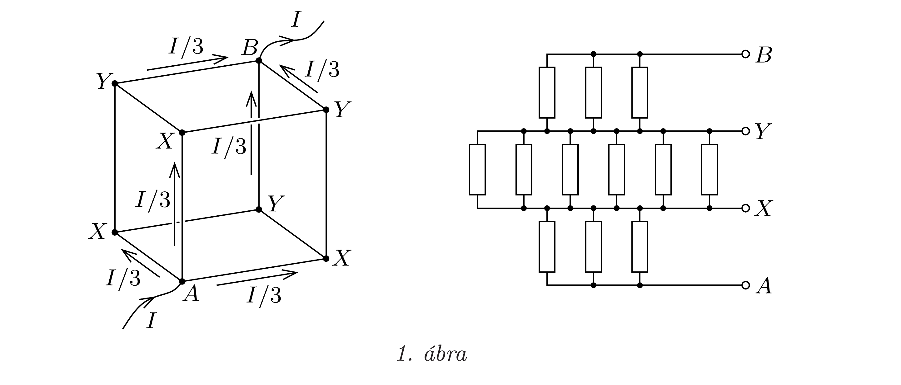
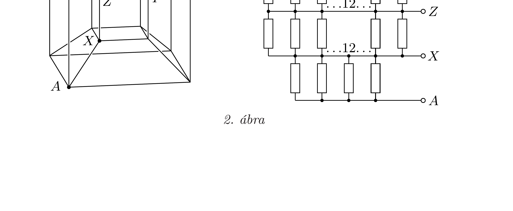

## Útmutatás

Keressünk a kockán ekvipotenciális pontokat, miközben a testátló egyik végpontján $I$ áram folyik be a kockába, a másik végpontján pedig $I$ áram folyik ki. Az ekvipotenciális pontok összekötésével leegyszerúsíthetjük a kapcsolást.

## Megoldás

Vezessünk be a kocka egyik csúcsán $I$ áramot, és az adott ponthoz tartozó testátló másik végén vezessük el azt (lásd az 1. ábra bal felét). Szimmetriaokok miatt a kérdéses testátló két végpontjához tartozó három-három ellenálláson azonos, $I / 3$ erósségú áram folyik, tehát ezen ellenállásokon azonos feszültség esik. Így az ábrán látható $X$-szel, illetve $Y$-nal jelölt pontok külön-külön ekvipotenciálisak, vagyis összeköthetők. Ezután a kapcsolás az 1. ábra jobb oldalán látható módon rajzolható át, és az eredő ellenállás akár fejben is kiszámolható. Ha mindegyik ellenállás $1 \Omega$-os, akkor az eredő ellenállás $\frac{5}{6} \Omega$.

Az egydimenziós „kocka” egyszerúen egy egyenes szakasz, ennek eredő ellenállása önmaga, vagyis $1 \Omega$. A kétdimenziós „kocka" a négyzet, amit az egyenes szakasz oldalhosszúságú eltolásával kapunk meg. A négyzet valamely átlójának egyik végpontjából két ellenállás indul ki, és a másik végpontba is két ellenállás fut be. Ha áramot engedünk az átló végpontjain keresztül, a másik átló végpontjai ekvipotenciális pontok lesznek (tehát összeköthetők), és így két-két párhuzamosan kötött ellenállás soros kapcsolásához jutunk. A négyzet esetén az eredő ellenállás emiatt $1 \Omega$. A háromdimenziós kocka testátlójának végpontjaiból - mint láttuk három-három ellenállás indul ki, a további hat ellenállás az ekvipotenciális ,,felületeket" köti össze.

A négydimenziós „kockát” úgy kaphatjuk meg, ha a háromdimenzióst önmagával párhuzamosan eltoljuk a negyedik dimenzió felé oldalhossznyi távolsággal, és a megfelelő csúcspontokat összekötjük. A négydimenziós kockának tehát $12+12+8=32$ oldaléle van, mert a rendes kockának 12, az eltoltnak szintén 12, és a nyolc-nyolc csúcspontot 8 él köti össze. Mérési célra készíthetünk négydimenziós „kockát”, illetve annak eltorzított három dimenziós vetületét, ha az eredeti kockát megtartjuk, készítünk egy nagyobbat, amellyel körülvesszük az eredetit, és az egymásnak megfelelő csúcspontokat újabb ellenállásokkal kötjük össze (2. ábra bal fele). Ekkor a negyedik dimenzióba történő eltolás helyett háromdimenziós nagyítást végeztünk, ezért lesz torz a kockánk, ennek azonban az ellenállások szempontjából nincs jelentősége. A 2. ábrán feltüntettük a nyolc lehetséges testátló egyikének $A$ és $B$ végpontját is; elektromos kapcsolásunkban itt vezetjük be, illetve ki az áramot.

A négydimenziós „kocka” $A$ pontjából 4 él indul ki, ezek végpontjai ( $X$ pontok) ekvipotenciálisak, és ugyanez teljesül a $B$ pontból kiinduló élek végpontjaira is ( $Y$ pontok). Az egyik ekvipotenciális „felületről” a másikra legrövidebben 2 ellenálláson keresztül juthatunk el. Ilyen „közbenső“ ellenállásból 24 van, hiszen az összes, $2^{4}=32$ ellenállásból 4-4 a testátló végpontjaihoz kapcsolódik. Ennek a 24 ellenállásnak a (2. ábrán $Z$-vel jelölt) „belső“ pontjai is ekvipotenciálisak, összeköthetők, vagyis 12-12 ellenállás párhuzamosan, azok együttese pedig sorosan van kapcsolva. Az átrajzolt kapcsolás segítségével megállapíthatjuk, hogy az eredő ellenállás $\frac{2}{3} \Omega$.

Megjegyzés. A feladat $n$-dimenziós kockára is általánosítható, és a megfelelő áramkör tetszőleges $n$-re ténylegesen megvalósítható, egyforma $1 \Omega$-os ellenállásokból összeforrasztható. Ha a megfelelő ekvipotenciális pontok összekötésével az áramkört azonos ellenállások párhuzamos kapcsolására, majd ezek sorbakapcsolására bontjuk, az egyik testátló menti eredő ellenállásra a következő formulát kapjuk:
\[
R_{n}=\frac{1}{\binom{n}{1}}+\frac{1}{2\binom{n}{2}}+\frac{1}{3\binom{n}{3}}+\ldots+\frac{1}{n\binom{n}{n}},
\]
ami
\[
R_{n}=\frac{1}{n}\left[\frac{1}{\binom{n-1}{0}}+\frac{1}{\binom{n-1}{1}}+\frac{1}{\binom{n-1}{2}}+\frac{1}{\binom{n-1}{3}}+\ldots+\frac{1}{\binom{n-1}{n}}\right]
\]
alakban is felírható. Érdekes, hogy $n$ növekedtével $R_{n}$ egyre kisebbé válik, és határértékben $R_{n} \approx 2 / n \rightarrow 0$. Ez azért túnhet meglepőnek, mert a sokdimenziós kockáknál az áram csak sok (legalább $n$ ) ellenálláson keresztül juthat el a testátló egyik végétől a másikig. Az eredő ellenállás mégis nullához tart, melynek oka az, hogy a dimenziószám növelésével a párhuzamos áramvezető „utak” száma is nő́, méghozzá gyorsabb ütemben, mint az utak hossza.
