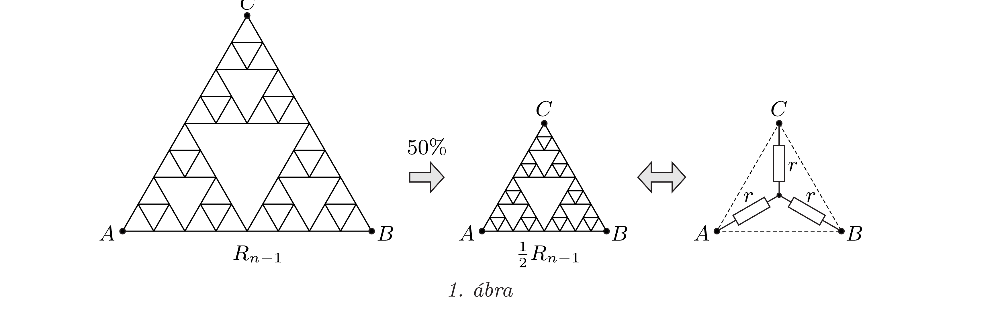
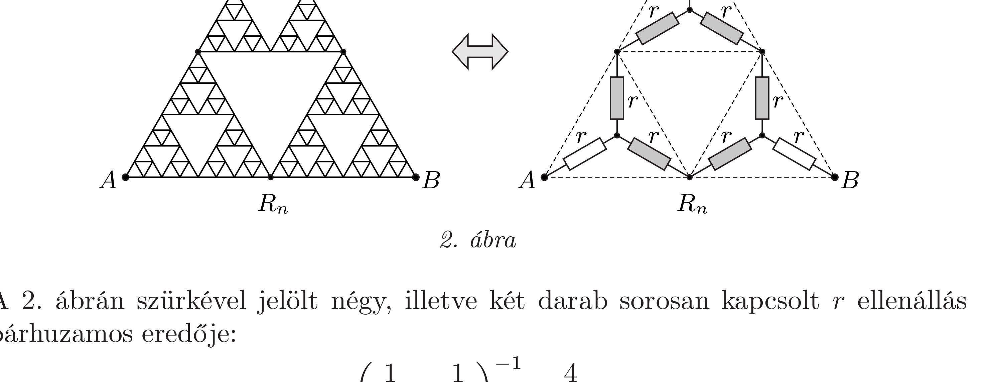
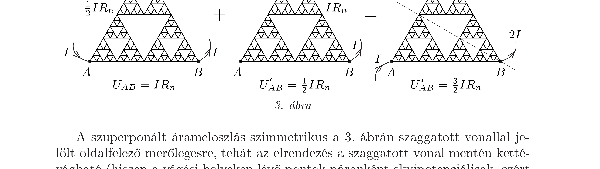
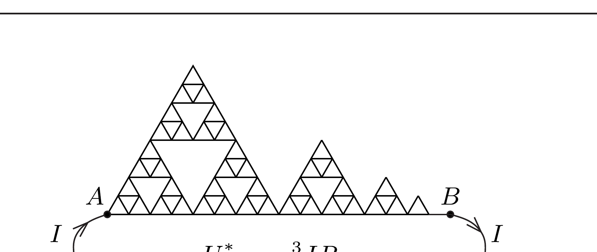

## Útmutatás

Jelölje $R_{n}$ az $n$-edik lépés után kapott áramkör két csúcsa közötti ellenállást! Keressünk rekurziós összefüggést $R_{n}$ és $R_{n-1}$ között, majd ennek ismeretében fejezzük ki $R_{n}$-t $R_{0}$-lal! Hasznos lehet, ha a bonyolult, három kivezetéssel ellátott kapcsolást három darab (alkalmasan választott nagyságú) ellenállás csillagkapcsolásával helyettesítjük.

Úgy is célhoz érhetünk, ha felhasználjuk a kapcsolás „háromfogású forgásszimmetriáját", illetve a szuperpozíciós elvet.

## Megoldás

I. megoldás. Jelöljük az $n$-edik lépés után kapott áramkör $A$ és $B$ pontjai között mérhető ellenállást $R_{n}$-nel! Az $n$-edik lépésben kapott hálózat tartalmazza az előző lépésnek megfelelő háromszöget három példányban, de felére kicsinyített méretben. Egy-egy ilyen - lecsökkentett méretú - dróthálózat eredő ellenállása bármely két csúcspontja között $\frac{1}{2} R_{n-1}$.

Keressünk kapcsolatot $R_{n}$ és $R_{n-1}$ között, majd ennek ismeretében fejezzük ki $R_{n}-\mathrm{t} R_{0}$-lal! Bármely hárompólusú (három kivezetéssel ellátott) ellenálláshálózat helyettesíthető három alkalmasan választott nagyságú ellenállás csillagkapcsolásával. Mivel esetünkben a háromszög csúcsai teljesen szimmetrikus szerepet játszanak, a helyettesítő kapcsolás három ellenállása egyforma $r$ nagyságú. Az $(n-1)$-edik lépés után kialakult hálózat felére kicsinyített mása esetén például
\[
r=\frac{1}{4} R_{n-1},
\]
hiszen ekkor lesz a tényleges és a helyettesítő csillagkapcsolásban az $A$ és $B$ pontok közötti eredő ellenállás ugyanakkora (1. ábra).

Rakjuk össze az $n$-edik lépés utáni kapcsolást a megelőző lépésben szereplő áramkör három felére kicsinyített példányából, pontosabban az azokat helyettesítő csillagkapcsolásokból (2. ábra).

A 2. ábrán szürkével jelölt négy, illetve két darab sorosan kapcsolt $r$ ellenállás párhuzamos eredője:
\[
\left(\frac{1}{4 r}+\frac{1}{2 r}\right)^{-1}=\frac{4}{3} r .
\]

Ezeknek és a hozzájuk sorosan kapcsolódó két darab $r$ nagyságú ellenállásnak az eredője megadja $R_{n}$-t:
\[
R_{n}=2 r+\frac{4}{3} r=\frac{10}{3} r=\frac{5}{6} R_{n-1} .
\]
Ebből a rekurzív összefüggésből $R_{n}$ egyszerüen meghatározható:
\[
R_{1}=\frac{5}{6} R_{0}, \quad R_{2}=\frac{5}{6} R_{1}=\left(\frac{5}{6}\right)^{2} R_{0}, \quad \ldots, \quad R_{n}=\left(\frac{5}{6}\right)^{n} R_{0} .
\]
II. megoldás. Jelöljük a kiindulási helyzetben szereplő szabályos háromszög egy-egy oldalának ellenállását $r_{0}$-lal, az $n$-edik lépés után keletkező áramkör $A$ és $B$ pontjai közötti eredő ellenállást pedig $R_{n}$-nel! (Könnyen kiszámítható, hogy $r_{0}=\frac{3}{2} R_{0}$, de ezt a későbbiekben nem fogjuk felhasználni.)

Tekintsük az $n$-edik lépés utáni helyzetet, és gondolatban vezessünk be az $A$ pontnál $I$ erősségú áramot, majd vezessük el azt a $B$ pontból! Ekkor az $A$ és $B$ pontok közötti feszültség $U_{A B}=I R_{n}$ lesz, továbbá (a szimmetria miatt) $U_{A C}=U_{B C}=\frac{1}{2} I R_{n}$. Ha felcseréljük a szerepeket, és a $C$ pontban vezetjük be az $I$ áramot, de továbbra is a $B$ pontból vezetjük el azt, akkor a megfelelő feszültségek:
\[
U_{A B}^{\prime}=U_{A C}^{\prime}=\frac{1}{2} U_{B C}^{\prime}=\frac{1}{2} I R_{n} .
\]

Képezzük most a fenti két kapcsolás áram- és feszültségeloszlásának szuperpozícióját (3. ábra)! Az eredmény: a háromszög $A$ és $C$ pontjába bevezetett, egyenként $I$ erósségú áram a $B$ pontnál távozik, miközben az $A$ és $B$ pontok között összesen $U_{A B}^{*}=\frac{3}{2} I R_{n}$ feszültség esik.

A szuperponált árameloszlás szimmetrikus a 3. ábrán szaggatott vonallal jelölt oldalfelező merólegesre, tehát az elrendezés a szaggatott vonal mentén kettévágható (hiszen a vágási helyeken lévó pontok páronként ekvipotenciálisak, ezért mindegy, hogy van-e közöttük kapcsolat, vagy nincs). Így a 4. ábrán látható elrendezéshez jutunk. A kapcsolás teljes ellenállása egyrészt $U_{A B}^{*} / I=\frac{3}{2} R_{n}$, másrészt egy sorbakapcsolt ellenállásrendszer eredője.

A rendszer elsó tagja az $R_{n-1}$ ellenállás fele, mert az eggyel korábbi lépés eredményének felére kicsinyített változata, a második tag $R_{n-2}$ negyede és így tovább. A kapcsolás jobb szélén egy $r_{0} / 2^{n}$ ellenállású vezetékdarab található. Ezek alapján felírhatjuk, hogy
\[
\frac{3}{2} R_{n}=\frac{1}{2} R_{n-1}+\underbrace{\frac{1}{4} R_{n-2}+\frac{1}{8} R_{n-3}+\ldots+\frac{1}{2^{n}} R_{0}+\frac{1}{2^{n}} r_{0}}_{\frac{1}{2} \cdot \frac{3}{2} R_{n-1}} .
\]
A jobb oldalon álló összeg első tagját leválasztva a maradékról felismerhetjük, hogy az éppen $\frac{3}{2} R_{n-1}$-nek a fele, így fennáll:
\[
\frac{3}{2} R_{n}=\frac{1}{2} R_{n-1}+\frac{1}{2} \cdot \frac{3}{2} R_{n-1},
\]
amiből $R_{n}=\frac{5}{6} R_{n-1}$ adódik, azaz
\[
R_{n}=\left(\frac{5}{6}\right)^{n} R_{0} .
\]

Megjegyzések. 1. Az eljárás nagyon sokszor történő ismétlésének nyilván fizikai határt szab a vezeték véges vastagsága, de mivel a kezdeti méret (elvben) tetszőlegesen nagynak választható, $n$ bármilyen nagy szám lehet. Érdekes, hogy ha $n \rightarrow \infty$, akkor $R_{n} \rightarrow 0$, jóllehet ebben a határesetben a felhasználandó huzal teljes hossza (és így a huzal szétdaradolás előtti ellenállása is) tetszőlegesen naggyá válik, matematikai értelemben végtelenhez tart. A látszólagos ellentmondás feloldása: az egymás melletti („párhuzamos”) áramvezetési lehetőségek száma a Sierpinski-háromszögben gyorsabb ütemben növekszik, mint a vezeték hossza, a csúcspontok közötti eredő ellenállás tehát bármilyen kicsivé tehető, ha $n$ elegendően nagy.
2. A feladatban szereplő fraktálobjektumot W. F. Sierpinski (1882-1969) lengyel matematikusról nevezték el, aki többek között a halmazelméletben, a valós függvénytanban, a számelméletben és a topológiában is maradandót alkotott.
