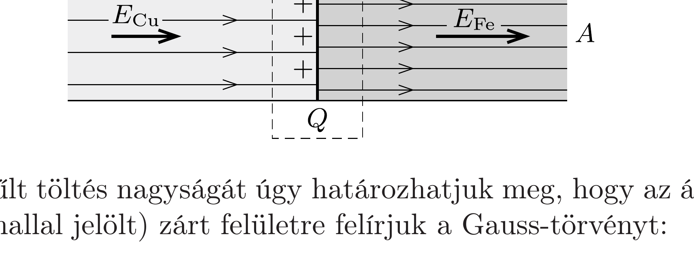

## Útmutatás

A két fémben (különböző erősségǘ) elektromos mező alakul ki, melynek térerősségét a differenciális Ohm-törvény segítségével határozhatjuk meg. A határfelületen felhalmozódó töltés meghatározásához alkalmazzuk Gauss törvényét!

## Megoldás

Jelöljük a vezetékben folyó áramot $I$-vel, a vezeték keresztmetszetét $A$-val, a szóban forgó anyagok fajlagos ellenállását pedig $\varrho_{\mathrm{Fe}}$-vel és $\varrho_{\mathrm{Cu}}$-val. Egy
$\ell$ hosszúságú, homogén vezetékre felírva az Ohm-törvényt:
\[
U=I \frac{\varrho \ell}{A},
\]
ahonnan a vezetékben lévő elektromos térerősségre
\[
E=\frac{U}{\ell}=\frac{\varrho I}{A}
\]
adódik.
Megjegyzés. Az (1) egyenlet jobb oldalán a vezetékben kialakuló $j=I / A$ áramsúrúség jelenik meg. Izotrop fémek esetén az áramsúrúség és az elektromos térerősség iránya megegyezik, ezért ilyen esetekben az
\[
\boldsymbol{E}(\boldsymbol{r})=\varrho \boldsymbol{j}(\boldsymbol{r})=\frac{1}{\sigma} \boldsymbol{j}(\boldsymbol{r})
\]
vektoros összefüggés is fennáll, amit differenciális Ohm-törvénynek neveznek. ( $\sigma$ a fajlagos vezetőképesség, a fajlagos ellenállás reciproka.) Ennek az egyenletnek az előnye, hogy lokálisan (helyrốl helyre) írja le a töltéshordozók áramlását.

A réz fajlagos ellenállása kisebb, mint a vasé, (1) értelmében tehát a rézben az elektromos térerősség kisebb, mint a vasban. A térerősségek különbözősége - Gauss törvénye szerint - azzal jár együtt, hogy a két fém csatlakozásánál töltés halmozódik fel (lásd az ábrát).

Az összegyült töltés nagyságát úgy határozhatjuk meg, hogy az ábrán látható (szaggatott vonallal jelölt) zárt felületre felírjuk a Gauss-törvényt:
\[
Q=\varepsilon_{0}\left(E_{\mathrm{Fe}}-E_{\mathrm{Cu}}\right) A=\varepsilon_{0} I\left(\varrho_{\mathrm{Fe}}-\varrho_{\mathrm{Cu}}\right) .
\]
Érdekes, hogy ez a töltésmennyiség csak az áramerősségtől és anyagi állandóktól függ, a vezeték keresztmetszetétól nem.

Az ismert adatokat behelyettesítve a töltésre $Q \approx 5 \cdot 10^{-21} \mathrm{C}$ adódik, ami az elemi töltésnek mindössze harmincadrésze! Annak ellenére, hogy a vezetékben ténylegesen megvalósítható, makroszkopikus nagyságú, jól mérhető áram folyik, a felhalmozott töltésre a mikroszkopikus (atomfizikai) töltésegység töredékét kaptuk. Ez a furcsaság arra utal, hogy a klasszikus elektrodinamika (kicsiny golyócskáknak elképzelt töltéshordozókkal) nem írhatja le minden tekintetben helyesen az elektromos jelenségeket. A felvetett kérdés megnyugtató tárgyalása csak a kvantumelmélet és a statisztikus fizika bonyolultabb törvényeinek alkalmazásától
remélhető. (Az előbbi a „szétkent elektronhullám" fogalmával, az utóbbi pedig a statisztikus átlagolással képes leírni az elemi töltés töredékének látszólagos megjelenését.)
