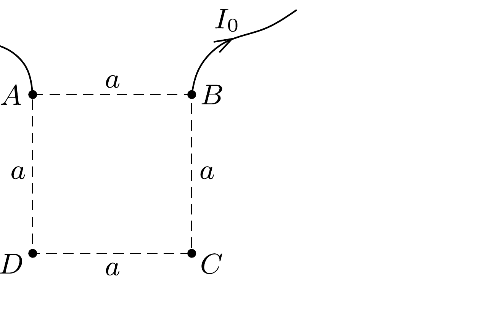

## Útmutatás

Alkalmazzuk (a 306. feladatban tárgyaltakhoz hasonlóan) a szuperpozíciós elvet! A vezető féltérben kialakuló elektromos teret az előző feladatban szereplő differenciális Ohm-törvénnyel határozhatjuk meg.

## Megoldás

A 306. feladathoz hasonlóan a szuperpozíció „trükkjét” alkalmazzuk: először külön-külön tárgyaljuk az áram be- és kivezetését, majd a feladatban leírt mérést ezek szuperpozíciójának tekintjük. A síkra rajzolt négyzet egyik csúcsát jelöljük $A$-val, itt vezetünk be $I_{0}$ áramot, amit az ezzel szomszédos $B$ csúcson vezetünk ki. A négyzet két másik csúcsa ( $C$ és $D$ ) között mérjük az $U_{0}$ feszültséget, ahogy ezt az ábra mutatja.

Ha először $I_{0}$ áramot küldünk be az $A$ ponton, akkor az áram a féltérben egyenletesen, (fél)gömbszimmetrikusan oszlik el, vagyis az $A$ ponttól $r$ távolságban az áramsúrúség (egységnyi felületen átfolyó áram nagysága):
\[
j(r)=\frac{I_{0}}{2 \pi r^{2}} .
\]

Ez az összefüggés nagyon kis $r$ távolságokra nem érvényes (az áramsúrúség nem tart végtelenhez), mert az $A$ pontban lévő elektróda méretét megközelítve az összefüggés nyilvánvalóan érvényét veszti.

Az Ohm-törvény lokális (helyi) változata az ún. differenciális Ohm-törvény, amely az áramsúrúséget az adott helyen fellépő $\boldsymbol{E}$ elektromos térerősség és a helyi $\varrho$ fajlagos ellenállás segítségével fejezi ki: $\boldsymbol{j}(r)=\boldsymbol{E}(r) / \varrho$ (lásd az előzó feladat megoldását). Ennek segítségével meghatározhatjuk a féltérben kialakuló elektromos térerősség nagyságát:
\[
E(r)=\frac{I_{0} \varrho}{2 \pi r^{2}} .
\]

A térerősségből a potenciálfüggvényt (és annak két pont közötti különbségét, a feszültséget) általában integrálással határozhatjuk meg; esetünkben azonban egy egyszerú analógia alapján is megkaphatjuk azt. Emlékeztetünk arra, hogy egy $Q$ nagyságú ponttöltés elektromos tere $1 / r^{2}$-tel, potenciálja pedig $1 / r$-rel arányos, és mindkét esetben ugyanaz az arányossági tényezó $\left(E=k Q / r^{2}\right.$, illetve $U=k Q / r$ ). Ez azt jelenti, hogy a feladatunkban meghatározott térerősségnek a következő potenciálfüggvény felel meg (ha a végtelen távoli pont potenciálját választjuk nullának):
\[
U(r)=\frac{I_{0} \varrho}{2 \pi r} .
\]
Minél közelebb van tehát egy pont az áram bevezetési helyéhez, annál magasabb a potenciálja. A $D$ és $C$ pontokra ezért $U_{D}>U_{C}$ teljesül, és a két pont potenciálkülönbsége
\[
U_{D}-U_{C}=\frac{I_{0} \varrho}{2 \pi}\left(\frac{1}{a}-\frac{1}{\sqrt{2} a}\right)=\frac{I_{0} \varrho(2-\sqrt{2})}{4 \pi a} .
\]

Második lépésben tekintsük azt az esetet, amikor $I_{0}$ áramot vezetünk ki a $B$ pontból. Minden megegyezik az előzőekkel, csak a mennyiségek (áram, áramsúrúség, térerósség, potenciál) elójele fordul az ellentettjére. A potenciál a vizsgált féltérben: $U\left(r^{\prime}\right)=-I_{0} \varrho /\left(2 \pi r^{\prime}\right)$, ahol $r^{\prime}$ a $B$ ponttól mért távolság. A $D$ és $C$ pontok közötti feszültség most is ugyanolyan előjelú és ugyanakkora nagyságú, mint az első esetben. Ha a vizsgált két esetet egymásra szuperponáljuk, akkor megvalósul a feladatban megadott helyzet, és a $D$ és $C$ pontok között éppen a fenti két (egyforma) potenciálkülönbség összegét, vagyis
\[
U_{0}=\frac{I_{0} \varrho(2-\sqrt{2})}{2 \pi a}
\]
feszültséget mérünk. Innen a kérdéses fajlagos ellenállás kifejezhető:
\[
\varrho=\frac{(2+\sqrt{2}) \pi a U_{0}}{I_{0}} .
\]

Megjegyzés. Ezt a módszert széles körben alkalmazzák a gyakorlatban, például kőzetek fajlagos ellenállásának meghatározására. Természetesen nem végtelen féltereken mérnek, hanem olyan nagy térfogatokat és síkokat választanak, amelyekhez képest az $a$ négyzetoldal elhanyagolhatóan kicsi.
