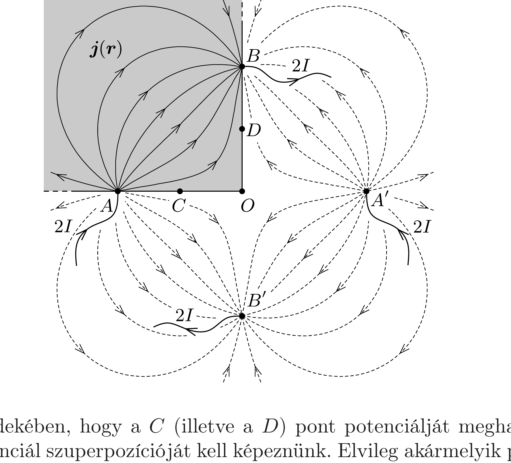

## Útmutatás

A lemez mindkét hozzáférhetó szélén (a négyzet élei mentén) az áramsűrúség-vektoroknak az élekkel párhuzamosan kell futni. Ez a határfeltétel úgy valósítható meg, ha a negyedsíkot kitöltő lemezt gondolatban kiterjesztjük a teljes síkra, majd az áramok be- és kivezetésére „tükörelektródákat” alkalmazunk.

## Megoldás

A cél a voltmérő által jelzett $U$ feszültség és a lemezbe vezetett $I$ áramerősség közötti összefüggés megállapítása. Ha ismernénk a kialakuló kétdimenziós árameloszlás helyfüggő $\boldsymbol{j}(\boldsymbol{r})$ áramsűrúségét, akkor az $\boldsymbol{E}(\boldsymbol{r})=\varrho \boldsymbol{j}(\boldsymbol{r})$ differenciális Ohm-törvényből meghatározhatnánk az elektromos térerősséget a lemez belsejében. A térerősségből a $C$ és $D$ pontok közötti feszültség már integrálással kiszámítható. Ez matematikailag nehéz feladat, de szerencsére van egy sokkal könnyebben járható út.

A fémlemez éleinél a $\boldsymbol{j}(\boldsymbol{r})$ áramsúrúség-vektor élre merőleges komponensének el kell túnnie. Ez a szokatlan határfeltétel könnyen kezelhetővé válik, ha az elektrosztatikában használt tükörtöltés-módszerhez hasonló gondolatmenetet követünk úgy, hogy a negyedsíkot kitöltő lemezt kiterjesztjük a teljes síkra (lásd az ábrát).

A kiterjesztéshez tükrözzük az $A$ és $B$ pontokat a lemez $B D$ és $A C$ oldaléleire; az így kapott pontokat jelölje $A^{\prime}$ és $B^{\prime}$. A negyedsíkot kitöltő lemezben az árameloszlás éppen olyan, amilyen a teljes síkra kiterjesztett fémlemez egyik negyedében alakulna ki, ha abba az $A$ és $A^{\prime}$ pontokban egyaránt $2 I$ erősségú áramot vezetnénk be, a $B$ és $B^{\prime}$ pontokból pedig $2 I$ áramot vezetnénk el.

Ezek után hasonló módon járunk el, mint a 314. feladatban, vagyis alkalmazzuk a szuperpozíciós elvet. Ha $2 I$ erősségú áramot vezetünk a végtelen fémlemezbe, akkor az áramsúrúség nagysága a bevezetési ponttól $r$ távolságban
\[
j(r)=\frac{2 I}{2 \pi r \delta} .
\]

Az áramsűrúség-vektor - a szimmetria miatt - az áram bevezetési pontjával ellentétes irányba mutat. A lemezbeli térerősség ugyanitt
\[
E(r)=\frac{\varrho I}{\pi r \delta}
\]
nagyságú, a potenciál pedig (egy önkényesen választható, az elektródától $r_{0}$ távolságra lévő ponthoz képest)
\[
\Phi(r)=-\int_{r_{0}}^{r} E(r) \mathrm{d} r=\frac{\varrho I}{\pi \delta} \ln \frac{r_{0}}{r} .
\]

Annak érdekében, hogy a $C$ (illetve a $D$ ) pont potenciálját meghatározzuk, négy részpotenciál szuperpozícióját kell képeznünk. Elvileg akármelyik pontot válaszhatjuk a potenciálok nulla helyének, de a számítás sokkal rövidebbé válik, ha a potenciált az eredeti négyzet $O$ csúcsában választjuk nullának; ez a pont valamennyi áram be- és kivezetési pontjától $r_{0}=2 d$ távolságban van. Ezzel a választással a $C$ pont potenciálja a valódi és a „tükörelektródák” hatásának szuperpozíciójaként
\[
\Phi_{C}=\frac{\varrho I}{\pi \delta}\left(\ln \frac{r_{0}}{d}+\ln \frac{r_{0}}{3 d}-\ln \frac{r_{0}}{\sqrt{5} d}-\ln \frac{r_{0}}{\sqrt{5} d}\right),
\]
figyelembe véve, hogy melyik elektróda jelent forrást, illetve nyelőt. A logaritmusra vonatkozó azonosság felhasználásával a $C$ pont potenciálja a következő egyszerú alakra hozható:
\[
\Phi_{C}=\frac{\varrho I}{\pi \delta} \ln \frac{5}{3} .
\]

Ugyanilyen módon számolhatjuk a $D$ pont potenciálját is, vagy a szimmetriára hivatkozva láthatjuk, hogy $\Phi_{D}=-\Phi_{C}$. A $C$ és $D$ pontok közötti feszültség tehát $2 \Phi_{C}$, ennyit jelez a negyedsíkot kitöltő lemezre kapcsolt voltmérő is:
\[
U=\frac{2 \varrho I}{\pi \delta} \ln \frac{5}{3} .
\]
Ebből a lemez $\varrho$ fajlagos ellenállása kifejezhető:
\[
\varrho=\frac{\pi \delta}{2 \ln (5 / 3)} \frac{U}{I} .
\]

Érdekes, hogy az eredmény nem függ a $d$ távolság megválasztásától (egészen addig, amíg $d$ sokkal kisebb a négyzetlap oldaléleinél, és sokkal nagyobb a lemez $\delta$ vastagságánál).
