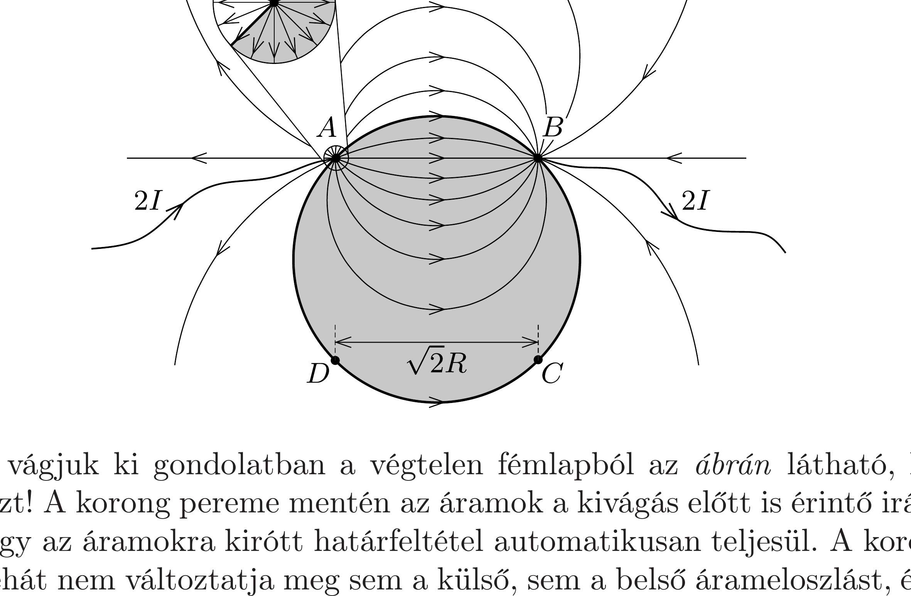

## Útmutatás

Célszerú először egy végtelen fémlap két pontjába be- és kivezetett áram esetét tanulmányozni. A 247. vagy 285. számú feladatokban használt érveléssel belátható, hogy ilyenkor az áramvonalak olyan körívek, melyek átmennek az áramot szállító vezetékek csatlakozási pontjain. Ezután gondoljuk meg, hogyan befolyásolja az árameloszlást, ha a végtelen fémlapot fémkorongra cseréljük!

## Megoldás

A fémkorong vizsgálata előtt az előzó feladathoz hasonlóan most is érdemes egy végtelen fémlemez esetéből kiindulni. Képzeljük el, hogy a végtelen fémlap $A$ pontjába $2 I$ áramot vezetünk, a $B$ pontból pedig elvezetjük azt. Ha csak az egyik elektróda lenne jelen, a fémlemezben az elektromos térerősség fordítottan arányos lenne az elektródától mért távolsággal, éppen úgy, ahogy egy végtelen hosszú, egyenletesen töltött szigetelő pálca esetén. Mindkét elektróda jelenlétében a lemezbeli elektromos tér analóg két párhuzamos, ellentétes vonalmenti töltéssúrúségú szigetelő pálca terével. A 247. feladatban láttuk, hogy egy ilyen töltéselrendezés elektromos eróvonalai körívek, így a lemezben futó erővonalak (és így az áramvonalak is) olyan körívek, melyek átmennek az $A$ és $B$ pontokon.

Most vágjuk ki gondolatban a végtelen fémlapból az ábrán látható, korong alakú részt! A korong pereme mentén az áramok a kivágás előtt is érintő irányban folytak, így az áramokra kirótt határfeltétel automatikusan teljesül. A korong kivágása tehát nem változtatja meg sem a külső, sem a belső árameloszlást, és így a feszültségviszonyokat sem. A végtelen fémlapban az áram be- és kivezetési pontjának közvetlen közelében az árameloszlás izotrop volt (itt a távolabbi elektróda
hatása már nem érződik), így a korong kivágása előtt a fémlemezbe vezetett $2 I$ erősségú áramnak pontosan a fele jutott be a korongba (lásd az ábrát). A feladatbeli kérdés tehát egyenértékú azzal, hogy mekkora volt a feszültség a végtelen fémlap $C$ és $D$ pontjai között a korong kivágása előtt?
$\mathrm{Az} A$ pontban bevezetett $2 I$ áram hatására az elektródától $r$ távolságra a fémlap potenciálja (az $A$ és $B$ pontok között félúton elhelyezkedő referenciaponthoz képest)
\[
\Phi(r)=\frac{\varrho \cdot 2 I}{2 \pi \delta} \ln \frac{r_{0}}{r},
\]
ahol $r_{0}=R / \sqrt{2}$ (lásd a 315. feladatot). Ennek felhasználásával az $A$ pontbeli elektróda által a $C$ és $D$ pontok között létrehozott (előjeles) feszültség:
\[
U_{C D}^{(A)}=\frac{\varrho I}{\pi \delta}\left(\ln \frac{r_{0}}{2 R}-\ln \frac{r_{0}}{\sqrt{2} R}\right)=-\frac{\varrho I}{2 \pi \delta} \ln 2 .
\]
Ugyanekkora potenciálkülönbséget hoz létre a $B$ jelú elektróda is, így a szuperpozíció értelmében a $C$ és $D$ pontok között eső feszültség
\[
U_{C D}=U_{C D}^{(A)}+U_{C D}^{(B)}=2 U_{C D}^{(A)}=-\frac{\varrho I}{\pi \delta} \ln 2 .
\]
Ekkora tehát a kivágott fémkorong $C$ és $D$ pontjai közötti feszültség is.
Megjegyzés. Vékony lemezek fajlagos ellenállásának meghatározására alkalmas van der Pauw módszere, melynek lényege a következő. Egyenletes $\delta$ vastagságú, tetszőleges alakú (de belül nem lyukas) fémlemez peremén kiválasztunk négy $(A, B, C$ és $D)$ pontot. Első lépésben az $A$ és $B$ pontokon keresztül $I_{A B}$ áramot vezetünk át a fémlapon, és megmérjük a $D$ és $C$ pontok közötti $U_{D C}$ feszültséget. Ebből a minta $R_{A B, D C}=U_{D C} / I_{A B}$ ún. négypont-ellenállása kiszámítható. Második lépésben az $A$ és $C$ pontokon keresztül vezetünk át $I_{A C}$ áramot, és megmérjük a $D-B$ pontpár feszültségét, így kapjuk az $R_{A C, D B}=U_{D B} / I_{A C}$ négypont-ellenállást. Komplex függvénytani módszerekkel megmutatható, hogy a kapott ellenállásértékek között fennáll a következő összefüggés:
\[
\mathrm{e}^{(\pi \delta / \varrho) R_{A B, D C}}-\mathrm{e}^{(\pi \delta / \varrho) R_{A C, D B}}=1,
\]
amelyből a vékonyréteg $\varrho$ fajlagos ellenállása meghatározható.
Van der Pauw módszerével igen egyszerüen eljuthatunk az eredeti feladat végeredményéhez. A korong esetében ugyanis a szimmetria miatt az $R_{A C, D B}$ négypont-ellenállás zérus, így a fenti egyenletből a másik négypont-ellenállásra
\[
R_{A B, D C}=\frac{U_{D C}}{I}=-\frac{U_{C D}}{I}=\frac{\varrho}{\pi \delta} \ln 2
\]
adódik, ami egyezik az elemi módszerrel kapott eredménnyel.
