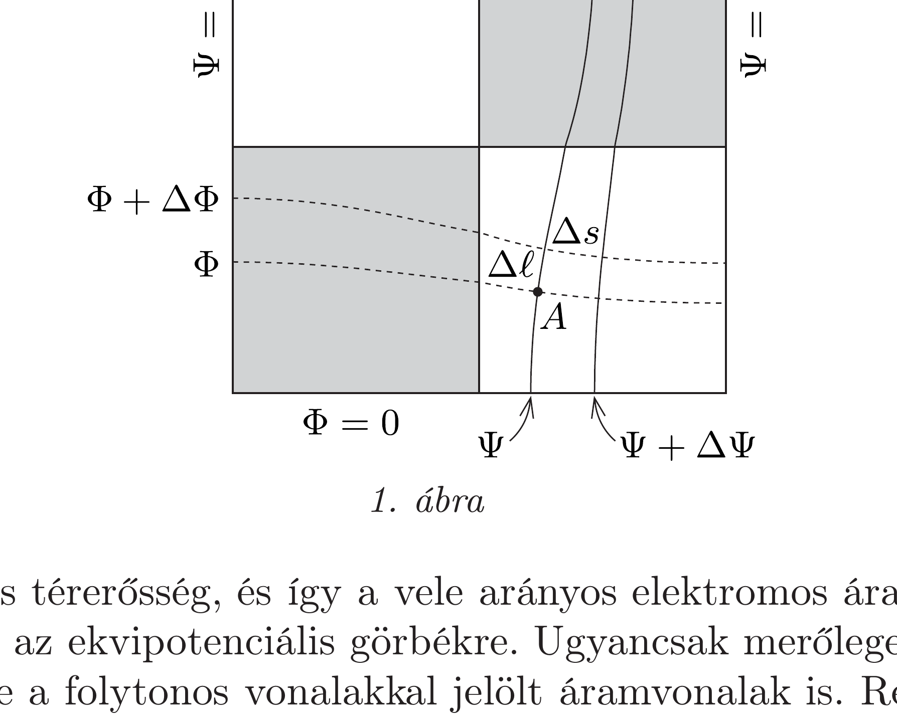
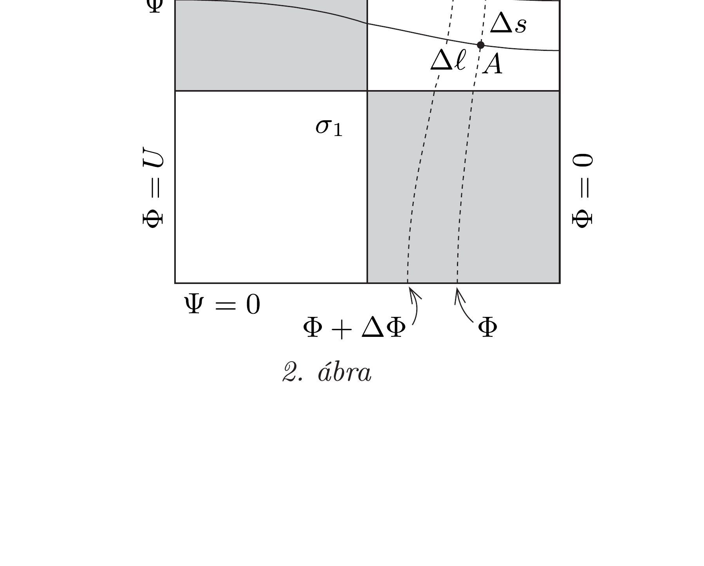
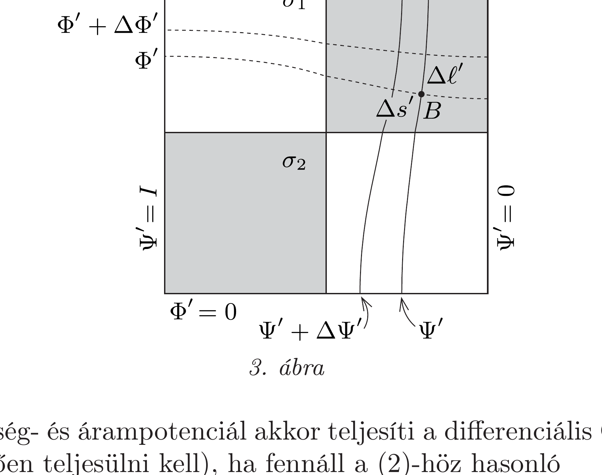
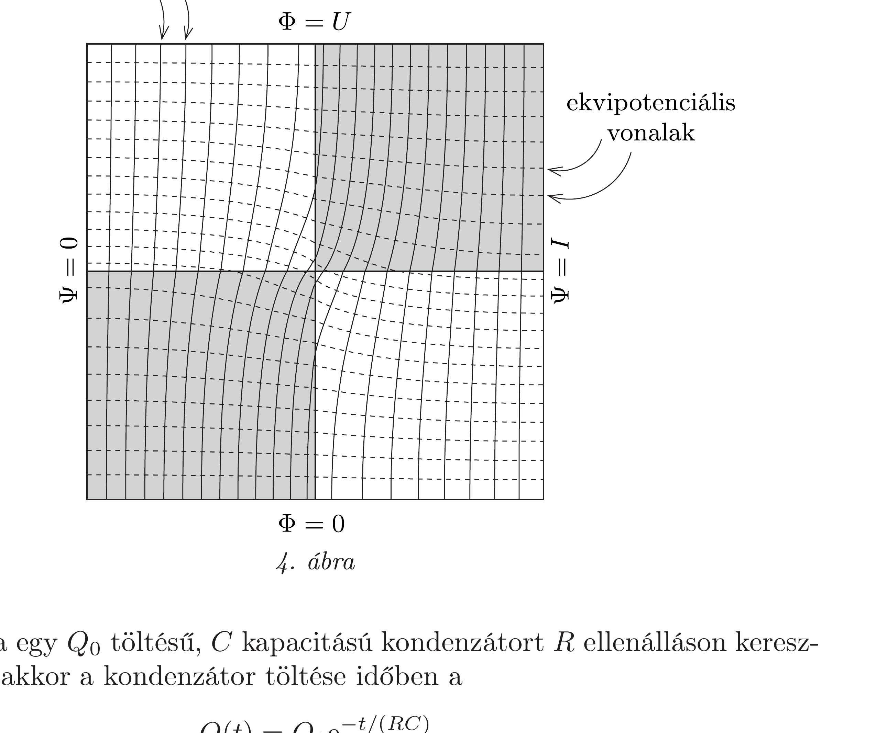

## Útmutatás

A kialakuló (gyakorlatilag síkbeli) árameloszlást az áramvonalakkal, az elektromos mezőt pedig az ekvipotenciális vonalakkal jellemezhetjük. Ezek egymásra merőleges görbesereget alkotnak. (Lásd még a 285. feladat megoldásánál leírtakat.) A sakktáblát 90°-kal elforgatva a két görbesereg szerepet cserél, az eredő ellenállás azonban változatlan marad.

## Megoldás

Ha a sakktábla homogén, mindenhol $\sigma_{1}$ vezetőképességú anyagból készült volna, a benne kialakuló elektromos térerősség $E=U / L$, az áramsűrúség $j_{1}=\sigma_{1} E$, a sakktáblán átfolyó teljes áram pedig
\[
I_{1}=j_{1} L \delta=U \sigma_{1} \delta
\]
lenne. Hasonló módon, egy $\sigma_{2}$ vezetőképességú, homogén lemezben $U$ feszültség hatására
\[
I_{2}=j_{2} L \delta=U \sigma_{2} \delta
\]
nagyságú áram folyna. (Érdekes, hogy az áramerősség nem függ $L$-től.)
A továbbiakban megmutatjuk, hogy az inhomogén vezetőképességú sakktáblán átfolyó áram $I_{1}$ és $I_{2}$ mértani közepe, vagyis
\[
I=U \delta \sqrt{\sigma_{1} \sigma_{2}} .
\]
Ez az állítás minden olyan négyzetlapra igaz, amelyre teljesül, hogy a négyzet bármely két, a négyzet 90°-os elforgatásával egymásba átvihető $A$ és $B$ pontjához tartozó vezetőképesség szorzata a pontpár helyzetétől független állandó. Esetünkben ez nyilván igaz, hiszen a sakktábla 90°-os elforgatása a világos mezőket sötétre változtatja, és ugyanez igaz megfordítva is, vagyis az $A$ és $B$ pontok mindig ellentétes színúek, tehát $\sigma_{A} \sigma_{B} \equiv \sigma_{1} \sigma_{2}$. A továbbiakban az egyszerúség és a könnyebb áttekinthetőség kedvéért a szokásos sakktábla helyett annak $2 \times 2$-es változatát tüntetjük fel az ábrákon, hiszen az említett tulajdonság erre is teljesül.

Vizsgáljuk meg a lemezben kialakuló elektromos mezőt és a lemezben folyó áramokat! A konzervatív elektrosztatikus mező jól jellemezhető az elektromos potenciállal, amit $\Phi$-vel jelölünk, illetve az ekvipotenciális felületekkel (esetünkben ekvipotenciális vonalakkal), melyeket szaggatott vonalakkal szemléltetünk (1. ábra). A négyzetlap „alsó” élét választhatjuk nulla potenciálúnak, a „felső” él potenciálja ekkor a telep $U$ feszültségével egyezik meg.

Az elektromos térerősség, és így a vele arányos elektromos áramsúrúség vektora is meróleges az ekvipotenciális görbékre. Ugyancsak merőlegesek az ekvipotenciális görbékre a folytonos vonalakkal jelölt áramvonalak is. Rendeljük hozzá
mindegyik áramvonalhoz azt a $\Psi$ számot, amely a kérdéses vonal és a lemez bal széle között összesen folyó áram erősségével egyezik meg! A lemez bal széle nyilván áramvonal, ez $\Psi=0$-nak felel meg, a lemez jobb szélénél pedig $\Psi=I$, a lemezen átfolyó teljes árammal egyenlő. A továbbiakban $\Phi$-t feszültségpotenciálnak, $\Psi$-t pedig árampotenciálnak fogjuk nevezni.

Ha a lemez egy tetszőleges $A$ pontjának közelében a kicsiny $\Delta \Phi$ potenciálkülönbségnek megfelelő ekvipotenciális görbék távolsága $\Delta \ell$, akkor az elektromos térerősség nagysága
\[
E_{A}=\frac{\Delta \Phi}{\Delta \ell},
\]
az elektromos áramsűrúség nagysága pedig
\[
j_{A}=\sigma_{A} E_{A}=\sigma_{A} \frac{\Delta \Phi}{\Delta \ell},
\]
ahol $\sigma_{A}$ az $A$ pont környezetében érvényes vezetőképességet jelöli (ami a mező „színétől” függően $\sigma_{1}$ vagy $\sigma_{2}$ ). Ekkora áramsúrúség mellett a lemez $\delta \Delta s$ keresztmetszetú darabkáján $j_{A} \delta \Delta s$ nagyságú áram folyik át, ami éppen az árampotenciál $\Delta s$ távolságra jutó $\Delta \Psi$ megváltozásával egyenlő:
\[
j_{A} \delta \Delta s=\sigma_{A} \frac{\Delta \Phi}{\Delta \ell} \delta \Delta s=\Delta \Psi,
\]
ahonnan végül a
\[
\delta \sigma_{A} \frac{\Delta \Phi}{\Delta \ell}=\frac{\Delta \Psi}{\Delta s}
\]
összefüggéshez jutunk.
Forgassuk most el az 1. ábrát a lemez síkjában 90°-kal az óramutató járásával ellentétes irányban, így a 2. ábrán látható elrendezést kapjuk.

Felmerül a kérdés, vajon alkalmas-e ez az elrendezés a feszültség- és árampotenciálok felcserélése, továbbá megfelelően választott paraméterekkel való szorzása után az eredeti lemezben folyó áramok leírására? Legyen
\[
\Psi^{\prime}=\frac{I}{U} \Phi \quad \text { és } \quad \Phi^{\prime}=\frac{U}{I} \Psi,
\]
és jelöljük az egymáshoz közeli görbék távolságát
\[
\Delta \ell^{\prime}=\Delta s, \quad \text { illetve } \quad \Delta s^{\prime}=\Delta \ell
\]
módon! A szorzófaktorokat úgy választottuk meg, hogy $\Phi^{\prime}$ (az új feszültségpotenciál) legnagyobb értéke $U, \Psi^{\prime}$ (vagyis az új árampotenciál) maximuma pedig $I$ legyen. Ha ezeket az új (vesszős) mennyiségeket az eredeti (el nem forgatott) lemezre rajzoljuk fel, a 3. ábrának megfelelő elrendezést kapjuk. Az itt látható $B$ pont az a hely, ahova az $A$ pont került a sakktábla 90°-os elforgatása után. Mivel $B$ biztosan ellentétes színú mezőre esik, mint amilyenen $A$ volt, így a megfelelő vezetőképességek szorzata:
\[
\sigma_{A} \sigma_{B}=\sigma_{1} \sigma_{2} .
\]
Ez a szorzat mindig ugyanakkora, függetlenül attól, hogyan választjuk meg az $A$ pontot, illetve ezzel együtt a $B$ pont helyzetét a sakktáblán.

Az új feszültség- és árampotenciál akkor teljesíti a differenciális Ohm-törvényt (aminek kötelezően teljesülni kell), ha fennáll a (2)-höz hasonló
\[
\delta \sigma_{B} \frac{\Delta \Phi^{\prime}}{\Delta \ell^{\prime}}=\frac{\Delta \Psi^{\prime}}{\Delta s^{\prime}}
\]
összefüggés. Felhasználva a vesszős és vesszőtlen mennyiségek közötti kapcsolatokat, valamint a (2) egyenletet, a fenti feltétel így is felírható:
\[
\delta \sigma_{B} \frac{U}{I} \frac{\Delta \Psi}{\Delta s}=\delta \sigma_{B} \frac{U}{I} \cdot \delta \sigma_{A} \frac{\Delta \Phi}{\Delta \ell}=\frac{I}{U} \frac{\Delta \Phi}{\Delta \ell} .
\]

Elvégezve az egyszerúsítéseket és felhasználva a (3) összefüggést, a következő végeredményt kapjuk:
\[
I=U \delta \sqrt{\sigma_{A} \sigma_{B}}=U \delta \sqrt{\sigma_{1} \sigma_{2}},
\]
amint ezt a megoldás elején az (1) egyenletben előzetesen kimondtuk.
Megjegyzések. 1. A megoldásban közölt levezetés minden egyes lépése nemcsak a $2 \times 2-$ es táblára igaz, hanem a 8 × 8-as szokásos sakktáblára is. Általánosabban kimondhatjuk, hogy a végeredmény minden olyan $n \times n$ négyzetből álló táblára érvényes, ahol $n$ páros, de nem érvényes páratlan $n$-ekre. Ugyanis páratlan $n$ esetében a $90^{\circ}$-os elforgatás nem változtatja meg a mezők „színét”, továbbá a sötét és a világos mezők száma nem azonos, tehát az eredmény nem lehet szimmetrikus $\sigma_{1}$ és $\sigma_{2}$ felcserélésére.
2. Számítógépes numerikus módszerekkel az elektromos áramvonalak és az ekvipotenciális vonalak bármilyen táblára kiszámíthatók, illetve kirajzoltathatók. A 4. ábrán ilyen számítógépes „térkép" látható egy szimmetrikus 2 × 2-es tábla esetén, ahol a sötét mezők $\sigma_{2}$ vezetőképessége éppen kétszerese a világos négyzetek $\sigma_{1}$ vezetőképességének. A határfeltételek miatt mind az áramvonalak, mind pedig az ekvipotenciális vonalak megtörnek (irányt váltanak) a mezők érintkezési vonalainál - hasonlóságot mutatva ahhoz, ahogy a fény megtörik két különböző közeg határán.

