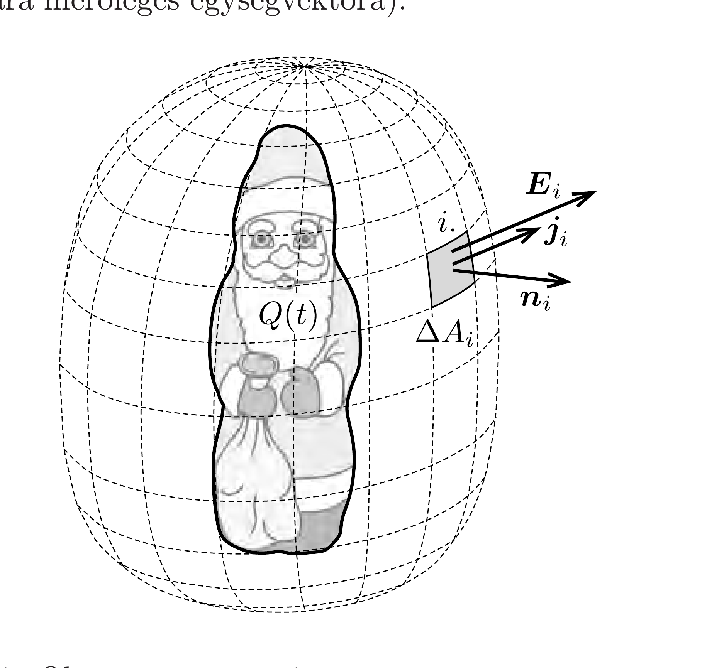

## Útmutatás

Az előzó feladatra adott megoldás a csokimikulás szabálytalan alakja miatt ebben az esetben nem múködik: sem a csokimikulás kapacitását, sem pedig a levegő „helyettesítő“ ellenállását nem tudjuk kiszámítani.

Vegyük körbe a csokimikulást egy zárt felülettel és hasonlítsuk össze egy kis felületdarabkán időegység alatt kiáramló töltést a mikulás elektromos terének a felületdarabkán létrehozott fluxusával.

\section*{Elektromágneses indukció, idốben változó mezők}

## Megoldás

Vegyük körbe gondolatban a csokimikulást egy zárt felülettel! A zárt felületet osszuk fel kis felületdarabkákra, és jelöljük az $i$-edik darabka felszínét $\Delta A_{i}$-vel, a darabka helyén a csokimikulás által létrehozott térerősséget $\boldsymbol{E}_{i}$-vel, az áramsűrúséget pedig $\boldsymbol{j}_{i}$-vel!

A zárt felületen áthaladó elektromos áram megadja a csokimikulás $Q(t)$ töltésének csökkenési ütemét:
\[
\frac{\Delta Q(t)}{\Delta t}=-\sum_{i} \boldsymbol{j}_{i} \boldsymbol{n}_{i} \Delta A_{i}
\]
ahol $\boldsymbol{n}_{i}$ az $i$-edik felületdarabka (a zárt felületből kifelé mutató) normálisa (a felület érintősíkjára merőleges egységvektora).

A differenciális Ohm-törvény szerint az áramsúrúség és a térerősség között fennáll a $\boldsymbol{j}_{i}=\sigma \boldsymbol{E}_{i}$ összefüggés, melynek segítségével a mikulás töltésének csökkenési üteme a következő alakra hozható:
\[
\frac{\Delta Q(t)}{\Delta t}=-\sigma \sum_{i} \boldsymbol{E}_{i} \boldsymbol{n}_{i} \Delta A_{i} .
\]
Az egyenlet jobb oldalán megjelenő összeg nem más, mint a csokimikulás elektromos terének a zárt felületre vonatkoztatott fluxusa, ami a Gauss-törvény értelmében éppen a felület által bezárt töltés $1 / \varepsilon_{0}$-szorosa:
\[
\frac{\Delta Q(t)}{\Delta t}=-\frac{\sigma}{\varepsilon_{0}} Q(t) .
\]
Ez az egyenlet analóg egy sugárzó mintában található radioaktív magok számának csökkenési ütemét leíró egyenlettel, így a két egyenlet megoldása is hasonló:
\[
Q(t)=Q_{0} \mathrm{e}^{-\frac{\sigma}{\varepsilon_{0}} t}=Q_{0} \cdot 2^{-\frac{\sigma}{\varepsilon_{0} \ln 2} t}=Q_{0} \cdot 2^{-t / T_{1 / 2}},
\]
ahonnan leolvasható, hogy a mikulás töltése
\[
T_{1 / 2}=\frac{\varepsilon_{0} \ln 2}{\sigma}
\]
idő alatt csökken a kezdeti érték felére.
Azt a meglepő eredményt kaptuk tehát, hogy a felezési idő sem a csokimikulás méretétől, sem az alakjától nem függ, tehát ugyanakkora, mint az előző feladatban a töltött fémgömb esetén.

\section*{Elektromágneses indukció, idốben változó mezők}
