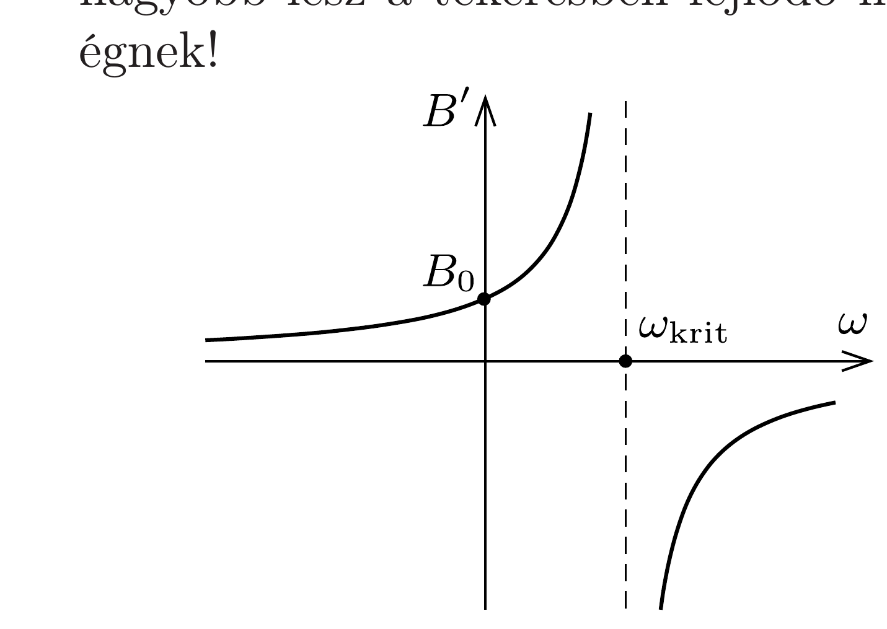
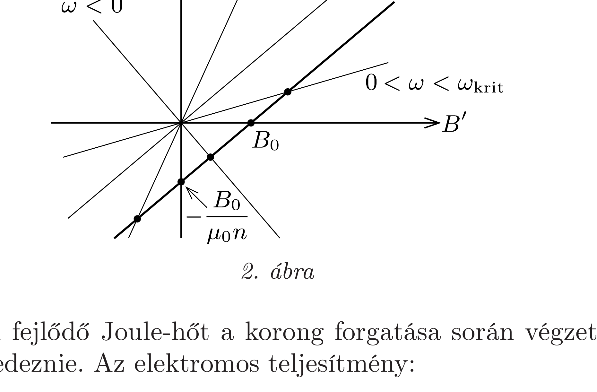

## Útmutatás

A forgó korongban elektromos mezó indukálódik, ami áramot hajt át a tekercsen. A Föld mágneses tere mellett a tekercs mágneses tere szintén hozzájárul az indukcióhoz; a szögsebesség irányától függően csökkenti vagy növeli azt.

## Megoldás

A tekercsben létrejövő $B^{\prime}$ mágneses indukció a Föld $B_{0}$ indukciójának és a tekercsben folyó áram által keltett $B$ indukciónak az összege:
\[
B^{\prime}=B_{0} \pm B .
\]
$\mathrm{A} \pm$ előjel a korong kétféle lehetséges forgásirányának felel meg. Ebben a $B^{\prime}$ indukciójú mágneses térben a megforgatott korongban lévő $-e$ töltésú elektronokra sugárirányú Lorentz-eró hat, melynek nagysága a középponttól a korong pereme felé haladva egyenletesen növekszik zérusról erω $B^{\prime}$ értékre. Ez az átlagosan erc $B^{\prime} / 2$ nagyságú erő
\[
U_{\mathrm{i}}=\frac{r^{2} \omega}{2} B^{\prime}
\]
feszültséget indukál a korongban, melynek hatására az $R$ ellenállású tekercsen
\[
I=\frac{U_{\mathrm{i}}}{R}=\frac{r^{2} \omega}{2 R} B^{\prime}
\]
erósségú áram folyik át. Ez az áram meghatározza a tekercs saját mágneses indukcióját:
\[
B=\mu_{0} n I .
\]

Az (1)-(3) egyenletekből $B, B^{\prime}$ és $I$ meghatározható. Az (1) egyenletben szereplő kétféle előjelet úgy vehetjük figyelembe, hogy a szögsebesség pozitív és negatív értékeit egyaránt megengedjük. (Tekintsük $\omega$ azon értékeit pozitívnak, amelyeknél a tekercs mágneses tere növeli a földi mágneses teret.) Az eredő mágneses mezőre, illetve az áramerősségre a következőket kapjuk:
\[
B^{\prime}=\frac{2 R B_{0}}{2 R-\mu_{0} n r^{2} \omega}, \quad I=\frac{B_{0} r^{2} \omega}{2 R-\mu_{0} n r^{2} \omega} .
\]
A korong álló helyzetében az áram nyilván nulla, a tekercsben kialakuló eredő mágneses indukció pedig megegyezik a földi $B_{0}$ mágneses indukcióval.

Ha a forgásirány olyan, hogy a tekercs tere lerontja a külső mágneses teret $(\omega<0)$, akkor a tekercs növekvő nagyságú (negatív) szögsebességével az eredő mágneses indukció monoton csökken, igen nagy $\omega$ esetén nullához tart. A tekercsben folyó áram nagyon gyors forgásnál $-B_{0} /\left(\mu_{0} n\right)$ értékhez tart (éppen ekkora áram egyenlíti ki a földi mágneses teret).

Ellentétes forgásirány $(\omega>0)$ esetén a tekercsben folyó áram növeli a földi mágneses indukciót, emiatt nagyobb feszültség indukálódik és nagyobb áram folyik, ami a mágneses indukció további növekedéséhez vezet (pozitív visszacsatolás). Egy bizonyos „kritikus” szögsebességnél,
\[
\omega_{\text {krit }}=\frac{2 R}{\mu_{0} n r^{2}}
\]
értéknél a mágneses indukció is és az áramerősség is végtelen nagy értéket akar felvenni (1. ábra). Ilyen állapot azonban nem valósulhat meg: ha a szögsebességet
fokozatosan növeljük, azt tapasztaljuk, hogy egyre nagyobb áram folyik, egyre nagyobb lesz a tekercsben fejlődő hő, egészen addig, amíg a vezetékek szét nem égnek!

Jobban megérthetjük a rendszer furcsa viselkedését, ha a tekercs árama és az eredő mágneses indukció közötti kapcsolatot grafikusan is ábrázoljuk (2. ábra). A (2) egyenlet szerint $I$ és $B^{\prime}$ arányos egymással, méghozzá úgy, hogy az arányossági tényező $\omega$-tól függ. Grafikusan ez egy, az origón átmenő egyenesnek felel meg, amelynek meredeksége $\omega$-val arányos. Ugyanakkor (1) és (3) szerint $B^{\prime}=B_{0} \pm \mu_{0} n I$, ami ugyancsak lineáris kapcsolat, grafikonja $1 /\left(\mu_{0} n\right)$ meredekségú ( $\omega$-tól független) egyenes, amely nem halad át az origón. Ennek a két egyenesnek a metszéspontja határozza meg a ténylegesen kialakuló áramerősséget és az eredő mágneses indukciót. Ha $\omega=\omega_{\text {krit }}$, akkor a két egyenes párhuzamos, és az egyenletrendszernek nincs megoldása: a kritikus szögsebességhez tartozó állapot nem valósulhat meg. (Reális számadatokat tekintve a kritikus szögsebesség olyan nagy érték, hogy a gyakorlatban még csak meg sem közelíthető.)

A tekercsben fejlődő Joule-hőt a korong forgatása során végzett mechanikai munkának kell fedeznie. Az elektromos teljesítmény:
\[
P_{\mathrm{el}}=R I^{2},
\]
az egységnyi idő alatt végzett mechanikai munka pedig a forgatónyomaték és a
szögsebesség szorzata:
\[
P_{\mathrm{mech}}=M \omega=\frac{1}{2} I B^{\prime} r^{2} \omega .
\]
(Felhasználtuk, hogy a forgatónyomaték az $I B^{\prime} r$ erő és az $r / 2$ átlagos erőkar szorzatával egyenlő.) $B^{\prime}$ és $I$ közötti kapcsolatot felhasználva közvetlenül adódik, hogy $P_{\mathrm{el}}=P_{\text {mech }}$.

Megjegyzések. 1. Érdemes átgondolni, hogyan érvényesül a Lenz-törvény a feladatban leírt eszköz esetén. A Lenz-törvény szerint a keletkező áram a korong forgását fékezi. Jól látszik ez (a csak elvileg megvalósítható) $\omega>\omega_{\text {krit }}$ esetben, amikor a $B^{\prime}$ eredő mágneses indukció is, illetve a körben folyó $I$ áramerősség is előjelet vált, azonban a Lorentz-eró (és így a forgatónyomaték is) ugyanolyan előjelú marad.
2. A feladat megoldásának meglepő furcsasága az, hogy a korongot akár pozitív, akár negatív forgásirányban pörgetjük igen nagy szögsebességgel, ugyanakkora és ugyanolyan irányú áram jön létre, ami mindkét forgásirány esetében éppen nullára kompenzálja a tekercsben a földi mágneses teret.
3. A feladatban szereplő furcsa eszközt unipoláris dinamónak nevezik.
