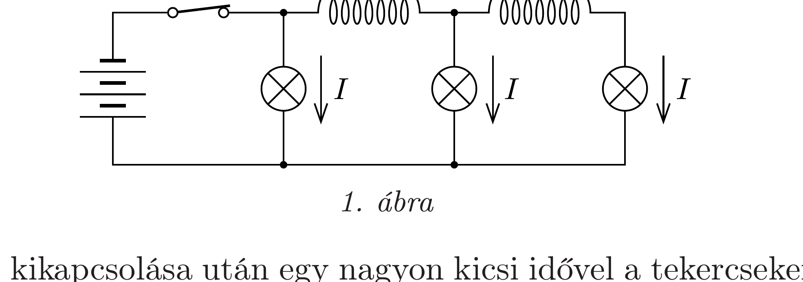
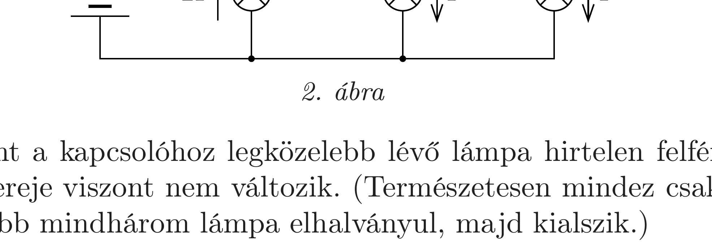

## Útmutatás

A Faraday-féle indukciótörvény szerint egy tekercsben folyó áram nem képes hirtelen megváltozni.

## Megoldás

A kapcsoló zárása után hosszabb idővel az áramkörben az 1. ábrán látható áramok folynak. Az $I$ áramerősség értékét a telep feszültsége és a lámpák ellenállása határozza meg.

A kapcsoló kikapcsolása után egy nagyon kicsi idővel a tekercseken folyó áram még majdnem ugyanakkora, mint korábban volt. (Ha nem így lenne, akkor az nagyon gyors ütemú mágneses fluxusváltozásnak felelne meg, és ez nagyon nagy feszültséget indukálna a tekercsekben.) A tekercseken tehát $2 I$ és $I$ erősségú áram folyik, és ezek egyértelmúen meghatározzák a lámpákon átfolyó áramerósségeket is (2. ábra).

Ezek szerint a kapcsolóhoz legközelebb lévő lámpa hirtelen felfénylik, a másik kettő fényereje viszont nem változik. (Természetesen mindez csak rövid ideig érvényes, később mindhárom lámpa elhalványul, majd kialszik.)
