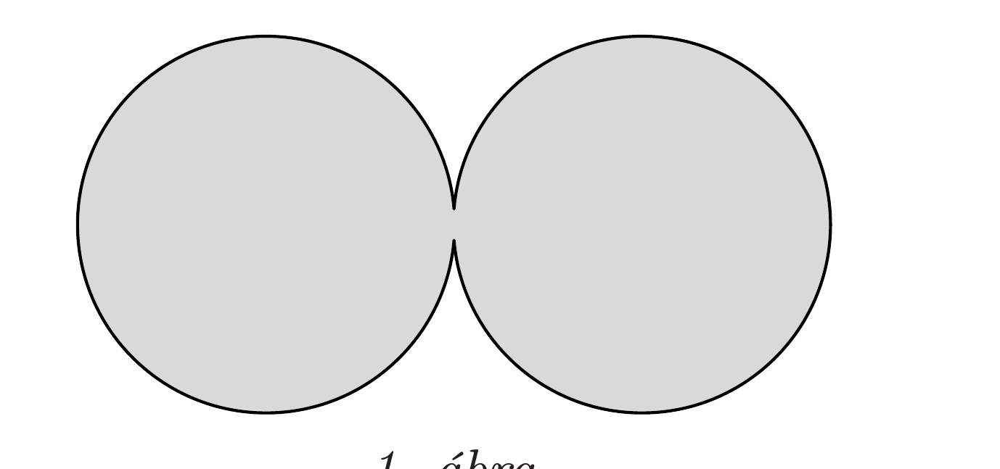
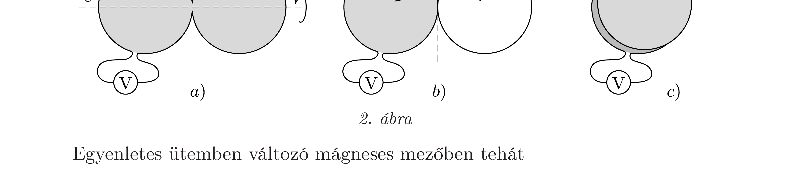

## Útmutatás

A Möbius-szalag ún. nem irányítható felület, ezért az indukciótörvényt csak kellő körültekintéssel alkalmazhatjuk. Hajtsuk szét gondolatban a szalag szélén futó vezetéket úgy, hogy önmagának átmetszése nélkül síkban kiteríthető legyen. Nézzük meg, milyen felületet határol itt a szalag, majd keressük meg ezen felület megfelelőjét a Möbius-szalagnál!

## Megoldás

Induljunk ki az 1. ábrán látható két, egyenként $R=L /(2 \pi)$ sugarú körlapból, melyek egy kicsiny darabon összeérnek. Ha ezt az alakzatot a körlapok síkjára merőleges, homogén, de időben változó mágneses térbe helyezzük, a határgörbéjén végigvezetett drótdarabban
\[
U=2 R^{2} \pi \frac{\Delta B}{\Delta t}
\]
feszültség indukálódik.

Tekerjük meg 180°-kal a jobb oldali körlapot az $e$ szimmetriatengely körül a 2. ábra $a$ ) részén látható módon, ekkor a felsó( mondjuk sötétre festett) fele alulra kerül, ahogy azt a $b$ ) ábra mutatja. Fordítsuk el ezután ugyanezt a körlapot a $t$ tengely körül (majdnem pontosan) 180°-kal ( $c$ ) ábra). Így most mindkét körlap sötét fele felülre került, a határgörbe pedig éppen a feladatban szereplő Möbiusszalag határvonala.

Egyenletes ütemben változó mágneses mezőben tehát
\[
U=2 R^{2} \pi \frac{\Delta B}{\Delta t}=k \frac{L^{2}}{2 \pi}
\]
feszültséget jelez a voltmérő. Ez az érték sokkal nagyobb, mint amekkorát a papírdarab területe alapján naiv módon gondolhatnánk. A Möbius-szalagra illeszkedő (egyoldalú) felület nagysága nem egyezik meg a papírszalag területének nagyságával, vékony szalagoknál sokkal nagyobb annál!

Az indukált feszültséget úgy is kiszámíthatjuk, hogy a vezetéket a „megtekerésnél" két egymenetes „tekercsre” vágjuk szét, és az egyes menetekben indukálódott feszültséget (a tekercselési iránynak megfelelően) előjelesen összegezzük. Jelen esetben a két meneten gondolatban végighaladva ugyanolyan körüljárási irányban haladunk, tehát az egyes menetek $U_{0}=k R^{2} \pi$ feszültsége összegződik, $U=2 U_{0}$.
