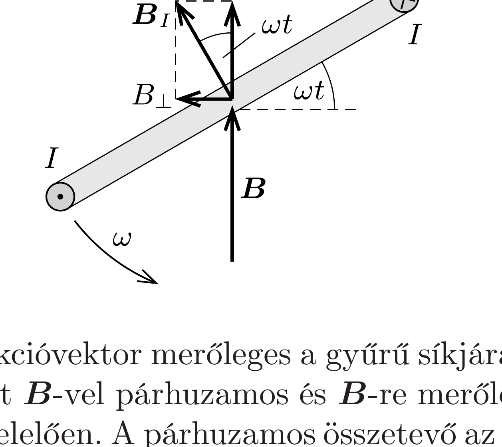

## Útmutatás

A Föld mágneses tere áramot indukál a forgó gyürúben, ennek hatására megváltozik a gyűrú középpontjában a mágneses indukcióvektor átlagos iránya, és ettől az iránytú elfordul.

## Megoldás

Bontsuk fel a Föld mágneses terét függőleges és vízszintes komponensekre. A függőleges komponens nem indukál áramot a gyűrúben, mert a fluxusa mindvégig nulla. Jelöljük a földmágnesség vízszintes komponensét $\boldsymbol{B}$-vel, a gyürú szögsebességét pedig $\omega$-val! Az $r$ sugarú gyűrúben a mágneses fluxus a
\[
\Phi=r^{2} \pi B \cos \omega t
\]
összefüggés szerint változik az időben. Ennek a fluxusnak a változási üteme Faraday indukciós törvénye szerint az indukált feszültséggel egyenlő:
\[
U=-\frac{\Delta \Phi}{\Delta t}=r^{2} \pi B \omega \sin \omega t .
\]
(Ezt az eredményt deriválással vagy egy harmonikus rezgőmozgást végző test mozgásegyenletével fennálló analógia alapján kaphatjuk meg.) Az $R$ ellenállású gyúrúben folyó
\[
I=\frac{U}{R}=\frac{r^{2} \pi B \omega}{R} \sin \omega t
\]
áram a gyürú középpontjában
\[
B_{I}=\frac{\mu_{0} I}{2 r}=\mu_{0} \frac{r \pi B \omega}{2 R} \sin \omega t
\]
nagyságú mágneses indukciót hoz létre.

A $\boldsymbol{B}_{I}$ mágneses indukcióvektor merőleges a gyúrú síkjára, és vele együtt forog. Bontsuk fel a $\boldsymbol{B}_{I}$ vektort $\boldsymbol{B}$-vel párhuzamos és $\boldsymbol{B}$-re merőleges komponensekre a felülnézeti ábrának megfelelően. A párhuzamos összetevő az időben $\cos \omega t \cdot \sin \omega t=$ $(1 / 2) \sin 2 \omega t$-vel arányosan változik, és ennek a kifejezésnek az időbeli átlaga nulla. A $\boldsymbol{B}$-re meróleges komponens viszont így írható:
\[
B_{\perp}=\mu_{0} \frac{r \pi B \omega}{2 R} \sin ^{2} \omega t=\mu_{0} \frac{r \pi B \omega}{4 R}(1-\cos 2 \omega t) .
\]
Ennek a kifejezésnek van egy (viszonylag) gyorsan változó része, aminek időbeli átlaga nulla, de tartalmaz egy időben állandó tagot is, ami $\alpha=2^{\circ}$-os szöggel
eltéríti az iránytűt eredeti, észak-déli irányától. Mivel az iránytú az (átlagos) eredő tér vízszintes komponensének irányába áll be, fennáll, hogy
\[
\operatorname{tg} \alpha=\frac{B_{\perp}^{\text {átlag }}}{B}=\mu_{0} \frac{r \pi \omega}{4 R} .
\]
A mágnestú a fenti szöggel jellemzett helyzet körül kisebb kilengéseket végez 20 Hz-es frekvenciával. (A kilengések nagyságát a mágnestú mechanikai és mágneses jellemzői, valamint a csillapítás mértéke együtt határozzák meg.)

Érdekes, hogy a mágnestú elfordulásának szöge nem függ a Föld mágneses terének nagyságától! Csak annak van jelentősége, hogy $\boldsymbol{B}$ vízszintes összetevője nullától különböző legyen. A gyúrú $R$ ellenállása a fenti összefüggésből számítható, és $1,8 \cdot 10^{-4} \Omega$-nak adódik.
