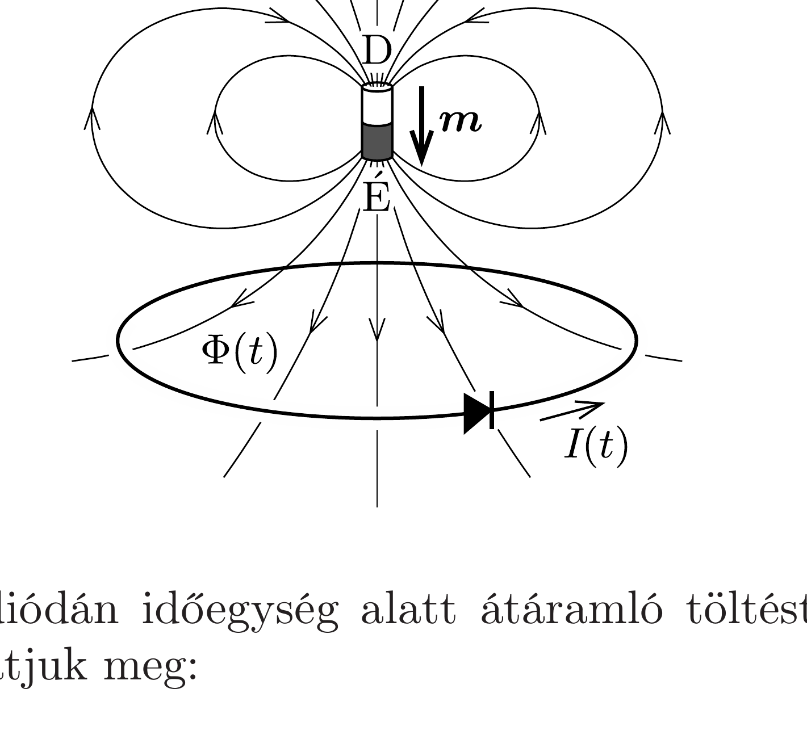

## Útmutatás

Az ideális dióda az áramot az egyik irányban ellenállás nélkül átengedi, míg a másik irányban szakadásként múködik. Keressünk összefüggést a kis mágnes által a körvezetőn létrehozott mágneses fluxus és a diódán áthaladt töltés között! A fluxus elemi úton is meghatározható, ha a mágnest kis körárammal helyettesítjük (lásd az előző feladat megoldását).

## Megoldás

A kis mágnes terének a körvezetőn létrehozott mágneses fluxusa az esés közben időben változik, ez a Faraday-féle indukciótörvény miatt feszültséget indukál a karikában:
\[
U_{\mathrm{i}}=-\frac{\Delta \Phi}{\Delta t} .
\]
A mágnes mozgása során a fluxusváltozás pillanatnyi előỏelétől függően az indukált feszültség polaritása kétféle lehet; ennek megfelelően a dióda vagy zár (szakadásként viselkedik), vagy kinyit (és ellenállás nélkül átengedi az áramot). A karikán átmenő mágneses fluxus nagysága a kezdeti (közel zérus) értékről a mágnes közeledtével növekedni kezd (lásd az ábrát), a karika középpontjához érve eléri maximális $\Phi_{\text {max }}$ értékét, majd a mágnes távolodásakor csökken. Lenz törvényét alkalmazva látszik, hogy a mozgás első szakaszában az indukált áram a dióda nyitó irányában „szeretne” folyni, aminek semmi akadálya: a diódán töltés halad át. Amikor a mágnes már elhagyta karika középpontját, az indukált feszültség polaritása megfordul, a dióda zár, a körben nem folyik áram.

A nyitott állású diódán időegység alatt átáramló töltést Ohm törvényének segítségével határozhatjuk meg:
\[
\frac{\Delta \Phi}{\Delta t}=R \frac{\Delta Q}{\Delta t} .
\]
(A fluxusváltozás előtt álló, a balkézszabálynak megfelelő negatív előjelet az egyszerúség kedvéért elhagytuk, mert az csak a töltésáramlás irányára utal.) Ebbő́l a
\[
\frac{\Delta(\Phi-R Q)}{\Delta t}=0 \quad \longrightarrow \quad \Phi(t)-R Q(t)=\text { állandó }
\]
összefüggésre jutunk. Kezdetben a karikán átmenő mágneses fluxus elhanyagolhatóan kicsiny, az átáramlott töltés pedig zérus, így az állandó értéke 0. A diódán keresztülhaladt teljes töltésmennyiség tehát:
\[
Q=\frac{\Phi_{\max }}{R} .
\]

Már csak a karikán átmenő mágneses fluxust kell meghatároznunk abban a pillanatban, amikor a mágnes éppen a karika középpontjában van. Ehhez helyettesítsük a mágnesrudat egy vele megegyező mágneses momentumú, kicsiny $r_{0}$ sugarú körvezetővel, melyben $I_{0}$ áram folyik! Egy ilyen kis köráram dipólnyomatéka
\[
|\boldsymbol{m}|=r_{0}^{2} \pi I_{0} .
\]
Az előző feladat megoldásában láttuk, hogy két azonos síkú, koncentrikus, $r$ és $r_{0} \ll r$ sugarú körvezető kölcsönös indukciós együtthatója
\[
M=\frac{\mu_{0} r_{0}^{2} \pi}{2 r},
\]
így a kis mágnes által a körvezetőn létrehozott fluxus
\[
\Phi_{\max }=M I_{0}=\frac{\mu_{0} r_{0}^{2} \pi}{2 r} I_{0}=\frac{\mu_{0}|\boldsymbol{m}|}{2 r} .
\]
A diódán átáramlott teljes töltés tehát
\[
Q=\frac{\mu_{0}|\boldsymbol{m}|}{2 r R} .
\]
