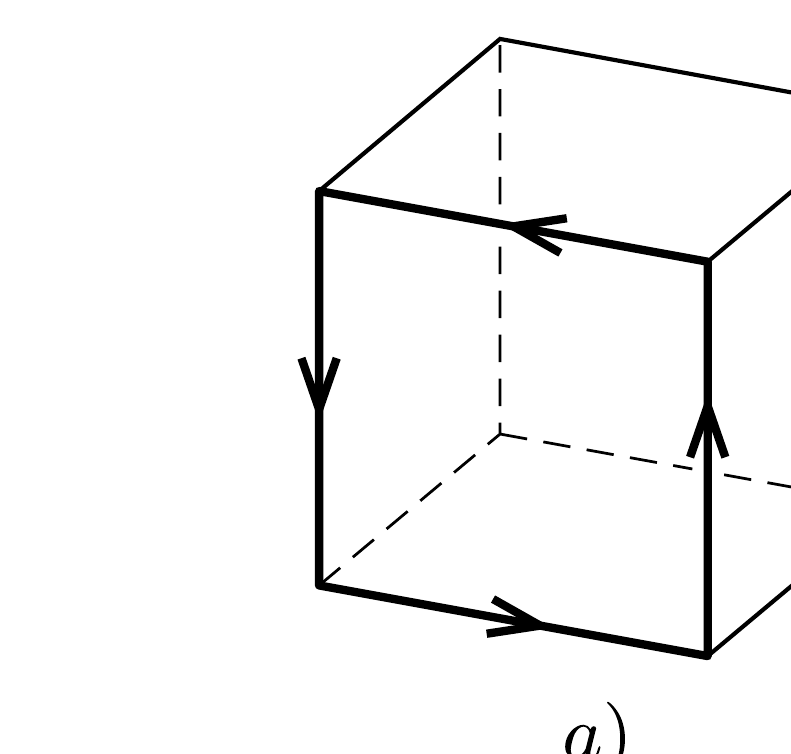
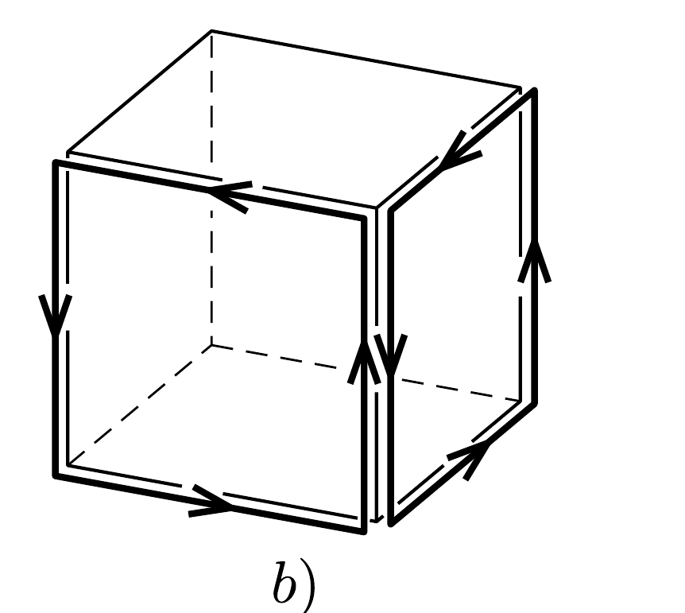
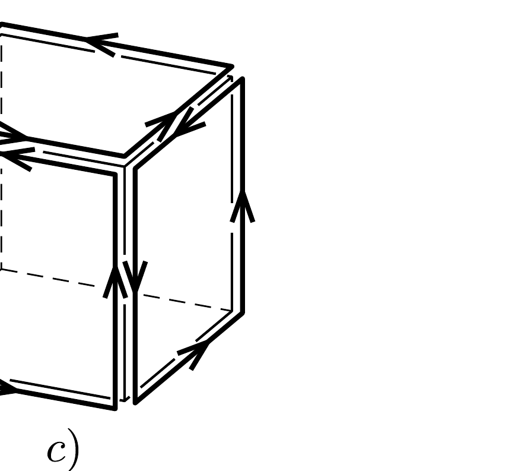

## Útmutatás

A $b$ ) és $c$ ) ábra vonalvezetése egyenértékú azzal, mintha az $a$ ) ábrán látható négyzet alakú áramvezetőt két, illetve három szomszédos lapon helyeznénk el. Az áramok és a nekik megfelelő mágneses terek szuperponálhatók.

## Megoldás

A b) és c) esetben a drótban folyó áram és az általa keltett mágneses mező előállítható négyzet alakú áramvezetők (és azok mágneses terének) szuperpozíciójaként (lásd az ábrát).

Ha az $a$ ) ábrán látható négyzet oldalélét képező vezetékben $I$ erősségü áram folyik, akkor ennek mágneses tere $\Phi_{\text {saját }}=L_{1} I$ mágneses fluxust hoz létre a négyzetlapon. (A kockából kifelé mutató irányokat tekintjük pozitívnak.)

Ugyanez az áram a szomszédos lapok mindegyikén valamekkora $\Phi_{\text {szomszéd }}$ (negatív) mágneses fluxust eredményez, és ez kapcsolatba hozható a $b$ ) elrendezésben mért önindukcióval (hiszen ott mindkét négyzet alakú vezető saját magában és a szomszédjában is hoz létre fluxust):
\[
L_{2} I=2 \Phi_{\text {saját }}+2 \Phi_{\text {szomszéd }}=2 L_{1} I+2 \Phi_{\text {szomszéd }},
\]
ahonnan
\[
\Phi_{\text {szomszéd }}=\left(\frac{1}{2} L_{2}-L_{1}\right) I .
\]

A c) elrendezés vezetéke három négyzettel helyettesíthető, és ezek ( $I$ áramerósség mellett)
\[
L_{3} I=3 \Phi_{\text {saját }}+3 \cdot 2 \Phi_{\text {szomszéd }}=3 L_{1} I+6\left(\frac{1}{2} L_{2}-L_{1}\right) I=3\left(L_{2}-L_{1}\right) I
\]
fluxust alakítanak ki. A c) kapcsolás önindukciós együtthatója tehát
\[
L_{3}=3\left(L_{2}-L_{1}\right) .
\]
