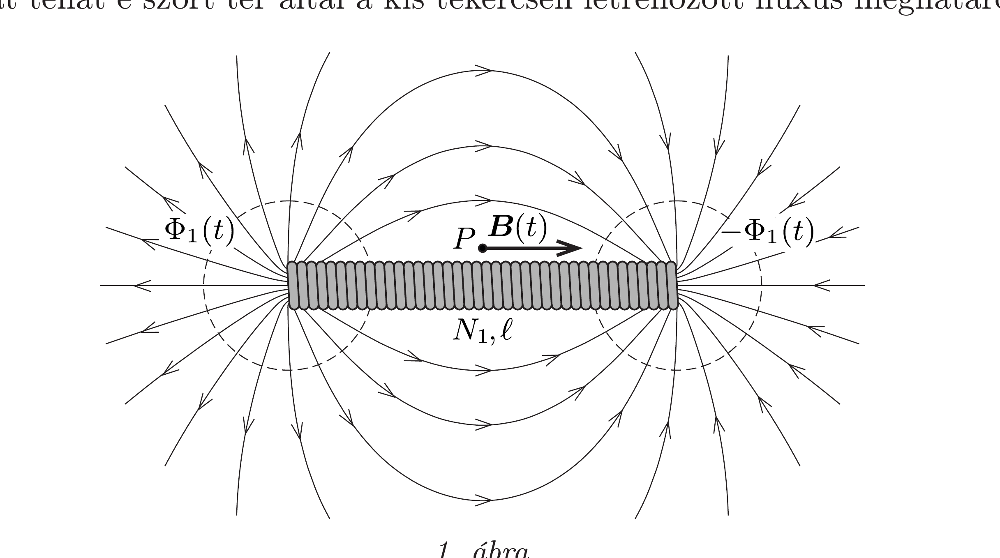
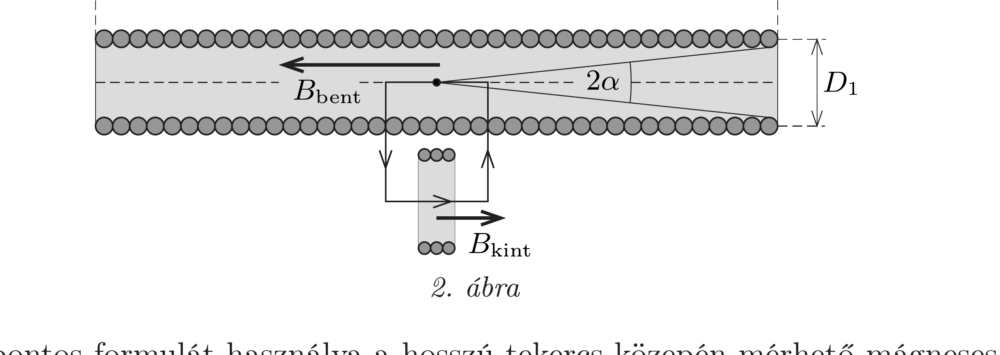

## Útmutatás

A kis tekercsre kapcsolt voltméró azért jelez feszültséget, mert a hosszú tekercs időben változó szórt tere feszültséget indukál benne. Ezt a szórt
mágneses mezőt leírhatjuk úgy, mintha azt a hosszú, vékony tekercs két végén elhelyezkedő, pontszerú, északi és déli mágneses pólusok hozták volna létre.

Egy másik megoldási lehetőség a gerjesztési törvény alkalmazása egy kis téglalap alakú hurokra, amelynek két párhuzamos oldala a két tekercs tengelyén fekszik. Itt arra kell ügyelni, hogy a hosszú tekercs közepén mérhető mágneses indukció meghatározásakor a véges hosszúságú tekercsekre érvényes formulát használjuk (lásd a 288. feladat megoldását).

## Megoldás

I. megoldás. A hosszú tekercsben a benne folyó áram hatására időben periodikusan változó mágneses mezó alakul ki, amely menetenként valamekkora $\Phi_{1}(t)$ fluxust hoz létre a szolenoidban. Ez a változó mágneses fluxus a hosszú tekercs minden menetében feszültséget indukál, ezek összege minden pillanatban megegyezik a tekercsre kapcsolt váltakozó feszültséggel:
\[
U_{1}(t)=N_{1} \frac{\Delta \Phi_{1}(t)}{\Delta t} .
\]

A lapos tekercsben lényegében nem folyik áram (mivel a voltmérő ellenállása nagyon nagy), de a hosszú tekercs szórt mágneses tere feszültséget indukál benne. A feladat tehát e szórt tér által a kis tekercsen létrehozott fluxus meghatározása.

A tekercsen kívüli mágneses mező $\ell \gg D_{1}$ miatt jó közelítéssel olyan, mintha a tekercs egyik végén egy pontszerú forrásból összesen $\Phi_{1}(t)$ mágneses fluxus indulna ki gömbszimmetrikusan, a tekercs másik végén pedig ugyanekkora fluxus nyelődne el (vagyis mintha egy $-\Phi_{1}(t)$ erősségú forrás helyezkedne el ott, lásd az 1. ábrát). A lapos tekercs a hosszú tekercs felezősíkjában, a hosszú tekercshez közel helyezkedik el, így ezen a helyen mindkét forrás külön-külön
\[
B(t)=\frac{\Phi_{1}(t)}{4 \pi(\ell / 2)^{2}}
\]
mágneses indukciót hoz létre, mert a $\Phi_{1}$ fluxus egy $\ell / 2$ sugarú gömb felületén oszlik el egyenletesen. A lapos tekercs közel van a hosszú tekercshez, így az imént kiszámított indukcióvektor közel meróleges a felületére. A lapos tekercs egyes menetein áthaladó (mindkét forrásból származó) fluxus emiatt:
\[
\Phi_{2}(t)=2 B(t) \pi\left(\frac{D_{2}}{2}\right)^{2}=\frac{1}{2}\left(\frac{D_{2}}{\ell}\right)^{2} \Phi_{1}(t) .
\]
Ez az időben változó fluxus az $N_{2}$ menetszámú lapos tekercsben
\[
U_{2}(t)=N_{2} \frac{\Delta \Phi_{2}(t)}{\Delta t}=\frac{1}{2} N_{2}\left(\frac{D_{2}}{\ell}\right)^{2} \frac{\Delta \Phi_{1}(t)}{\Delta t}=\frac{1}{2} \frac{N_{2}}{N_{1}}\left(\frac{D_{2}}{\ell}\right)^{2} U_{1}(t)
\]
feszültséget indukál, ahol felhasználtuk $U_{1}(t)$ korábban felírt kifejezését.
Az $U_{1}(t)$ és $U_{2}(t)$ feszültségek minden pillanatban arányosak egymással, így az effektív értékek aránya is ugyanekkora. Ebből a keresett feszültség:
\[
U_{2}=\frac{1}{2} \frac{N_{2}}{N_{1}}\left(\frac{D_{2}}{\ell}\right)^{2} U_{1} \approx 4,5 \mathrm{mV} .
\]
II. megoldás. Egy nagyon hosszú, egyenes tekercs (szolenoid) belsejében kialakuló mágneses indukció nagyságára jól ismert a következő összefüggés:
\[
B_{\infty}=\mu_{0} \frac{N I}{\ell},
\]
ahol $N$ a tekercs menetszáma, $I$ a tekercsen átfolyó áramerősség, $\ell$ pedig a tekercs hossza. Ez az összefüggés azonban véges hosszúságú tekercsre csak közelítóleg igaz! A 288. feladat megoldásában beláttuk, hogy egy véges hosszúságú tekercs közepén a mágneses indukciót helyesen a következő kifejezés adja meg:
\[
B=\mu_{0} \frac{N I}{\ell} \cos \alpha=B_{\infty} \cos \alpha,
\]
ahol $\alpha$ a tekercs zárókörének fél látószöge a tekercs középpontjából nézve. Hosszú, vékony tekercsnél $\alpha \ll 1$, és így $\cos \alpha \approx 1$, tehát az ismert összefüggés általában jó közelítésként használható. Ebben a feladatban azonban pont ez a kicsi különbség lesz számunkra fontos!

A pontos formulát használva a hosszú tekercs közepén mérhető mágneses indukció kifejezhető a tekercs adataival (2. ábra):
\[
B_{\text {bent }}=\mu_{0} \frac{N_{1} I}{\ell} \cos \alpha \approx \mu_{0} \frac{N_{1} I}{\ell}\left[1-\frac{1}{2}\left(\frac{D_{1}}{\ell}\right)^{2}\right],
\]
ahol felhasználtuk, hogy az $\alpha$ szög kicsiny, ezért fennáll:
\[
\cos \alpha=\sqrt{1-\sin ^{2} \alpha} \approx 1-\frac{1}{2} \sin ^{2} \alpha \approx 1-\frac{1}{2}\left(\frac{D_{1}}{\ell}\right)^{2} .
\]

Írjuk most fel a gerjesztési törvényt a 2. ábrán látható kis téglalapra, amelynek két ( $\Delta \ell$ hosszúságú) oldala a két tekercs tengelyén fekszik! Ez a kis hurok a hosszú tekercs $N_{1} \Delta \ell / \ell$ számú menetét öleli körül, így
\[
B_{\text {bent }} \Delta \ell+B_{\text {kint }} \Delta \ell=\mu_{0} N_{1} \frac{\Delta \ell}{\ell} I,
\]
ahol $B_{\text {kint }}$ a hosszú tekercsen kívül, azaz a rövid tekercsben lévó indukció nagysága. (Felhasználtuk, hogy a tengelyre merőleges indukciókomponens a szolenoid
közepe tájékán elhanyagolható.) Az (1) és (2) egyenletekből $B_{\text {kint }}$ kifejezhető:
\[
B_{\text {kint }}=\mu_{0} \frac{N_{1} I}{\ell}-B_{\text {bent }}=\frac{1}{2}\left(\frac{D_{1}}{\ell}\right)^{2} \mu_{0} \frac{N_{1} I}{\ell} \approx \frac{1}{2}\left(\frac{D_{1}}{\ell}\right)^{2} B_{\text {bent }} .
\]

Az egyes tekercsekben indukált feszültség arányos a tekercsek menetszámával és az egy meneten áthaladó fluxussal, amiból a keresett feszültség:
\[
U_{2}=\frac{N_{2} B_{\mathrm{kint}} \pi\left(D_{2} / 2\right)^{2}}{N_{1} B_{\mathrm{bent}} \pi\left(D_{1} / 2\right)^{2}} U_{1}=\frac{1}{2} \frac{N_{2}}{N_{1}}\left(\frac{D_{2}}{\ell}\right)^{2} U_{1},
\]
az I. megoldással megegyezően.
Megjegyzés. A megoldásban nem használtuk fel a megadott adatok közül a hosszú tekercs $D_{1}$ átmérőjének és a frekvenciának a számértékét. Ugyanakkor mindkét adat nagyságrendje fontos a megoldáshoz! Felhasználtuk, hogy $\ell \gg D_{1}$, mert emiatt köze-líthettük a külső teret két pontforrás terével. A hosszú tekercs induktív ellenállása, és így a tekercsen folyó áram erőssége függ a frekvenciától. Ha a frekvencia sokkal kisebb (például 50 Hz) lenne, akkor a tekercsben a rákapcsolt 100 V feszültség hatására olyan nagy áram indulna meg, amely a tekercset azonnal szétolvasztaná.
