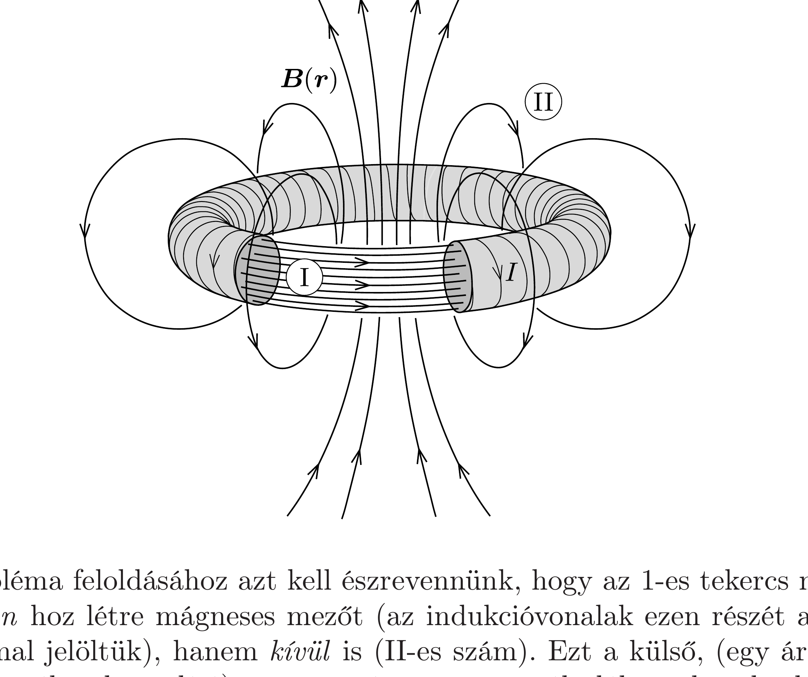

## Útmutatás

Ismert, hogy az 1-es számú toroid mágneses tere a toroidon belül nagyon erós, ezt azonban a 2-es számú tekercs csak egyszer (igaz, igen „tekervényesen") öleli körül. Az 1-es toroid a menetein kívül is létrehoz egy igen gyenge, külső mágneses teret, ami viszont a 2-es tekercs $N_{2}$ darab menetén halad keresztül. A két toroid kölcsönös indukciós együtthatójának meghatározásakor csak akkor kapunk helyes (az $N_{1}$ és $N_{2}$ menetszámok felcserélésére szimmetrikus) összefüggést, ha mind a belső, erős mágneses tér, mind pedig a külső, gyenge tér hatását figyelembe vesszük.

## Megoldás

Azt, hogy az 1-es toroidban folyó $I_{1}$ áram változása mekkora $U_{2}$ feszültséget kelt a 2-es tekercsben, a két tekercs közötti $M$ kölcsönös indukciós együttható felhasználásával adhatjuk meg:
\[
U_{2}(t)=M \frac{\Delta I_{1}}{\Delta t} .
\]
Mivel a 2-es tekercsben az ideális voltmérő miatt nem folyik áram, ezért az 1-es tekercs áramkörére a huroktörvény a következő alakot ölti:
\[
U_{1}(t)=L_{1} \frac{\Delta I_{1}}{\Delta t},
\]
ahol $L_{1}$ az 1-es számú toroid önindukciós tényezője. E két kifejezésből az 1-es tekercsre kapcsolt feszültség pillanatnyi értéke és a 2-es tekercs kivezetésein mérhető feszültség pillanatnyi értéke közötti kapcsolat:
\[
U_{2}(t)=\frac{M}{L_{1}} U_{1}(t) .
\]
Hasonló összefüggés állapítható meg a feszültségek effektív értékei között. A feladat tehát lényegében a két tekercs kölcsönös indukciós együtthatójának meghatározása.

Az 1-es tekercsben folyó, időtől függő $I_{1}(t)$ áramerősség hatására az 1-es tekercs belsejében az Ampère-féle gerjesztési törvény értelmében
\[
B_{1}(t)=\frac{\mu_{0} N_{1}}{\ell} I_{1}(t),
\]
indukciójú mágneses mező alakul ki ( $\ell$ a toroidok középvonalának hossza). Ez a mágneses mező az 1-es tekercs $A$ területú menetein összesen $\Phi_{1}=N_{1} B_{1}(t) A$ fluxust hoz létre, így a toroid önindukciós együtthatója:
\[
L_{1}=\frac{\Phi_{1}}{I_{1}(t)}=\frac{\mu_{0} N_{1}^{2} A}{\ell} .
\]

A 2-es tekercs (bár igen kacskaringósan, de) egyszer veszi körül az 1-es tekercs belsejében kialakult mágneses mezőt, ezért elsőre azt gondolhatjuk, hogy az 1-es tekercs által keltett mágneses mezőnek a 2-es tekercsen létrehozott (időtől függő) fluxusa egyszerúen
\[
\Phi_{12}^{\mathrm{I}}=B_{1}(t) A=\frac{\mu_{0} N_{1} A}{\ell} I_{1}(t) .
\]
Ha ez így lenne, akkor az 1-es tekercs 2-esre vonatkoztatott kölcsönös indukciós együtthatója
\[
M=\frac{\Phi_{12}^{\mathrm{I}}}{I_{1}(t)}=\frac{\mu_{0} N_{1} A}{\ell}
\]
lenne, amely kifejezés viszont $N_{1}$ és $N_{2}$ felcserélésére nem szimmetrikus! Megmutatható, hogy a kölcsönös indukciós együttható szimmetriájának sérülése ellentmondana az energiamegmaradás törvényének, tehát valamit figyelmen kívül hagytunk.

A probléma feloldásához azt kell észrevennünk, hogy az 1-es tekercs nemcsak a belsejében hoz létre mágneses mezőt (az indukcióvonalak ezen részét az ábrán I-es számmal jelöltük), hanem kívül is (II-es szám). Ezt a külső, (egy áramjárta körvezetó teréhez hasonlító) gyenge mágneses teret általában el szoktuk hanyagolni, viszont most az 1-es tekercs menetein kívüli indukcióvonalak a 2-es tekercs $N_{2}$ számú menetén haladnak át, ami viszont már jelentős fluxust jelent!

Jelöljük $B_{i}(t)$-vel az 1-es tekercs gyenge, külső terének a 2-es tekercs $i$-edik meneténél mérhetó indukciójának a menet felületére merőleges komponensét. Mivel
a menetek átlagos távolsága éppen $\ell / N_{2}$, ezért az Ampère-féle gerjesztési törvény az 1-es tekercsben folyó áramra így írható:
\[
\sum_{i} B_{i}(t) \frac{\ell}{N_{2}} \approx \mu_{0} I_{1}(t) .
\]
Mindkét oldal $N_{2} A / \ell$-lel való szorzása után a bal oldalon éppen az 1-es tekercs külső mágneses tere által a 2-es tekercs menetein létrehozott $\Phi_{12}^{\mathrm{II}}$ fluxus jelenik meg:
\[
\Phi_{12}^{\mathrm{II}}=\sum_{i} B_{i}(t) A=\frac{\mu_{0} N_{2} A}{\ell} I_{1}(t) .
\]
Az 1-es tekercs mágneses mezője által a 2-esen létrehozott teljes fluxus a $\Phi_{12}^{\mathrm{I}}$ és $\Phi_{12}^{\mathrm{II}}$ fluxusok összege, tehát
\[
\Phi_{12}=\Phi_{12}^{\mathrm{I}}+\Phi_{12}^{\mathrm{II}}=\frac{\mu_{0}\left(N_{1}+N_{2}\right) A}{\ell} I_{1}(t),
\]
a kölcsönös indukciós együttható pedig (most már helyesen)
\[
M=\frac{\Phi_{12}}{I_{1}(t)}=\frac{\mu_{0}\left(N_{1}+N_{2}\right) A}{\ell} .
\]
Szerencsére ez az $M$ már szimmetrikus az $N_{1}$ és $N_{2}$ menetszámok felcserélésére!
A voltmérő által jelzett $U_{\mathrm{V}}$ értéket végül megkaphatjuk, ha az eddigi eredményeket felhasználva alkalmazzuk az (1) egyenletet a feszültségek effektív értékére:
\[
U_{\mathrm{V}}=\frac{M}{L_{1}} U_{0}=\frac{N_{1}+N_{2}}{N_{1}^{2}} U_{0} .
\]

Megjegyzések. 1. Ha a 2-es tekercsben indukálódó feszültség kiszámításánál helytelenül csak az 1-es toroid belsejében lévő mágneses mező hatását vennénk figyelembe, akkor a hibás, $U_{\mathrm{V}}=U_{0} / N_{1}$ eredményre jutnánk. Például $U_{0}=230 \mathrm{~V}, N_{1}=100$, $N_{2}=900$ adatok esetén a voltmérő által mutatott feszültségre a helyes formulával kapott $U_{\mathrm{V}}=U_{0} / 10=23 \mathrm{~V}$ eredmény helyett a rossz $U_{0} / 100=2,3 \mathrm{~V}$ eredményt kapnánk. Látható tehát, hogy a toroid külső terének (az esetek többségében jogos) elhanyagolása ebben az esetben a helyes eredménynél egy nagyságrenddel kisebb értékre vezet!
2. A $\Phi_{12}^{\mathrm{I}}$ és $\Phi_{12}^{\mathrm{II}}$ fluxusok összeadásánál hallgatólagosan feltételeztük, hogy mindkét toroidon ugyanolyan irányú (csavarodású) a tekercselés (hiszen a toroidok „csak a menetszámukban különböznek"). Ha véletlenül nem ez a helyzet (és az egyik tekercs jobb-, a másik pedig balmenetes), akkor a két fluxusjárulék különbségét kell képezni. Ekkor a voltmérő által mutatott feszültség nagysága:
\[
U_{\mathrm{V}}=\frac{\left|N_{1}-N_{2}\right|}{N_{1}^{2}} U_{0} .
\]
