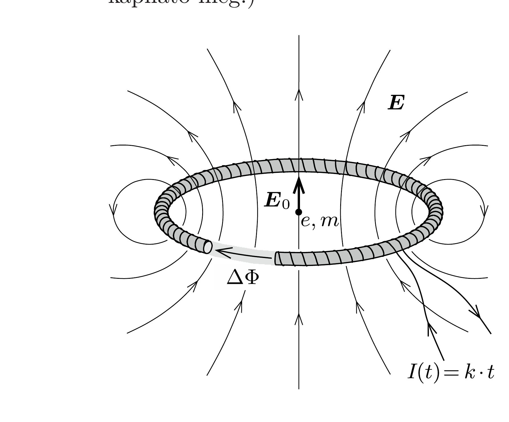
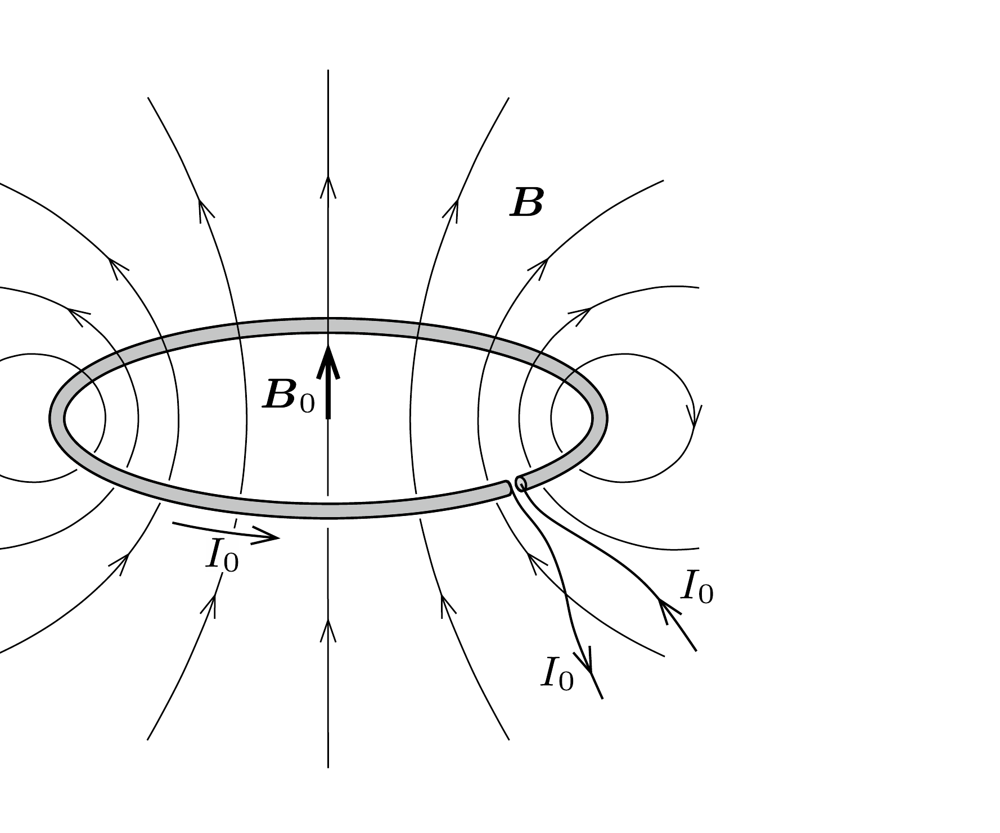

## Útmutatás

A (vékony) toroid változó mágneses tere által keltett elektromos mező hasonló szerkezetú, mint egy köráram mágneses mezője. A Faraday-féle indukciótörvény és az Ampère-féle gerjesztési törvény alaki hasonlóságát felhasználva keressük meg a két jelenségkör egymásnak megfeleltethető fizikai mennyiségeit! Ebből, illetve a köráramra alkalmazott Biot-Savart-törvényből kiindulva eljuthatunk a keresett megoldásig.

## Megoldás

A Faraday-féle indukciótörvény szerint tetszőleges zárt görbére az elektromos körfeszültség (elektromos örvényerósség):
\[
\sum \boldsymbol{E}(\boldsymbol{r}) \Delta \boldsymbol{r}=-\frac{\Delta \Phi}{\Delta t} .
\]
Hasonló állítást fogalmaz meg az Ampère-féle gerjesztési törvény a mágneses örvényerősségre („mágneses körfeszültségre”):
\[
\sum \boldsymbol{B}(\boldsymbol{r}) \Delta \boldsymbol{r}=\mu_{0} I .
\]
Ez a két egyenlet, valamint (szabad töltések hiányában) az elektromos és a mágneses mezők forrásmentességét kifejező Gauss-törvény egyértelműen meghatározzák az adott áramerősségekhez, illetve adott mágneses fluxusváltozáshoz tartozó elektromágneses mezőt.

Az (1) és (2) egyenletek alakilag hasonlóak, egymásba átalakíthatóak, ha bennük a
\[
\begin{array}{rll}
-\frac{\Delta \Phi}{\Delta t} & \longleftrightarrow & \mu_{0} I \\
\boldsymbol{E} & \longleftrightarrow & \boldsymbol{B}
\end{array}
\]
cserét hajtjuk végre. Ezt a szimmetriát felhasználva, ha ismerjük az egyik jelenségkör valamelyik speciális problémájának megoldását, könnyen megkaphatjuk a másik, neki geometriailag megfelelő „analóg” feladat megoldását is. Esetünkben a toroid alakú, vékony körtekercs időben (egyenletesen) változó mágneses fluxusa éppen olyan örvényes elektromos teret kelt, mint amilyen mágneses tér egy (egyenárammal átjárt) körvezető körül kialakul (lásd az ábrát).

A Biot-Savart-törvény alapján tudjuk, hogy egy $r$ sugarú körvezetőben folyó $I$ erósségú áram a kör középpontjában
\[
B_{0}=\frac{1}{2 r}\left(\mu_{0} I\right)
\]
nagyságú, a kör síkjára merőleges irányú mágneses indukciót hoz létre. Ebből a (3) megfeleltetés szerint következik, hogy a körtekercs változó mágneses fluxusa a toroid középpontjában
\[
E_{0}=-\frac{1}{2 r} \frac{\Delta \Phi}{\Delta t}
\]
erősségú elektromos teret „indukál”. (A negatív előjel arra utal, hogy a körtekercsben lévő mágneses tér irányához képest $\boldsymbol{E}_{0}$ iránya a balkéz-szabály segítségével kapható meg.)

Tudjuk, hogy egy $N$ menetes, $I(t)$ erősségú árammal átjárt, $r$ sugarú toroid belsejében a mágneses indukció
\[
B=\frac{\mu_{0} N I}{2 r \pi},
\]
az ennek megfelelő mágneses fluxus időbeli változása tehát
\[
E_{0}=\frac{\mu_{0}}{4 \pi} \cdot \frac{N A}{r^{2}} \cdot \frac{\Delta I}{\Delta t}=10^{-7} \frac{\mathrm{Vs}}{\mathrm{Am}} \cdot \frac{200 \cdot 2 \cdot 10^{-4} \mathrm{~m}^{2}}{(0,1 \mathrm{~m})^{2}} \cdot 10 \frac{\mathrm{~A}}{\mathrm{~s}}=4 \cdot 10^{-6} \frac{\mathrm{~V}}{\mathrm{~m}}
\]
nagyságú elektromos térerősséget eredményez (itt $A$ a toroid keresztmetszete). Ennek hatására az $e$ töltésú, $m$ tömegú proton
\[
a_{0}=\frac{e E_{0}}{m} \approx 380 \frac{\mathrm{~m}}{\mathrm{~s}^{2}}
\]
gyorsulással indul el.
