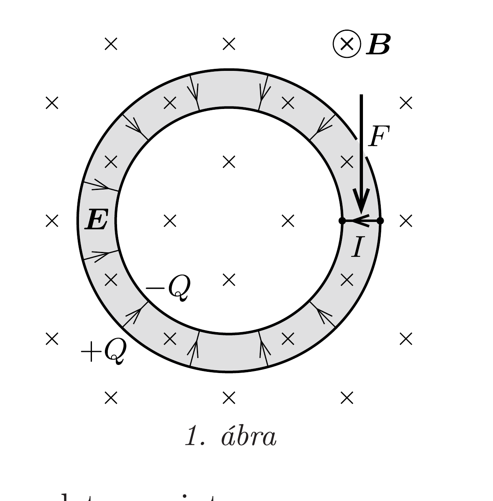
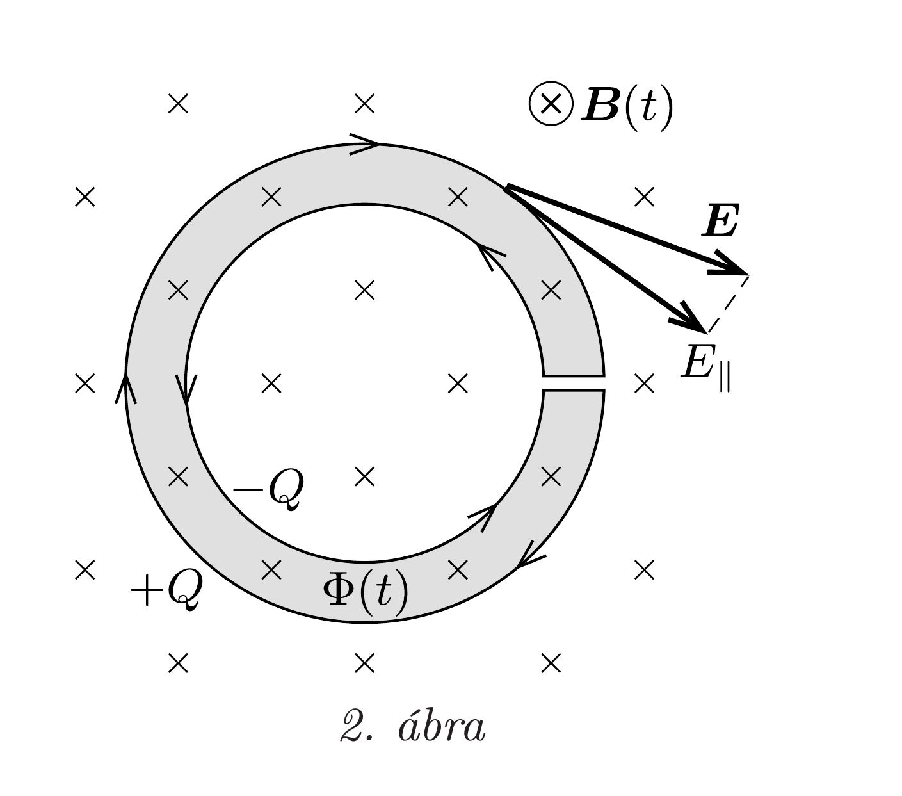

## Útmutatás

A kondenzátor mindkét esetben forgásba jön, és a folyamat végén szögsebessége mindkét esetben ugyanakkora lesz.
a) A kondenzátor kisütésekor az áramjárta vezetékre a mágneses mező erőt (és forgatónyomatékot) fejt ki.
b) Az időben változó mágneses tér örvényes elektromos mezőt kelt, ami a kondenzátor eltérő töltéseire erốt (és forgatónyomatékot) fejt ki.

## Megoldás

A kondenzátor kapacitása ( $d \ll R$ közelítésben) egy síkkondenzátor kapacitásához hasonlóan számolható:
\[
C=\varepsilon_{0} \frac{2 R \pi \ell}{d},
\]
így a lemezekre
\[
Q=C U=\varepsilon_{0} \frac{2 R \pi \ell U}{d}
\]
töltés kerül.
a) Ha a kondenzátor fegyverzeteit összekötjük, a vezetékben időben gyorsan változó $I(t)$ áramlökés alakul ki. A sugárirányú áramvezetóre a mágneses tér $I B d$ Lorentz-erót, azaz a kondenzátor egészére IBRd forgatónyomatékot fejt ki (1. áb$r a)$. Ez a forgatónyomaték az $M R^{2}$ tehetetlenségi nyomatékú rendszert forgásba hozza. (A Lorentz-eró a kondenzátort ingaként ki is térítené, ezt azonban a feladat szövege szerint megakadályozzuk.)

A forgómozgás alapegyenlete szerint:
\[
M R^{2} \frac{\Delta \omega}{\Delta t}=I B R d,
\]
amit az áramerősség és a töltésváltozás $I(t)=\frac{\Delta Q}{\Delta t}$ kapcsolatának ismeretében
\[
M R^{2} \Delta \omega=B R d \Delta Q
\]
alakban is felírhatunk. Összegezzük (2) mindkét oldalát a teljes kisülési folyamatra! Mivel a szögsebesség kezdetben nulla volt, a vezetéken átáramló $\Delta Q$ töltések összege pedig a kondenzátor kezdeti töltése, (1) felhasználásával megkapjuk, hogy mekkora szögsebességre gyorsul fel a kondenzátor:
\[
\omega_{\max }=\sum \Delta \omega=\frac{B R d}{M R^{2}} \sum \Delta Q=\frac{B Q d}{M R}=2 \pi \varepsilon_{0} \frac{U B \ell}{M} .
\]
Érdekes, hogy ez az érték nem függ az $R$ és $d$ távolságoktól, és a kisülés időbeli lefolyásának részleteitől is független.
b) A mágneses tér kikapcsolásakor az időben változó indukció örvényes elektromos mezőt hoz létre, ami a kondenzátor fegyverzetein lévő töltésekre erốt és forgatónyomatékot fejt ki. A kialakuló elektromos mező általában nem hengerszimmetrikus, pontos értékét csak a teljes mágneses mező ismeretében lehetne meghatározni, de az örvényességére jellemző körfeszültséget bármely zárt görbe mentén ki tudjuk számítani. Tekintsük például a 2. ábrán látható (a hengerkondenzátor keresztmetszetét körüljáró) görbét, amelyre az elektromos körfeszültség Faraday indukciótörvénye szerint
\[
\sum E_{\|} \Delta s=-\frac{\Delta \Phi}{\Delta t}=-2 \pi R d \frac{\Delta B}{\Delta t},
\]
ahol $\Phi$ a sötétebben jelölt területre vonatkozó mágneses fluxust, $\Delta s$ a görbe kicsiny darabkájának hosszát, $E_{\|}$pedig az elektromos térerősség érintő irányú komponensét jelöli.

Az indukálódó elektromos tér forgatónyomatékot fejt ki a hengerkondenzátor fegyverzetein lévó töltésekre. Egy $\Delta s$ hosszúságú szakasznak megfelelő hengerpalást-darabon $\Delta Q=\frac{\Delta s}{2 R \pi} Q$ töltés található, amire az elektromos mező $\frac{\Delta s}{2 R \pi} Q R E_{\|}$ forgatónyomatékot fejt ki. Ezek szerint (3) bal oldalán szereplő összeg (a sugárirányú két kis szakasz járulékát elhagyva) egy $Q /(2 \pi)$ szorzótényezótől eltekintve éppen a kondenzátorra ható teljes forgatónyomaték. A forgómozgás alapegyenlete szerint
\[
M R^{2} \frac{\Delta \omega}{\Delta t}=\frac{Q}{2 \pi} \sum E_{\|} \Delta s=-\frac{Q}{2 \pi} \frac{\Delta \Phi}{\Delta t}=-\frac{Q}{2 \pi} 2 R \pi d \frac{\Delta B}{\Delta t},
\]
vagyis
\[
\Delta \omega=-\frac{Q d}{M R} \Delta B .
\]
Ha a teljes folyamatra elvégezzük az összegzést, a kondenzátor végső szögsebességére (1)-et is felhasználva
\[
\omega_{\max }=\sum \Delta \omega=-\frac{Q d}{M R} \sum \Delta B=\frac{B Q d}{M R}=2 \pi \varepsilon_{0} \frac{U B \ell}{M}
\]
adódik, éppen ugyanakkora érték, mint az $a)$ esetben.
Megjegyzés. A fenti számítás azt mutatja, hogy a mágneses térbe helyezett hengerkondenzátor ugyanakkora szögsebességü forgásba jön, akár az elektromos mezőt, akár a mágneses mezőt „kapcsoljuk ki". Vajon van-e ennek mélyebb fizikai oka?

A hengerkondenzátor önmagában nem alkot zárt rendszert, a körülötte lévő elektromágneses térrel együtt viszont már igen, amelyre érvényesülnie kell a perdületmegmaradás törvényének. Kézenfekvő az az értelmezés, miszerint az elektromágneses mező képes perdületet hordozni, de ez a perdület nem köthető a geometriai tér valamelyik pontjához, hanem a térben „elkenten” van jelen. (Hasonlóan „szétkent” módon tartalmaz az elektromágneses mező energiát és lendületet is.)

Az elektromágneses mezó perdületét az
\[
\boldsymbol{S}=\frac{1}{\mu_{0}} \boldsymbol{E} \times \boldsymbol{B}
\]

Poynting-vektor segítségével írhatjuk fel. A Poynting-vektor az energiaáram-sűrúséget fejezi ki, vagyis azt adja meg, hogy az energia terjedési irányára merólegesen egységnyi felületen egységnyi idő alatt mennyi energia áramlik át. Ha a Poynting-vektort elosztjuk a fénysebességgel, akkor az impulzusáram-súrúséget kapjuk meg. Egy adott pontra vonatkozó „perdületáram-sürúséget” úgy kaphatjuk meg, ha a pont helyvektorának és az impulzusáram-súrúségnek a vektoriális szorzatát képezzük. A feladatban szereplő geometria igencsak megkönnyíti a számítást, mert az elektromágneses mező csak a két hengerpalást közötti részen „áramlik”, a szóban forgó vektorok pedig páronként merőlegesek egymásra. A rendszer szimmetriatengelyére vonatkozó „perdületáram-súrúség”
\[
\frac{S}{c} R=\frac{E B R}{\mu_{0} c},
\]
amit az $\ell d$ területtel és a $2 \pi R / c$ idővel kell megszoroznunk, hogy megkapjuk a hengerkondenzátorban körbeforgó elektromágneses energiából származó teljes perdületet:
\[
|N|=\frac{2 \pi E B R^{2} \ell d}{\mu_{0} c^{2}} .
\]
Ha az elektromos térerősség helyére beírjuk az $E=U / d$ összefüggést, valamint felhasználjuk, hogy $1 / c^{2}=\varepsilon_{0} \mu_{0}$, akkor az elektromágneses mező perdületét
\[
|\boldsymbol{N}|=2 \pi \varepsilon_{0} U B \ell R^{2}
\]
alakban kapjuk meg, ami megegyezik a megoldásban kiszámított $M R^{2} \omega_{\text {max }}$ mechanikai perdülettel.

A feladatban ugyanaz az elektromágneses perdület alakul át mechanikai perdületté először azért, mert az elektromos tér szúnik meg, másodszor pedig azért, mert a mágneses tér válik nullává. Ez azt jelenti, hogy a felhasznált közelítésektől függetlenül biztosak lehetünk abban, hogy a mechanikai perdület (a hengerkondenzátor szögsebessége) ugyanakkora lesz mindkét esetben.

Vajon hogy került ez az eredő perdület a rendszerbe? Nem nehéz végiggondolni, hogy amikor a mágneses térben lévő hengerkondenzátort korábban feltöltöttük, akkor is hatott rá (a feltöltő áramot vezető huzalon keresztül) forgatónyomaték. (Ugyanilyen hatás jelentkezik akkor is, ha egy már feltöltött hengerkondenzátort fokozatosan növekvő erősségú mágneses térben tartunk.) Ez a nyomaték a kezdetben álló kondenzátort forgásba hozta, amit külső erővel (kézzel) meg kellett állítanunk: így juthattunk el a feladatban szereplő kiindulási helyzethez.
