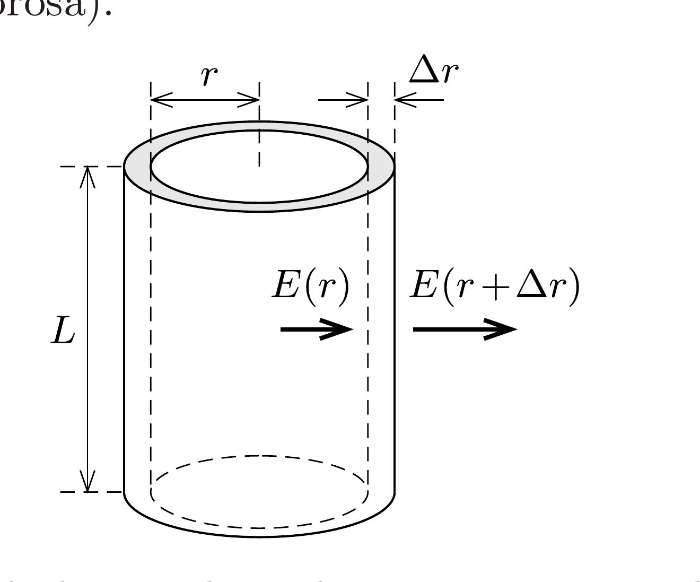

## Útmutatás

Vizsgáljuk meg, milyen erők tartják körpályán a fémben lévó elektronokat! Az elektromos térerősség ismeretében a Gauss-törvény segítségével határozhatjuk meg a kialakuló töltéseloszlást.

## Megoldás

Írjuk fel azokat az erőket, amelyek egy (a henger belsejében lévő) szabad elektron egyenletes körmozgását biztosítják:
\[
e E \pm e r \omega B=m r \omega^{2},
\]
ahol $e$ az elektron töltése, $m$ a tömege, $r$ a forgástengelytől mért távolsága, $E$ pedig a fémhengerben létrejövő elektrosztatikus térerősség, amit a hengerben kialakuló töltéseloszlás hoz létre. (A forgó töltések által keltett mágneses tér elhanyagolható.) A ± előjel azt fejezi ki, hogy a mágneses Lorentz-eró a henger forgásirányától függően kifelé is, befelé is mutathat.

Fejezzük ki az elektron mozgásegyenletéből az elektromos térerősséget:
\[
E=\left(\frac{m \omega^{2}}{e} \pm \omega B\right) r=K r .
\]
Látható, hogy a térerősség egyenesen arányos a sugárral. ( $K$ a szögsebességtől, a mágneses tér erősségétől és az elektron adataitól függő állandó.)

Az elektromos térerősség ismeretében meghatározhatjuk az egységnyi térfogatban lévő elektromos töltés mennyiségét, vagyis a henger töltéssürúségét is. Az elektrosztatika alaptörvényének Gausstól származó megfogalmazása szerint bármely zárt felületből kilépő elektromos fluxus a felület belsejében lévő össztöltéssel arányos (annak $1 / \varepsilon_{0}$-szorosa).

Tekintsük az ábrán látható vékony hengergyűrút, és jelöljük a tengelytől $r$ távolságban kialakuló térfogati töltéssúrúséget $\varrho(r)$-rel! A gyürúbe annak belső felületén $E(r) \cdot 2 \pi r L$ nagyságú elektromos fluxus (eróvonal) lép be, a külső felületen pedig $E(r+\Delta r) \cdot 2 \pi(r+\Delta r) L$ lép ki belőle. Gauss törvénye szerint
\[
K(r+\Delta r) \cdot 2 \pi(r+\Delta r) L-K r 2 \pi r L=\frac{1}{\varepsilon_{0}} \varrho(r) \cdot 2 \pi r \Delta r L,
\]
ahonnan (a $\Delta r$-ben másodrendúen kicsiny tagok elhanyagolásával) a henger töltéssúrúségére
\[
\varrho=2 \varepsilon_{0} K=2 \varepsilon_{0} \frac{m}{e} \omega\left(\omega \pm \frac{e}{m} B\right),
\]
vagyis $r$-től független, állandó érték adódik. Mivel a fémhenger össztöltése nulla, ennek a térfogati töltéssúrúségnek a kialakulása ugyanekkora nagyságú, de ellentétes előjelú, a henger felületén felhalmozódó töltéssel jár együtt.

A henger belsejének térfogati töltéssúrúsége - a mágneses tér és a szögsebesség irányától és nagyságától függően - lehet pozitív, negatív, sót akár nulla is. Ez utóbbi eset akkor állhat elő, ha $\omega=|e| B / m$. Ilyenkor a hengerben nem válnak szét a pozitív és a negatív töltések, mert a Lorentz-eró egymagában képes biztosítani a körmozgáshoz szükséges centripetális erőt.

Megjegyzés. A nagyságrendi viszonyok érzékeltetése kedvéért tételezzük fel, hogy a mágneses tér indukciója akkora, mint a földi mágneses tér az Egyenlítő környékén, vagyis $B=3 \cdot 10^{-5} \mathrm{~T}$. A nulla töltéssürúségnek ilyenkor az $\omega_{\mathrm{c}}=e B / m=5,3 \cdot 10^{6} \mathrm{~s}^{-1}$ szögsebesség (ciklotron-körfrekvencia) felel meg, ami több mint 50 milliós (!) percenkénti fordulatszámot jelent. A gyakorlatban ilyen nagy fordulatszám nem valósítható meg, hiszen nincs olyan erós anyag, ami kibírna ilyen gyors forgást.

A feladat azzal a tanulsággal szolgál, hogy rámutat: az elektron tömege igen kicsi a töltéséhez képest. Emiatt a töltéssürúségre kapott kifejezésben a szögsebesség négyzetét tartalmazó tag elhanyagolható: makroszkopikus esetekben a fellépő elektromos és mágneses erők eredőjének még akkor is (jó közelítéssel) nullát kell adnia, amikor az elektron gyorsul.
