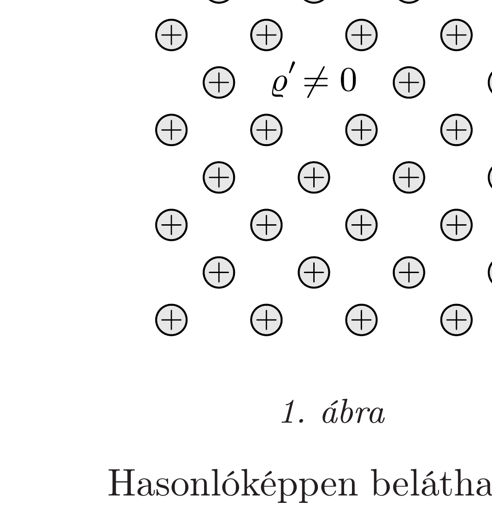
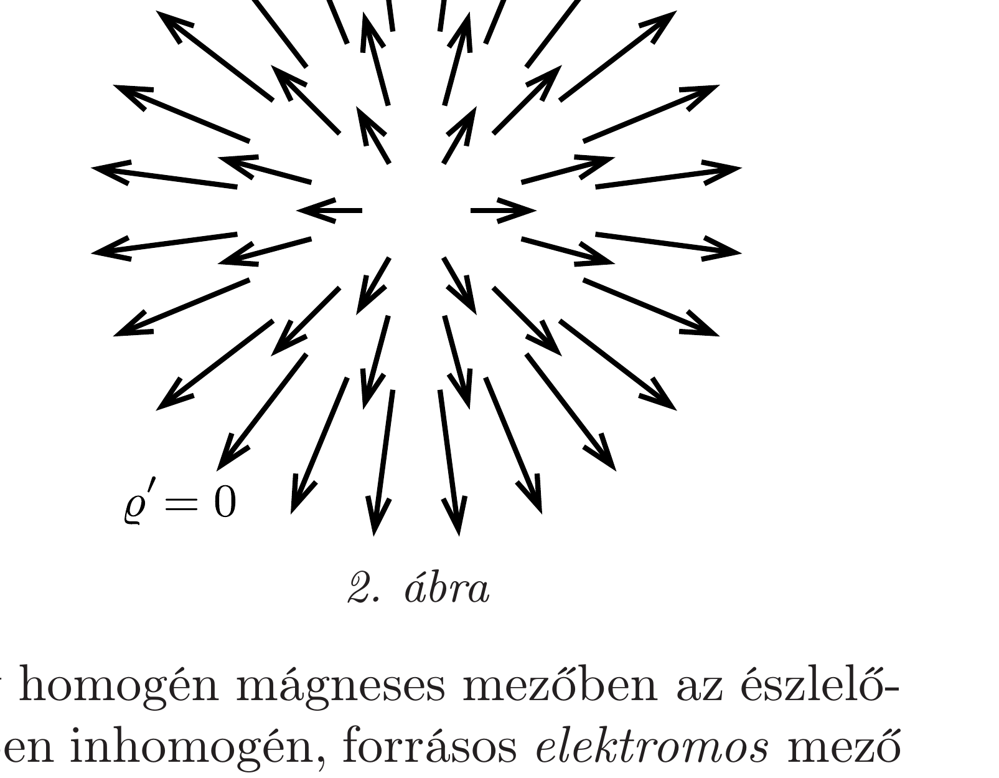

## Útmutatás

Az elektromos térerősséget az egységnyi töltésre ható eróként határozhatjuk meg, míg a mágneses indukciót a mozgó töltésre ható Lorentz-erőként vezethetjük be.

## Megoldás

A $\mathcal{K}^{\prime}$ forgó koordináta-rendszer minden egyes pontjában az elektromos töltéseloszlás ugyanolyan, mint a $\mathcal{K}$ laboratóriumi (inercia)rendszerben, mert a töltéssúrúség az egységnyi térfogatban lévő elektronok számával arányos, és mind a szám, mind a térfogat invariáns mennyiség. Ebbő̌l az következik, hogy az elektromos töltéssűrúség homogén, és a következő alakban fejezhető ki:
\[
\varrho^{\prime}=\varrho=2 \varepsilon_{0}\left( \pm \omega B+\frac{m \omega^{2}}{e}\right) \approx \pm 2 \varepsilon_{0} \omega B .
\]
Egy töltött részecskére ható $\boldsymbol{F}$ erő mindkét rendszerben azonos (amit azzal a ténnyel szemléltethetünk, hogy az erőmérésre alkalmas rugó megnyúlása független attól, hogy melyik rendszerben mérünk), így $\boldsymbol{F}^{\prime}=\boldsymbol{F}$.

A hengerrel együtt forgó rendszerben a fém szabad elektronjai nyugalomban vannak, és így a rájuk ható eredő erőnek nullának kell lennie (máskülönben a szabad elektronok elmozdulnának). Ha a centrifugális eró a lassú forgás miatt elhanyagolható, akkor a zérus eredő erő miatt az elektromos térerősség is nulla: $\boldsymbol{E}^{\prime}=0$. Ezek szerint a forgó vonatkoztatási rendszerben elektromos töltések lehetnek jelen hozzájuk tartozó elektromos tér nélkül, amint ezt az 1. ábra szemlélteti.

A forgó $\mathcal{K}^{\prime}$ rendszerben észlelt mágneses mező megegyezik a laboratóriumi $\mathcal{K}$ vonatkoztatási rendszerben mérhető mágneses térrel: $\boldsymbol{B}^{\prime}=\boldsymbol{B}$. (A 343. feladat megoldásában kapott $\boldsymbol{E} \times \boldsymbol{v} / c^{2}$-es korrekció ebben a nemrelativisztikus esetben elhanyagolható.)

Hasonlóképpen beláthatjuk, hogy egy homogén mágneses mezőben az észlelővel együtt forgó vonatkoztatási rendszerben inhomogén, forrásos elektromos mezó létezhet annak ellenére, hogy nincsenek jelen elektromos töltések (lásd a 2. ábrát).

Mindez azt jelenti, hogy a Gauss-törvény (ami az elektromos fluxus és az érte felelős töltések közötti kapcsolatot írja le) nem érvényes forgó vonatkoztatási rendszerekben. Ez a meglepő eredmény már lassú (nemrelativisztikus) sebességek esetén is érvényes!
