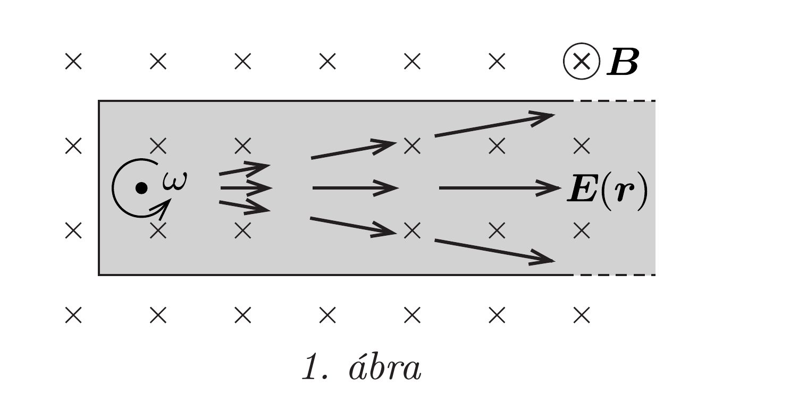
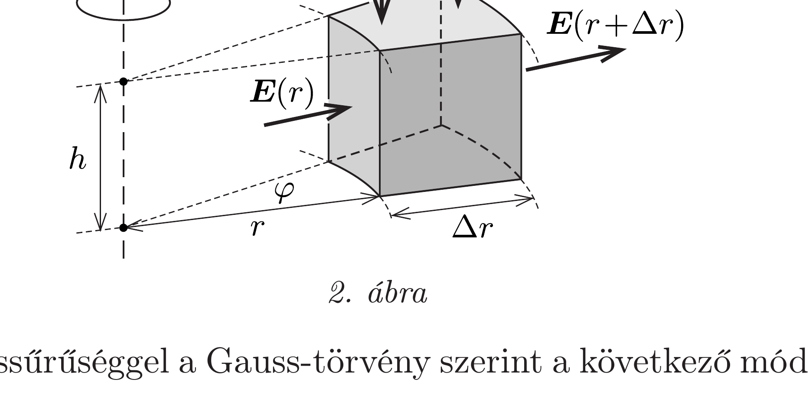

## Útmutatás

Zsiga megoldása a helyes. Emma hallgatólagosan feltette, hogy a forgó fémküllőben az elektromos tér eróvonalai párhuzamosak, pedig nem azok!

## Megoldás

Akármilyen vékony is a küllő, a problémát nem szabad egydimenziós feladatnak tekinteni. A küllőben kialakuló elektromos mező térerősségére (a körpályán mozgó elektronok mozgásegyenletéből) Emma az $E(r)=r B \omega$ kifejezést
kapta, ami helyes, azonban a fémküllő belsejében a térerősségvektorok nem párhuzamosak, hanem radiálisak, ahogy azt az 1. ábra szemlélteti. Ez azt jelenti, hogy a küllő felületén (ami egy hosszú, vékony hengerpalást) az elektromos fluxus nem nulla. Látni fogjuk, a küllő palástját éppen ugyanakkora fluxus éri el, mint a küllő külső végét.

Emmának abban igaza volt, hogy a Gauss-törvényt kell alkalmaznunk, azonban a helyes eredményre vezető ún. Gauss-felületet a 2. ábrán látható módon érdemes felvenni. Ebből a zárt felületből kilépő eredő elektromos fluxus:
\[
\Psi=E(r+\Delta r) h(r+\Delta r) \varphi-E(r) h r \varphi=B \omega h \varphi\left[(r+\Delta r)^{2}-r^{2}\right] \approx 2 B \omega h \varphi r \Delta r .
\]

A fluxust a töltéssürúséggel a Gauss-törvény szerint a következő módon hozhatjuk kapcsolatba:
\[
\Psi=\frac{1}{\varepsilon_{0}} \varrho \Delta V \approx \frac{1}{\varepsilon_{0}} \varrho h r \varphi \Delta r,
\]
amiből közvetlenül adódik a Zsiga által meghatározott $\varrho=2 \varepsilon_{0} B \omega$ töltéssűrúség.
Ha a küllő hossza $R$, keresztmetszete $A$, akkor a belsejében lévő töltés:
\[
Q=\varrho V=2 \varepsilon_{0} B \omega R A,
\]
ami $Q / \varepsilon_{0}=2 B \omega R A$ teljes fluxusnak felel meg. A küllő végénél a térerősség nagysága $E(R)=R B \omega$, az ebből adódó fluxus pedig $E A=R B \omega A$, vagyis a küllő végén lévő alaplapot valóban csak a teljes fluxus fele éri el, a többi a palástra jut.

Megjegyzések. 1. A küllőben felhalmozódó (homogén töltéssúrúségú) töltés elójele a mágneses tér irányától és a küllő forgásirányától függően lehet pozitív is, negatív is
(a fenti megoldásban hallgatólagosan feltettük, hogy a küllő belsejében a töltés pozitív). A belső töltéssúrúség előjelétől függetlenül a küllő össztöltése nulla. Ez úgy teljesül, hogy a küllő felületén a belsejével ellentétes előjelú töltés halmozódik fel, melynek nagysága megegyezik a belül lévő töltéssel. A felületi töltéseloszlás bonyolult, amit elemi módszerekkel nem lehet meghatározni.
2. Az elektromos (és mágneses) mezőt gyakran erővonalakkal ábrázoljuk. Ez akkor szemléletes, ha a vizsgált tartományban a tér forrásmentes, mert ilyenkor az erővonalak folytonosak (elektrosztatikus tér esetén töltésból indulva töltésben végződnek, magnetosztatikában zárt görbék). Ha az ábrázolt tartományban a tér forrásos, akkor ott újabb és újabb eróvonalaknak kell megjelenni vagy eltúnni, aminek a megjelenítése nehézkes (nem célszerú). Ezért ábrázoltuk a küllőben kialakuló elektromos mezőt az 1. ábrán eróvonalak helyett kicsiny nyilakkal.
