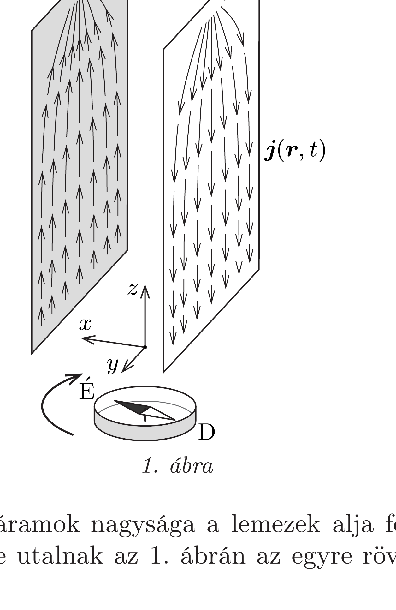
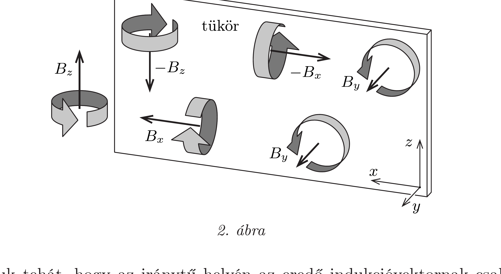

## Útmutatás

Aladár és Cili vitájának eldöntéséhez vizsgáljuk meg, hogy milyen irányú mágneses indukciót hoznak létre a kis iránytú helyén a kondenzátor lemezeiben és a pálcában folyó áramok! Bendegúz gondolatmenetét megcáfolhatjuk a Biot-Savart-törvény segítségével.

## Megoldás

A lemezeket összekötő pálcában folyó áram erősségét a kondenzátor pillanatnyi feszültsége és a pálca ellenállása határozza meg. Feltehetjük, hogy az utóbbi nem túlságosan kicsiny, így a kisülési folyamat időbeli lefolyása nem túl gyors. Ilyenkor, vagyis ha a kisülés ideje sokkal hosszabb, mint amennyi idő alatt a fény eljuthat a kondenzátor egyik szélétől a másikig, alkalmazható az ún. kvázistacionárius közelítés. Ebben a közelítésben a mágneses terek az időben változó erősségú áramokból éppen úgy számolhatók, mint az egyenáramoknál, és az elektromágneses hullámok létrejötte figyelmen kívül hagyható.

Vegyük sorra a három diák állításait, és vizsgáljuk meg, hogy a Biot-Savarttörvény alapján igazuk van-e?

Aladárnak igaza van abban, hogy a pálcában folyó áram (a jobbkéz-szabály értelmében) az ábra síkjára merőleges járulékot eredményez az iránytú helyén az eredő mágneses indukcióhoz, ez tehát valóban „befelé” mozdítaná az iránytú északi pólusát.

Bendegúz helyesen gondolja, hogy a fegyverzetek között eltolási áramok jelennek meg. A kondenzátor lemezei jó vezetők, ezért külön-külön ekvipotenciálisak, és így a lemezek között homogén (de időben változó), elektromos mező alakul ki. Az elektromos mező $\dot{\boldsymbol{E}}$ változási gyorsasága az Ampère-féle gerjesztési törvényben úgy jelenik meg, mintha $\varepsilon_{0} \dot{\boldsymbol{E}}$ áramsúrúségben töltések áramolnának a lemezek között.

Megjegyzés. Az eltolási áramok megjelenését számítással is nyomon követhetjük. Jelöljük a kondenzátor lemezeinek területét $A$-val, pillanatnyi töltését pedig $Q$-val. A lemezek tetejére helyezett pálcában a kisütés során $I$ erősségü elektromos áram folyik, melynek hatására $\dot{Q}=-I$ ütemben csökken a kondenzátor töltése. Emiatt a lemezek közötti
\[
E=\frac{1}{\varepsilon_{0}} \frac{Q}{A}
\]
térerősségữ elektromos tér is gyengül. Az időben változó elektromos tér által létrehozott eltolási áram iránya a pálcában folyó árammal ellentétes, a hozzá tartozó áramsúrúség nagysága pedig
\[
j_{\text {eltolási }}=\varepsilon_{0}|\dot{\boldsymbol{E}}|=\varepsilon_{0} \frac{1}{\varepsilon_{0}} \frac{1}{A}\left|\frac{\Delta Q}{\Delta t}\right|=\frac{I}{A} .
\]

Látható, hogy az eltolási áramok teljes $j_{\text {eltolási }} \cdot A=I$ áramerőssége éppen megegyezik a pálcában folyó vezetési áram $I$ erősségével.

Bendegúz gondolatmenete hibás, amikor a Biot-Savart-törvény alapján akarja számításba venni az eltolási áramok mágneses hatását. A Biot-Savart-törvényben ugyanis csak a töltéshordozók mozgása által létrehozott valódi áramok szerepelnek, az eltolási áramok nem! Ennek magyarázata a következő. A kondenzátor lemezeit feloszthatjuk kis (pontszerúnek tekinthető) darabkákra. Egy-egy ilyen kis darabka által keltett elektromos tér a Coulomb-törvénynek megfelelően minden pillanatban gömbszimmetrikus, és a kisülési folyamat során egyre gyengül. Ezt a gömbszimmetriát a változó elektromos tér által keltett mágneses mezőnek is örökölnie kell, ez azonban a mágneses mezó forrásmentessége miatt csak úgy lehetséges, hogy a darabka által keltett mágneses indukcióvektor mindenhol nullvektor (lásd a 348. és 350. feladatokat). A kis darabkák időben változó elektromos tere tehát nem ad járulékot a mágneses indukcióvektorhoz, ezért ugyanez mondható el a kondenzátor belsejében jelenlévő eltolási áramokról is. (Bendegúz tévedése azzal függhet össze, hogy a Biot-Savart-törvénnyel szemben az Ampère-féle gerjesztési törvényben a valódi és az eltolási áramokat is figyelembe kell venni.)

Érdemes megvizsgálnunk Cili gondolatát a kondenzátor lemezeiben folyó áramok mágneses hatásáról. Valóban kiolthatja ez az effektus a pálcában folyó áram hatását? Tekintsük az 1. ábrát, amely a lemezekben folyó áramokat szemlélteti, és válasszunk egy olyan koordináta-rendszert, melynek $y$ és $z$ tengelye párhuzamos a lemezek vízszintes és függőleges éleivel, origója pedig az áramot vezető pálca középpontja alá esik.

A lemezekben folyó áramok nagysága a lemezek alja felé haladva fokozatosan nullára csökken (erre utalnak az 1. ábrán az egyre rövidebb nyilak), hiszen
kvázistacionárius közelítésben a felületi töltések eloszlása a lemezeken mindvégig egyenletes marad.

Ha az egész árameloszlást (beleértve mindkét lemezben és a pálcában folyó áramot is) tükrözzük a koordináta-rendszerünk $x-z$ síkjára, akkor az eredeti elrendezést kapjuk vissza. Ennek a tükrözési szimmetriának a mágneses mezőre nézve is fenn kell állnia. A mágneses indukció axiálvektor, melynek iránya egy körüljárási irányt jelent (például azt, hogy milyen irányban keringene egy töltött részecske az adott pontbeli mágneses indukció hatására). Az axiálvektoroknak ez a tulajdonsága meghatározza, hogy hogyan viselkednek tükrözés hatására (lásd a 283. feladatot). A koordináta-rendszerünk $z$ tengelyén például (így a kis iránytü helyén is) a mágneses indukcióvektor a tükrözés múvelete során nem változhat meg. Ez csak úgy lehetséges, ha itt a mágneses indukcióvektor párhuzamos az $y$ tengellyel, hiszen az indukció $x$ és $z$ irányú komponense az $x-z$ síkra való tükrözés során előjelet váltana (ezt szemlélteti a 2. ábra).

Tudjuk tehát, hogy az iránytú helyén az eredő indukcióvektornak csak az $y$ tengellyel párhuzamos komponense van, és a pálca által keltett tér $-y$ irányú, tehát a lemezekben folyó áramoknak is csak az $y$ irányú összetevőjét kell vizsgálnunk. Tekintsünk most a bal oldali lemezben egy tetszőleges áramelemet! Ez az áramelem felbontható az $y$ és $z$ tengelyekkel párhuzamos komponensekre. A Biot-Savart-törvény értelmében az iránytú helyén lévő, $y$ tengellyel párhuzamos teret csak az áramelem $z$ irányú összetevője kelthet, ez pedig (a bal oldali lemezben „felfelé" áramló töltések miatt) a jobbkéz-szabály szerint $-y$ irányú indukciójárulékot eredményez. Hasonlóan belátható, hogy a jobb oldali lemezben folyó áramelemek is $-y$ irányban növelik az eredő indukciót az iránytú helyén.

Cilinek tehát nem volt igaza abban, hogy a kondenzátor lemezeiben folyó áramok leronthatják a pálcában folyó áram mágneses hatását, épp ellenkezőleg: erősítik azt. Az igazsághoz Aladár állt a legközelebb, bár magyarázata nem volt teljes: az iránytú északi pólusa a pálcában és a lemezekben folyó áramok együttes hatására az ábra síkjára merőlegesen „befelé” (felülről nézve az óramutató járásának megfelelően) térül ki.

Megjegyzés. A kisütés következtében az iránytú csak elvben térül ki, reális körülmények között a pálcában és a kondenzátor lemezeiben folyó áramok hatása olyan kicsi, hogy precíz mérőeszközök nélkül kimutathatatlan.
